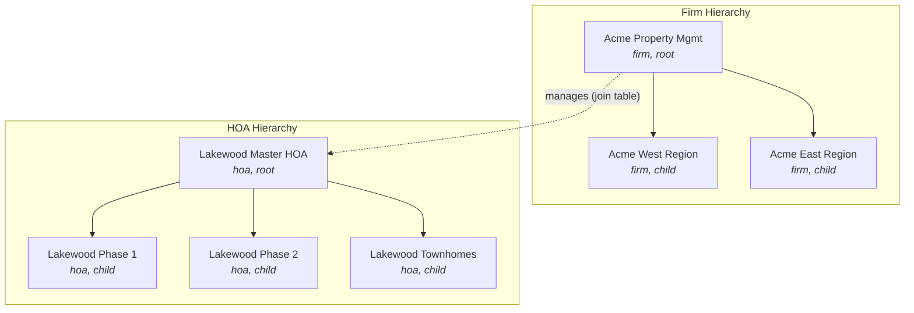
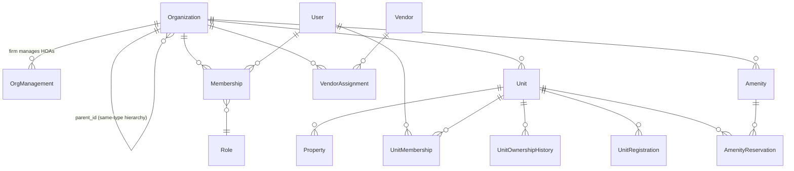
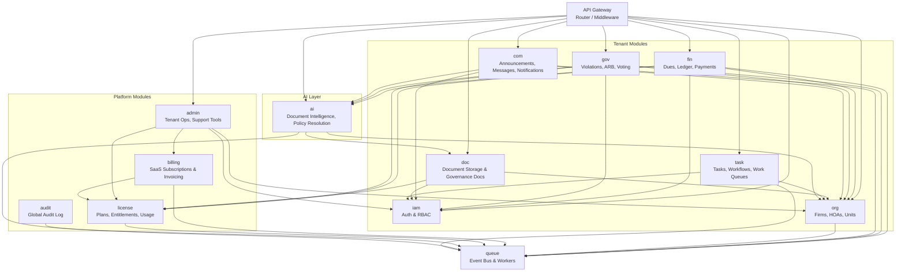
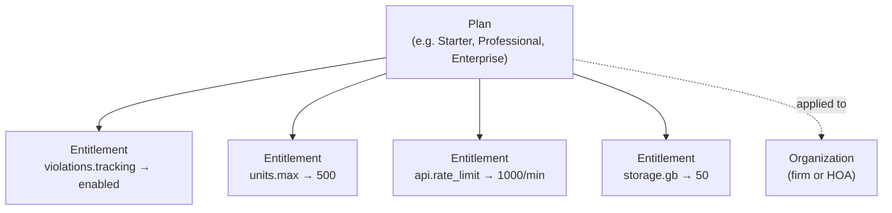
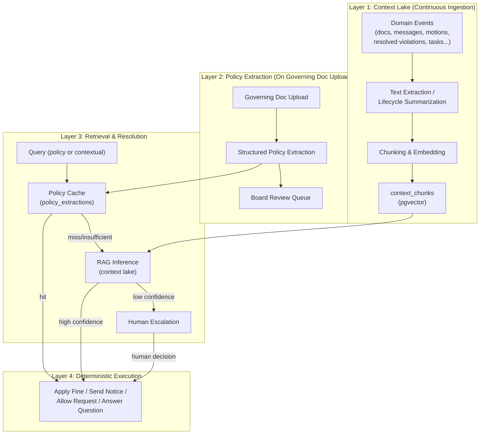
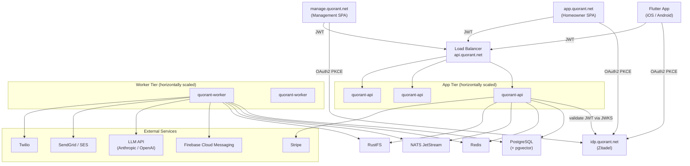

# Quorant — Architecture Document

> **Status:** Draft · **Last updated:** 2026-04-08
>
> This document is the single source of truth for system design decisions.
> No application code exists yet — everything here guides future implementation.

---

## Table of Contents

1. [Domain Model & Org Hierarchy](#1-domain-model--org-hierarchy)
2. [Go Modular Monolith — Module Boundaries](#2-go-modular-monolith--module-boundaries)
3. [PostgreSQL Schema Design](#3-postgresql-schema-design)
4. [API Design](#4-api-design)
5. [RBAC Model](#5-rbac-model)
6. [Audit Module](#6-audit-module)
7. [AI Intelligence Layer](#7-ai-intelligence-layer)
8. [Cross-Cutting Concerns](#8-cross-cutting-concerns)
9. [Flutter App Architecture](#9-flutter-app-architecture)
10. [Deployment Topology](#10-deployment-topology)
11. [Open Design Items](#11-open-design-items)

---

## 1. Domain Model & Org Hierarchy

Quorant serves three stakeholder types:

| Stakeholder | Description |
|---|---|
| **Management Firm** | Professional company managing one or more HOA communities |
| **HOA Board** | Volunteer board members governing a single community |
| **Homeowner** | Resident/unit owner within an HOA |

### Org Hierarchy

Both Management Firms and HOAs can be hierarchical. A management company may have regional subsidiaries; a master-planned community may contain sub-HOAs. The `organizations` table uses an **adjacency list** (`parent_id` self-FK) with an **`ltree` materialized path** column for efficient subtree queries.



### Key Design Decisions

- **`parent_id` self-FK on `organizations`** — used for same-type hierarchy only (firm→firm, hoa→hoa).
- **`organizations_management` join table** — links a firm (or firm subtree) to the HOAs it manages. This is a separate relationship because an HOA can change management firms without restructuring the tree.
- **`ltree` path column** (e.g., `root.child1.child2`) — enables fast ancestor/descendant queries (`WHERE path <@ 'root.child1'`) for permission inheritance and reporting rollups.

### Self-Managed HOAs

An HOA can exist independently with no management firm — simply an HOA org with no row in `organizations_management`. The board runs everything themselves using the same platform features.

### HOA ↔ Firm Lifecycle

A self-managed HOA can later connect to a management firm (insert into `organizations_management`), and a managed HOA can disconnect and go self-managed (soft-delete the row with `ended_at` timestamp). This is a **first-class workflow**, not an edge case.

- `organizations_management` has `started_at`, `ended_at` columns — full history of management relationships is preserved.
- **On connection:** firm staff gain access per their role; board retains all existing data and control.
- **On disconnection:** firm staff lose access immediately; all HOA data stays with the HOA (it's their org, not the firm's).
- An HOA can only have **one active management firm** at a time (unique constraint on `hoa_org_id WHERE ended_at IS NULL`).

### Firm-to-Firm Transitions

An HOA can switch from one management firm to another. Modeled as ending the current `organizations_management` row (`ended_at = now()`) and creating a new one with the new firm. The transition triggers:

- `FirmDisconnected` event → revoke old firm's staff access, handle license migration if the old firm was covering the HOA's subscription.
- `FirmConnected` event → provision new firm's staff access, resolve licensing under the new firm's plan (or require the HOA to have its own subscription during any gap).

Full history of all management relationships is preserved — queryable for compliance, audits, and reporting.

### Feature Parity

Self-managed HOAs get the same modules (`fin`, `gov`, `com`, `doc`) as firm-managed HOAs. The firm layer adds delegation and cross-HOA reporting but doesn't gate core functionality. Entitlements ([Section 2](#saas-platform-modules), license module) control feature access, not the presence of a management firm.

### Vendors

Vendors are external companies (landscapers, plumbers, roofers, etc.) contracted by a firm or directly by an HOA. Modeled as a **separate `vendors` table** (not an Organization) because they don't participate in the org hierarchy — they're service providers, not governance entities. A `vendor_assignments` join table links a vendor to specific org(s) with a service scope and date range.

Vendor contacts (the people) are `User` records with a `vendor_contact` role membership, allowing them to log into the platform to view work orders, submit invoices, and update job status.

### Core Entity Relationship Diagram



### Core Entities

| Entity | Description |
|---|---|
| **Organization** | A firm or HOA. Recursive tree via `parent_id` + `ltree` path. |
| **OrgManagement** | Join table linking a firm to the HOAs it manages. Temporal (`started_at`/`ended_at`). |
| **User** | A person who can authenticate. Has memberships in one or more orgs. |
| **Membership** | User ↔ Org ↔ Role binding for org-scoped roles (board members, firm staff). |
| **Role** | Named role with associated permissions (see [Section 5](#5-rbac-model)). |
| **Unit** | A lot, condo unit, or townhouse within an HOA. |
| **UnitMembership** | User ↔ Unit relationship (owner, tenant, resident). Tracks who's associated with each unit, including the voting delegate designation. Temporal (`started_at`/`ended_at`) for full ownership history. |
| **UnitOwnershipHistory** | Immutable transfer log recording legal ownership changes for compliance, estoppel letters, and financial reconciliation. |
| **Property** | Physical property record attached to a unit (address, parcel, metadata). |
| **Amenity** | Community amenity or common area (pool, clubhouse, gym, etc.). |
| **AmenityReservation** | Booking of a reservable amenity by a unit member. |
| **UnitRegistration** | Flexible registration data (vehicles, pets, parking) against a configurable schema per HOA. |
| **Vendor** | External service provider company. |
| **VendorAssignment** | Links a vendor to an org with service scope and date range. |

---

## 2. Go Modular Monolith — Module Boundaries

### Module Dependency Graph



Each module owns its DB tables and exposes an **internal Go interface** (no HTTP between modules). Cross-module calls go through explicit dependency injection, not imports of internal packages.

### Directory Layout

```
backend/
  cmd/
    quorant-api/            # API server entrypoint
    quorant-worker/         # Event consumer + scheduler entrypoint
  internal/
    platform/               # shared infra: db, logging, config, middleware
      queue/                # event bus interface, River transport adapter
      ai/                   # AI client, prompt management, model versioning
        engine.go           # LLM client abstraction, provider switching
        extraction.go       # document processing pipeline
        resolution.go       # policy resolution chain (cache → inference → escalation)
        embeddings.go       # document chunking, vector storage (pgvector)
        review.go           # human-in-the-loop review workflows
    iam/                    # auth, sessions, RBAC
    org/                    # org hierarchy, units, memberships
    fin/                    # assessments, ledger, payments
    gov/                    # violations, requests, approvals, voting
    com/                    # announcements, threads, push notifications
    doc/                    # file storage, community docs
    task/                   # tasks, workflows, work queues, SLA tracking
    audit/                  # global audit log, retention, compliance
    admin/                  # platform admin, tenant ops, support tools
    license/                # plans, entitlements, usage metering
    billing/                # SaaS subscription billing (Stripe)
  api/                      # OpenAPI specs, proto definitions
  migrations/               # SQL migration files (goose or atlas)
  go.mod
```

### Async / Event-Sourced Layer

Modules publish domain events to an internal event bus. A `queue` package in `internal/platform/queue` abstracts the transport.

| Concern | Approach |
|---|---|
| **Transport** | NATS JetStream for event delivery with at-least-once guarantees. Events are written to the `domain_events` table within the originating database transaction (transactional outbox pattern), then published to NATS by an outbox poller running in the worker tier. |
| **Event schema** | Typed struct implementing `Event` interface: `EventType() string`, `AggregateID() uuid.UUID`, `OccurredAt() time.Time`, `Payload() json.RawMessage`. Events are self-contained facts (see [Event Design Principles](#event-design-principles--extensibility)). |
| **Persistence** | Events persisted to an append-only `domain_events` table before dispatch (transactional outbox pattern). NATS JetStream provides delivery guarantees; the PG table provides the durable source of truth and historical record. |
| **Workers** | Separate `cmd/quorant-worker` binary subscribing to NATS subjects. Each module registers its own handlers at startup. Workers are stateless and horizontally scalable — NATS consumer groups distribute work across replicas. Graceful shutdown on SIGTERM. |
| **Idempotency** | Every handler must be idempotent. Events carry a unique `event_id`; handlers track processed IDs in `processed_events` to deduplicate. |

### Key Event Flows

| Producer | Event | Consumers |
|---|---|---|
| `fin` | `PaymentReceived` | `com` (send receipt notification), `fin` (update ledger) |
| `gov` | `ViolationCreated` | `com` (notify homeowner + board), `doc` (attach evidence), `task` (create violation review task) |
| `gov` | `ViolationFineApplied` | `fin` (create assessment on unit), `com` (notify homeowner) |
| `gov` | `ViolationCured` | `task` (close cure verification task), `com` (notify homeowner) |
| `gov` | `ARBRequestSubmitted` | `com` (notify board), `gov` (start approval workflow), `task` (create ARB review task) |
| `gov` | `ARBAutoApproved` | `com` (notify homeowner + board), `task` (close review task) |
| `gov` | `ARBRevisionRequested` | `com` (notify homeowner), `task` (create revision task) |
| `gov` | `MeetingScheduled` | `com` (send notice if required by policy), `task` (create meeting prep task) |
| `gov` | `MotionPassed` | domain module based on `resource_type` (e.g., `fin` to approve budget) |
| `gov` | `HearingScheduled` | `com` (send formal hearing notice), `task` (track notice delivery) |
| `gov` | `ProxyFiled` | `gov` (validate against policy deadline) |
| `org` | `MembershipChanged` | `iam` (invalidate cached permissions), `com` (welcome/offboard email) |
| `org` | `OwnershipTransferred` | `fin` (settle/transfer balance), `com` (welcome new owner), `iam` (update permissions) |
| `org` | `TenantRegistered` | `com` (welcome email), `iam` (grant limited access) |
| `org` | `TenantRemoved` | `iam` (revoke access), `com` (notify) |
| `org` | `ReservationConfirmed` | `fin` (charge fee if applicable), `com` (confirmation notification) |
| `org` | `ReservationCancelled` | `fin` (refund deposit if applicable), `com` (cancellation notification) |
| `org` | `RegistrationSubmitted` | `com` (notify board if approval required) |
| `org` | `RegistrationApproved` | `com` (notify homeowner) |
| `fin` | `AssessmentDue` | `com` (send reminder), `fin` (apply late fees after grace period) |
| `fin` | `ExpenseApproved` | `fin` (update budget actuals, post fund transaction) |
| `fin` | `ExpensePaid` | `fin` (update fund balance), `com` (notify vendor if applicable) |
| `fin` | `CollectionCaseOpened` | `com` (send initial late notice), `audit` (compliance record) |
| `fin` | `CollectionEscalated` | `com` (send stage-appropriate notice), `gov` (if hearing required) |
| `fin` | `PaymentPlanCreated` | `com` (notify homeowner with terms), `fin` (generate installment schedule) |
| `fin` | `PaymentPlanDefaulted` | `fin` (resume escalation), `com` (notify homeowner + board) |
| `fin` | `FundTransferCompleted` | `audit` (compliance record) |
| `com` | `NotificationRequested` | `com` worker (fan-out to push/email/SMS) |
| `com` | `CalendarEventCreated` | `com` (notify members based on audience_roles) |
| `com` | `AnnouncementScheduled` | `com` scheduler (publish at scheduled time) |
| `doc` | `DocumentVersionUploaded` | `ai` (re-index if governing document), `com` (notify board) |
| `doc` | `DocumentUploaded` | `ai` (chunk and embed for context lake; trigger policy extraction if governing doc) |
| `com` | `AnnouncementPublished` | `ai` (embed for context lake) |
| `com` | `CommunicationSent` | `audit` (compliance record), `ai` (embed significant communications for context lake) |
| `com` | `CommunicationBounced` | `task` (create follow-up task for alternative delivery), `com` (alert staff) |
| `com` | `ThreadMessageCreated` | `ai` (embed for context lake; batch into thread summaries periodically) |
| `gov` | `MeetingCompleted` | `doc` (prompt minutes upload), `task` (close meeting prep task), `ai` (summarize motions for context lake) |
| `gov` | `ViolationResolved` | `ai` (generate lifecycle narrative, embed for context lake) |
| `gov` | `ARBRequestResolved` | `ai` (generate lifecycle narrative, embed for context lake) |
| `fin` | `CollectionCaseClosed` | `ai` (generate lifecycle narrative, embed for context lake) |
| `task` | `TaskCompleted` | originating module (advance domain state if applicable), `com` (notify requestor), `ai` (generate lifecycle narrative if significant task type) |
| `fin` | `BudgetApproved` | `com` (notify homeowners), `doc` (archive budget document), `ai` (summarize for context lake) |
| `org` | `FirmConnected` | `iam` (provision firm staff access), `com` (notify board + firm admin) |
| `org` | `FirmDisconnected` | `iam` (revoke firm staff access), `com` (notify board) |
| `billing` | `PaymentFailed` | `com` (alert tenant + platform admin), `license` (start grace period) |
| `billing` | `SubscriptionCancelled` | `license` (suspend entitlements after grace), `com` (notify) |
| `license` | `EntitlementExceeded` | `com` (usage warning to tenant admin) |
| `doc` | `GoverningDocUploaded` | `ai` (trigger document indexing and policy extraction) |
| `ai` | `PolicyExtractionComplete` | `com` (notify board that review is needed), `task` (create policy review task) |
| `ai` | `PolicyResolutionEscalated` | `com` (notify relevant staff/board for human decision), `task` (create policy decision task) |
| `task` | `TaskCreated` | `com` (notify assignee) |
| `task` | `TaskAssigned` | `com` (notify new assignee) |
| `task` | `TaskSLABreached` | `com` (alert assignee + manager), `audit` (compliance record) |
| `task` | `TaskEscalated` | `com` (notify escalation target) |

### SaaS Platform Modules

#### `admin` — Platform Administration & Support Tools

- **Tenant lifecycle:** Onboard/suspend/offboard firms and HOAs. Provision initial admin users.
- **Impersonation:** Platform admins can act-as any user for support/debugging (logged in `audit_log` with impersonation flag, visible to the tenant).
- **Tenant dashboard:** Health metrics per org — active users, storage usage, API call volume, overdue payments.
- **Support tools:** Search across all tenants (users, orgs, transactions), view activity feeds, trigger password resets, unlock accounts.
- **Feature flags:** Per-tenant overrides for gradual rollouts and beta features.

#### `license` — Plans, Entitlements & Usage Metering



**Tables:** `plans`, `entitlements`, `org_subscriptions`, `org_entitlement_overrides`, `usage_records`.

- **`plans`** — Defines subscription tiers. `plan_type` enum: `firm`, `hoa`, `firm_bundle` (a firm plan that covers managed HOAs).
- **`entitlements`** — Each plan has N entitlements: `feature_key` + `limit_value` (nullable for boolean gates) + `limit_type` enum (`boolean`, `numeric`, `rate`).
- **`org_subscriptions`** — Links an org to a plan with `starts_at`, `ends_at`, status (`active`/`trial`/`suspended`/`cancelled`). One active subscription per org.
- **`org_entitlement_overrides`** — Per-org exceptions to plan defaults (e.g., "give Acme 1000 units instead of 500").
- **`usage_records`** — Metered usage events bucketed by org + period. Used for enforcement and billing overage.

##### Licensing Modes

| Scenario | Who pays | How entitlements resolve |
|---|---|---|
| Self-managed HOA | HOA has its own `org_subscription` | Entitlements from the HOA's plan directly |
| Firm + independently-licensed HOAs | Firm has its own plan; each HOA has its own plan | Firm plan gates firm-level features. Each HOA's plan gates HOA features independently |
| Firm with bundled HOA coverage | Firm has a `firm_bundle` plan | HOAs managed by this firm inherit entitlements from the firm's bundle. Limits can be pool-based or per-HOA allocated by firm admin |

##### Entitlement Resolution Logic

```
CheckEntitlement(orgID, featureKey):
  1. Check org_entitlement_overrides for orgID + featureKey → if found, use it
  2. Check org_subscriptions for orgID → if active, resolve from plan's entitlements
  3. If org is an HOA with an active firm via organizations_management:
     a. Check firm's org_subscription → if plan_type = 'firm_bundle',
        resolve from firm's entitlements
     b. Apply any per-HOA allocation limits from org_entitlement_overrides
  4. Deny (no active entitlement found)
```

**Firm → HOA transition:** When an HOA disconnects from a firm covering its license, the HOA needs its own subscription within a grace period or gets suspended. `FirmDisconnected` triggers the grace countdown and notifies the HOA board.

**Enforcement middleware:** Every request checks entitlements. The `license` module exposes `CheckEntitlement(ctx, orgID, featureKey) (allowed bool, remaining int, err error)` consumed by other modules. Results are cached in Redis with short TTL.

#### `billing` — SaaS Subscription Billing

- **`invoices`** — Monthly SaaS invoices from subscription + usage overage. Separate from the HOA `fin` module (which handles homeowner dues).
- **`billing_accounts`** — Payment method on file (Stripe customer ID, billing contact).
- **Stripe integration:** Subscription management, payment processing, webhook handling.
- **Events:** `SubscriptionCreated`, `SubscriptionCancelled`, `PaymentFailed` → consumed by `com` and `license`.

---

## 3. PostgreSQL Schema Design

**Multi-tenancy approach:** Row-level isolation via `org_id` foreign keys + RLS policies. No separate schemas per tenant.

### Schema Overview

| Domain | Tables |
|---|---|
| IAM | `users`, `roles`, `permissions`, `role_permissions` |
| Org | `organizations`, `organizations_management`, `memberships`, `units`, `unit_memberships`, `unit_ownership_history`, `properties`, `vendors`, `vendor_assignments`, `amenities`, `amenity_reservations`, `unit_registration_types`, `unit_registrations` |
| Fin | `assessment_schedules`, `assessments`, `ledger_entries`, `payments`, `payment_methods`, `budgets`, `budget_categories`, `budget_line_items`, `expenses`, `funds`, `fund_transactions`, `fund_transfers`, `collection_cases`, `collection_actions`, `payment_plans` |
| Gov | `violations`, `violation_actions`, `arb_requests`, `arb_votes`, `ballots`, `ballot_votes`, `proxy_authorizations`, `meetings`, `meeting_attendees`, `meeting_motions`, `hearing_links` |
| Com | `announcements`, `threads`, `messages`, `notification_preferences`, `unit_notification_subscriptions`, `push_tokens`, `calendar_events`, `calendar_event_rsvps`, `message_templates`, `directory_preferences`, `communication_log` |
| Doc | `documents`, `document_categories` |
| Task | `task_types`, `tasks`, `task_comments`, `task_status_history` |
| Audit | `audit_log` |
| Queue | `domain_events`, `processed_events` |
| Admin | `tenant_activity_log`, `feature_flags`, `feature_flag_overrides` |
| License | `plans`, `entitlements`, `org_subscriptions`, `org_entitlement_overrides`, `usage_records` |
| Billing | `billing_accounts`, `invoices`, `invoice_line_items` |
| AI | `governing_documents`, `context_chunks`, `policy_extractions`, `policy_resolutions` |
| Integration | `webhook_subscriptions`, `webhook_deliveries` |

### Extensions

```sql
CREATE EXTENSION IF NOT EXISTS "uuid-ossp";
CREATE EXTENSION IF NOT EXISTS "ltree";
CREATE EXTENSION IF NOT EXISTS "pgcrypto";
CREATE EXTENSION IF NOT EXISTS "vector";     -- pgvector for AI document embeddings
```

### Enum Types

```sql
CREATE TYPE org_type AS ENUM ('firm', 'hoa');
CREATE TYPE membership_status AS ENUM ('active', 'inactive', 'invited');
CREATE TYPE subscription_status AS ENUM ('active', 'trial', 'suspended', 'cancelled');
CREATE TYPE plan_type AS ENUM ('firm', 'hoa', 'firm_bundle');
CREATE TYPE limit_type AS ENUM ('boolean', 'numeric', 'rate');
CREATE TYPE invoice_status AS ENUM ('draft', 'issued', 'paid', 'overdue', 'void');
CREATE TYPE payment_status AS ENUM ('pending', 'completed', 'failed', 'refunded');
CREATE TYPE violation_status AS ENUM ('open', 'acknowledged', 'resolved', 'escalated', 'closed');
CREATE TYPE arb_status AS ENUM ('submitted', 'under_review', 'revision_requested', 'approved', 'conditionally_approved', 'denied', 'withdrawn');
CREATE TYPE ballot_status AS ENUM ('draft', 'open', 'closed', 'cancelled');
CREATE TYPE meeting_status AS ENUM ('scheduled', 'in_progress', 'completed', 'cancelled');
CREATE TYPE ledger_entry_type AS ENUM ('charge', 'payment', 'credit', 'adjustment', 'late_fee');
CREATE TYPE budget_status AS ENUM ('draft', 'proposed', 'approved', 'amended', 'closed');
CREATE TYPE expense_status AS ENUM ('draft', 'submitted', 'approved', 'paid', 'rejected', 'void');
CREATE TYPE collection_status AS ENUM ('current', 'late', 'delinquent', 'demand_sent', 'attorney_referred', 'lien_filed', 'foreclosure', 'payment_plan', 'settled', 'written_off');
CREATE TYPE notification_channel AS ENUM ('push', 'email', 'sms');
CREATE TYPE comm_direction AS ENUM ('outbound', 'inbound');
CREATE TYPE comm_channel AS ENUM ('email', 'sms', 'push', 'physical_mail', 'phone', 'in_person', 'platform', 'certified_mail');
CREATE TYPE comm_status AS ENUM ('draft', 'queued', 'sent', 'delivered', 'opened', 'bounced', 'failed', 'returned_to_sender');
CREATE TYPE unit_relationship AS ENUM ('owner', 'tenant', 'resident', 'emergency_contact');
CREATE TYPE reservation_status AS ENUM ('pending', 'confirmed', 'cancelled', 'completed', 'no_show');
CREATE TYPE policy_domain AS ENUM ('financial', 'governance', 'compliance', 'use_restrictions', 'operational');
CREATE TYPE extraction_review_status AS ENUM ('pending', 'approved', 'rejected', 'modified');
CREATE TYPE indexing_status AS ENUM ('pending', 'processing', 'indexed', 'failed');
CREATE TYPE context_source_type AS ENUM (
    'governing_document',     -- CC&Rs, bylaws, rules
    'document',               -- any uploaded document (minutes, contracts, reports)
    'announcement',           -- community announcements
    'thread_message',         -- discussion threads
    'meeting_minutes',        -- meeting minutes documents
    'meeting_motion',         -- structured motion records (summarized into narrative)
    'task_narrative',         -- completed task lifecycle summary
    'violation_narrative',    -- violation lifecycle summary
    'collection_narrative',   -- collection case summary
    'arb_narrative',          -- ARB request lifecycle summary
    'budget_summary',         -- budget approval context
    'event_summary'           -- significant domain events summarized for context
);
CREATE TYPE context_scope AS ENUM ('global', 'jurisdiction', 'firm', 'org');
CREATE TYPE task_status AS ENUM ('open', 'assigned', 'in_progress', 'blocked', 'review', 'completed', 'cancelled');
CREATE TYPE task_priority AS ENUM ('low', 'normal', 'high', 'urgent');
```

### IAM Tables

```sql
-- ============================================================
-- IAM: users, roles, permissions
-- Authentication is delegated to Zitadel (self-hosted identity provider).
-- The users table is a lightweight application profile referencing
-- the Zitadel user ID. Credentials, sessions, MFA, email verification,
-- and social/enterprise SSO are all handled by Zitadel.
-- ============================================================

CREATE TABLE users (
    id              UUID PRIMARY KEY DEFAULT gen_random_uuid(),
    idp_user_id     TEXT NOT NULL UNIQUE,      -- Zitadel user ID (external reference)
    email           TEXT NOT NULL UNIQUE,       -- synced from identity provider
    display_name    TEXT NOT NULL,              -- synced from identity provider
    phone           TEXT,
    avatar_url      TEXT,
    is_active       BOOLEAN NOT NULL DEFAULT TRUE,
    last_login_at   TIMESTAMPTZ,
    created_at      TIMESTAMPTZ NOT NULL DEFAULT now(),
    updated_at      TIMESTAMPTZ NOT NULL DEFAULT now(),
    deleted_at      TIMESTAMPTZ
);

CREATE INDEX idx_users_email ON users (email) WHERE deleted_at IS NULL;
CREATE INDEX idx_users_idp ON users (idp_user_id);

CREATE TABLE roles (
    id              UUID PRIMARY KEY DEFAULT gen_random_uuid(),
    name            TEXT NOT NULL UNIQUE,  -- e.g., 'firm_admin', 'board_president', 'hoa_manager'
    description     TEXT,
    is_system       BOOLEAN NOT NULL DEFAULT TRUE,  -- system roles cannot be deleted
    created_at      TIMESTAMPTZ NOT NULL DEFAULT now()
);

CREATE TABLE permissions (
    id              UUID PRIMARY KEY DEFAULT gen_random_uuid(),
    key             TEXT NOT NULL UNIQUE,  -- e.g., 'fin.assessment.create', 'gov.violation.update'
    description     TEXT,
    module          TEXT NOT NULL           -- e.g., 'fin', 'gov', 'org'
);

CREATE TABLE role_permissions (
    role_id         UUID NOT NULL REFERENCES roles(id) ON DELETE CASCADE,
    permission_id   UUID NOT NULL REFERENCES permissions(id) ON DELETE CASCADE,
    PRIMARY KEY (role_id, permission_id)
);
```

### Org Tables

```sql
-- ============================================================
-- ORG: organizations, management links, memberships, units
-- ============================================================

CREATE TABLE organizations (
    id              UUID PRIMARY KEY DEFAULT gen_random_uuid(),
    parent_id       UUID REFERENCES organizations(id),
    type            org_type NOT NULL,
    name            TEXT NOT NULL,
    slug            TEXT NOT NULL UNIQUE,   -- URL-safe identifier
    path            LTREE NOT NULL,         -- materialized path for subtree queries
    address_line1   TEXT,
    address_line2   TEXT,
    city            TEXT,
    state           TEXT,
    zip             TEXT,
    phone           TEXT,
    email           TEXT,
    website         TEXT,
    logo_url        TEXT,
    settings        JSONB NOT NULL DEFAULT '{}',  -- org-level config (timezone, retention policy, etc.)
    created_at      TIMESTAMPTZ NOT NULL DEFAULT now(),
    updated_at      TIMESTAMPTZ NOT NULL DEFAULT now(),
    deleted_at      TIMESTAMPTZ
);

CREATE INDEX idx_organizations_parent ON organizations (parent_id) WHERE deleted_at IS NULL;
CREATE INDEX idx_organizations_path ON organizations USING GIST (path);
CREATE INDEX idx_organizations_type ON organizations (type) WHERE deleted_at IS NULL;
CREATE INDEX idx_organizations_slug ON organizations (slug) WHERE deleted_at IS NULL;

-- Constraint: parent must be same type
-- (enforced via application logic + CHECK trigger, not simple FK)

CREATE TABLE organizations_management (
    id              UUID PRIMARY KEY DEFAULT gen_random_uuid(),
    firm_org_id     UUID NOT NULL REFERENCES organizations(id),
    hoa_org_id      UUID NOT NULL REFERENCES organizations(id),
    started_at      TIMESTAMPTZ NOT NULL DEFAULT now(),
    ended_at        TIMESTAMPTZ,           -- NULL = active relationship
    created_at      TIMESTAMPTZ NOT NULL DEFAULT now()
);

-- Only one active management firm per HOA at a time
CREATE UNIQUE INDEX idx_org_mgmt_active
    ON organizations_management (hoa_org_id)
    WHERE ended_at IS NULL;

CREATE INDEX idx_org_mgmt_firm ON organizations_management (firm_org_id) WHERE ended_at IS NULL;

CREATE TABLE memberships (
    id              UUID PRIMARY KEY DEFAULT gen_random_uuid(),
    user_id         UUID NOT NULL REFERENCES users(id),
    org_id          UUID NOT NULL REFERENCES organizations(id),
    role_id         UUID NOT NULL REFERENCES roles(id),
    status          membership_status NOT NULL DEFAULT 'active',
    invited_by      UUID REFERENCES users(id),
    joined_at       TIMESTAMPTZ,
    created_at      TIMESTAMPTZ NOT NULL DEFAULT now(),
    updated_at      TIMESTAMPTZ NOT NULL DEFAULT now(),
    deleted_at      TIMESTAMPTZ
);

-- A user can have only one active role per org
-- (multiple roles = multiple memberships, each explicit)
CREATE UNIQUE INDEX idx_memberships_user_org_role
    ON memberships (user_id, org_id, role_id)
    WHERE deleted_at IS NULL;

CREATE INDEX idx_memberships_org ON memberships (org_id) WHERE deleted_at IS NULL;
CREATE INDEX idx_memberships_user ON memberships (user_id) WHERE deleted_at IS NULL;

CREATE TABLE units (
    id              UUID PRIMARY KEY DEFAULT gen_random_uuid(),
    org_id          UUID NOT NULL REFERENCES organizations(id),  -- must be an HOA
    label           TEXT NOT NULL,          -- e.g., "Unit 12B", "Lot 47"
    unit_type       TEXT,                   -- e.g., 'condo', 'townhouse', 'single_family', 'lot'
    address_line1   TEXT,
    address_line2   TEXT,
    city            TEXT,
    state           TEXT,
    zip             TEXT,
    status          TEXT NOT NULL DEFAULT 'occupied',  -- 'occupied', 'vacant', 'delinquent', 'foreclosure'
    lot_size_sqft   INTEGER,
    voting_weight   NUMERIC(5,2) NOT NULL DEFAULT 1.00,  -- for weighted voting (by lot size, share %)
    metadata        JSONB NOT NULL DEFAULT '{}',
    created_at      TIMESTAMPTZ NOT NULL DEFAULT now(),
    updated_at      TIMESTAMPTZ NOT NULL DEFAULT now(),
    deleted_at      TIMESTAMPTZ
);

CREATE INDEX idx_units_org ON units (org_id) WHERE deleted_at IS NULL;

CREATE TABLE properties (
    id              UUID PRIMARY KEY DEFAULT gen_random_uuid(),
    unit_id         UUID NOT NULL REFERENCES units(id),
    parcel_number   TEXT,                   -- county parcel/APN
    square_feet     INTEGER,
    bedrooms        SMALLINT,
    bathrooms       NUMERIC(3,1),
    year_built      SMALLINT,
    metadata        JSONB NOT NULL DEFAULT '{}',
    created_at      TIMESTAMPTZ NOT NULL DEFAULT now(),
    updated_at      TIMESTAMPTZ NOT NULL DEFAULT now()
);

CREATE INDEX idx_properties_unit ON properties (unit_id);

CREATE TABLE vendors (
    id              UUID PRIMARY KEY DEFAULT gen_random_uuid(),
    name            TEXT NOT NULL,
    contact_email   TEXT,
    contact_phone   TEXT,
    service_types   TEXT[] NOT NULL DEFAULT '{}',  -- e.g., {'landscaping', 'plumbing'}
    license_number  TEXT,
    insurance_expiry TIMESTAMPTZ,
    metadata        JSONB NOT NULL DEFAULT '{}',
    created_at      TIMESTAMPTZ NOT NULL DEFAULT now(),
    updated_at      TIMESTAMPTZ NOT NULL DEFAULT now(),
    deleted_at      TIMESTAMPTZ
);

CREATE TABLE vendor_assignments (
    id              UUID PRIMARY KEY DEFAULT gen_random_uuid(),
    vendor_id       UUID NOT NULL REFERENCES vendors(id),
    org_id          UUID NOT NULL REFERENCES organizations(id),  -- firm or HOA
    service_scope   TEXT NOT NULL,          -- e.g., 'landscaping', 'general_maintenance'
    contract_ref    TEXT,                   -- external contract reference
    started_at      TIMESTAMPTZ NOT NULL DEFAULT now(),
    ended_at        TIMESTAMPTZ,
    created_at      TIMESTAMPTZ NOT NULL DEFAULT now()
);

CREATE INDEX idx_vendor_assignments_org ON vendor_assignments (org_id) WHERE ended_at IS NULL;
CREATE INDEX idx_vendor_assignments_vendor ON vendor_assignments (vendor_id) WHERE ended_at IS NULL;

-- User ↔ Unit relationships (owner, tenant, resident, emergency contact).
-- Replaces the old owner_user_id FK on units with a full relational model
-- supporting joint ownership, tenants, temporal history, and voting delegation.
CREATE TABLE unit_memberships (
    id              UUID PRIMARY KEY DEFAULT gen_random_uuid(),
    unit_id         UUID NOT NULL REFERENCES units(id),
    user_id         UUID NOT NULL REFERENCES users(id),
    relationship    unit_relationship NOT NULL,
    is_voter        BOOLEAN NOT NULL DEFAULT FALSE,  -- designated voting delegate for this unit
    started_at      TIMESTAMPTZ NOT NULL DEFAULT now(),
    ended_at        TIMESTAMPTZ,
    notes           TEXT,
    created_at      TIMESTAMPTZ NOT NULL DEFAULT now(),
    updated_at      TIMESTAMPTZ NOT NULL DEFAULT now(),

    -- Only owners can be the voting delegate
    CONSTRAINT chk_vote_requires_owner
        CHECK (is_voter = FALSE OR relationship = 'owner')
);

-- At most one voter per unit
CREATE UNIQUE INDEX idx_unit_memberships_voter
    ON unit_memberships (unit_id)
    WHERE is_voter = TRUE AND ended_at IS NULL;

-- Active memberships by unit
CREATE INDEX idx_unit_memberships_unit
    ON unit_memberships (unit_id)
    WHERE ended_at IS NULL;

-- Active memberships by user
CREATE INDEX idx_unit_memberships_user
    ON unit_memberships (user_id)
    WHERE ended_at IS NULL;

-- No duplicate active relationships of the same type
CREATE UNIQUE INDEX idx_unit_memberships_unique_active
    ON unit_memberships (unit_id, user_id, relationship)
    WHERE ended_at IS NULL;

-- Immutable transfer log for legal ownership changes.
-- Separate from unit_memberships (which tracks access); this tracks
-- legal transfers for compliance, estoppel letters, and financial reconciliation.
CREATE TABLE unit_ownership_history (
    id              UUID PRIMARY KEY DEFAULT gen_random_uuid(),
    unit_id         UUID NOT NULL REFERENCES units(id),
    org_id          UUID NOT NULL REFERENCES organizations(id),
    from_user_id    UUID REFERENCES users(id),         -- NULL for initial/original owner
    to_user_id      UUID NOT NULL REFERENCES users(id),
    transfer_type   TEXT NOT NULL,                      -- 'sale', 'inheritance', 'foreclosure', 'initial'
    transfer_date   DATE NOT NULL,
    sale_price_cents BIGINT,                            -- nullable, not always disclosed
    outstanding_balance_cents BIGINT,                   -- balance at time of transfer
    balance_settled BOOLEAN NOT NULL DEFAULT FALSE,     -- were outstanding dues resolved at closing?
    recording_ref   TEXT,                               -- county recording reference
    notes           TEXT,
    recorded_by     UUID NOT NULL REFERENCES users(id), -- who logged this transfer
    created_at      TIMESTAMPTZ NOT NULL DEFAULT now()
);

-- Immutable: application role gets INSERT only
CREATE INDEX idx_ownership_history_unit ON unit_ownership_history (unit_id, transfer_date DESC);
CREATE INDEX idx_ownership_history_org ON unit_ownership_history (org_id, transfer_date DESC);

-- Community amenities and common areas (pools, clubhouses, gyms, etc.)
CREATE TABLE amenities (
    id              UUID PRIMARY KEY DEFAULT gen_random_uuid(),
    org_id          UUID NOT NULL REFERENCES organizations(id),
    name            TEXT NOT NULL,
    amenity_type    TEXT NOT NULL,            -- 'pool', 'clubhouse', 'gym', 'tennis_court', 'park', 'bbq_area'
    description     TEXT,
    location        TEXT,                     -- "Building B, 2nd floor" or GPS coords
    capacity        INTEGER,                  -- max occupancy, NULL if not applicable
    is_reservable   BOOLEAN NOT NULL DEFAULT FALSE,
    reservation_rules JSONB NOT NULL DEFAULT '{}',  -- max duration, advance booking window, deposit, etc.
    fee_cents       BIGINT,                  -- reservation fee per booking, NULL if free
    hours           JSONB NOT NULL DEFAULT '{}',  -- operating hours by day of week
    status          TEXT NOT NULL DEFAULT 'open',  -- 'open', 'closed', 'maintenance', 'seasonal'
    metadata        JSONB NOT NULL DEFAULT '{}',
    created_at      TIMESTAMPTZ NOT NULL DEFAULT now(),
    updated_at      TIMESTAMPTZ NOT NULL DEFAULT now(),
    deleted_at      TIMESTAMPTZ
);

CREATE INDEX idx_amenities_org ON amenities (org_id) WHERE deleted_at IS NULL;

-- Amenity booking system with overlap protection
CREATE TABLE amenity_reservations (
    id              UUID PRIMARY KEY DEFAULT gen_random_uuid(),
    amenity_id      UUID NOT NULL REFERENCES amenities(id),
    org_id          UUID NOT NULL REFERENCES organizations(id),
    user_id         UUID NOT NULL REFERENCES users(id),
    unit_id         UUID NOT NULL REFERENCES units(id),    -- ties reservation to unit for billing/limits
    status          reservation_status NOT NULL DEFAULT 'pending',
    starts_at       TIMESTAMPTZ NOT NULL,
    ends_at         TIMESTAMPTZ NOT NULL,
    guest_count     INTEGER,
    fee_cents       BIGINT,                  -- snapshot at booking time
    deposit_cents   BIGINT,
    deposit_refunded BOOLEAN DEFAULT FALSE,
    notes           TEXT,
    cancelled_at    TIMESTAMPTZ,
    cancelled_by    UUID REFERENCES users(id),
    cancellation_reason TEXT,
    created_at      TIMESTAMPTZ NOT NULL DEFAULT now(),
    updated_at      TIMESTAMPTZ NOT NULL DEFAULT now()
);

CREATE INDEX idx_reservations_amenity_time
    ON amenity_reservations (amenity_id, starts_at, ends_at)
    WHERE status IN ('pending', 'confirmed');

CREATE INDEX idx_reservations_user ON amenity_reservations (user_id, starts_at DESC);
CREATE INDEX idx_reservations_org ON amenity_reservations (org_id, starts_at DESC);

-- DB-level overlap prevention (requires btree_gist extension):
-- ALTER TABLE amenity_reservations ADD CONSTRAINT no_overlap
--     EXCLUDE USING gist (amenity_id WITH =, tstzrange(starts_at, ends_at) WITH &&)
--     WHERE (status = 'confirmed');

-- Configurable registration categories per HOA (vehicles, pets, parking, etc.)
CREATE TABLE unit_registration_types (
    id              UUID PRIMARY KEY DEFAULT gen_random_uuid(),
    org_id          UUID NOT NULL REFERENCES organizations(id),
    name            TEXT NOT NULL,            -- 'Vehicle', 'Pet', 'Parking Space'
    slug            TEXT NOT NULL,            -- 'vehicle', 'pet', 'parking_space'
    schema          JSONB NOT NULL DEFAULT '{}',  -- defines expected fields for this type
    max_per_unit    INTEGER,                  -- NULL = unlimited
    requires_approval BOOLEAN NOT NULL DEFAULT FALSE,
    is_active       BOOLEAN NOT NULL DEFAULT TRUE,
    created_at      TIMESTAMPTZ NOT NULL DEFAULT now(),
    updated_at      TIMESTAMPTZ NOT NULL DEFAULT now(),
    UNIQUE (org_id, slug)
);

-- Flexible registration data validated against the type's schema
CREATE TABLE unit_registrations (
    id              UUID PRIMARY KEY DEFAULT gen_random_uuid(),
    org_id          UUID NOT NULL REFERENCES organizations(id),
    unit_id         UUID NOT NULL REFERENCES units(id),
    user_id         UUID NOT NULL REFERENCES users(id),  -- who registered it
    registration_type_id UUID NOT NULL REFERENCES unit_registration_types(id),
    data            JSONB NOT NULL,           -- actual registration data
    status          TEXT NOT NULL DEFAULT 'active',  -- 'pending_approval', 'active', 'expired', 'revoked'
    approved_by     UUID REFERENCES users(id),
    approved_at     TIMESTAMPTZ,
    expires_at      TIMESTAMPTZ,             -- for annual registrations
    created_at      TIMESTAMPTZ NOT NULL DEFAULT now(),
    updated_at      TIMESTAMPTZ NOT NULL DEFAULT now(),
    deleted_at      TIMESTAMPTZ
);

CREATE INDEX idx_unit_registrations_unit ON unit_registrations (unit_id, registration_type_id)
    WHERE deleted_at IS NULL;
CREATE INDEX idx_unit_registrations_org ON unit_registrations (org_id, registration_type_id)
    WHERE deleted_at IS NULL;
```

### Fin Tables

```sql
-- ============================================================
-- FIN: assessment schedules, assessments, ledger, payments,
--      budgets, expenses, funds, collections
-- ============================================================

-- Recurring assessment templates. The system generates individual
-- assessments from active schedules on a cron cycle.
CREATE TABLE assessment_schedules (
    id              UUID PRIMARY KEY DEFAULT gen_random_uuid(),
    org_id          UUID NOT NULL REFERENCES organizations(id),
    name            TEXT NOT NULL,              -- "2026 Monthly Dues"
    description     TEXT,
    frequency       TEXT NOT NULL,              -- 'monthly', 'quarterly', 'annually', 'semi_annually'
    amount_strategy TEXT NOT NULL,              -- 'flat', 'per_unit_type', 'per_sqft', 'custom'
    base_amount_cents BIGINT NOT NULL,          -- base amount (used when strategy = 'flat')
    amount_rules    JSONB NOT NULL DEFAULT '{}', -- rate tiers when strategy != 'flat'
    day_of_month    SMALLINT NOT NULL DEFAULT 1,
    grace_days      SMALLINT NOT NULL DEFAULT 15,
    starts_at       DATE NOT NULL,
    ends_at         DATE,                       -- NULL = indefinite
    is_active       BOOLEAN NOT NULL DEFAULT TRUE,
    approved_by     UUID REFERENCES users(id),
    approved_at     TIMESTAMPTZ,
    created_by      UUID NOT NULL REFERENCES users(id),
    created_at      TIMESTAMPTZ NOT NULL DEFAULT now(),
    updated_at      TIMESTAMPTZ NOT NULL DEFAULT now(),
    deleted_at      TIMESTAMPTZ
);

CREATE INDEX idx_assessment_schedules_org ON assessment_schedules (org_id)
    WHERE deleted_at IS NULL AND is_active = TRUE;

CREATE TABLE assessments (
    id              UUID PRIMARY KEY DEFAULT gen_random_uuid(),
    org_id          UUID NOT NULL REFERENCES organizations(id),
    unit_id         UUID NOT NULL REFERENCES units(id),
    schedule_id     UUID REFERENCES assessment_schedules(id),  -- NULL = special/one-off assessment
    description     TEXT NOT NULL,
    amount_cents    BIGINT NOT NULL,
    due_date        DATE NOT NULL,
    grace_days      SMALLINT NOT NULL DEFAULT 0,   -- snapshot from schedule or policy at generation time
    late_fee_cents  BIGINT NOT NULL DEFAULT 0,     -- snapshot from policy at generation time
    is_recurring    BOOLEAN NOT NULL DEFAULT FALSE,
    created_by      UUID NOT NULL REFERENCES users(id),
    created_at      TIMESTAMPTZ NOT NULL DEFAULT now(),
    updated_at      TIMESTAMPTZ NOT NULL DEFAULT now(),
    deleted_at      TIMESTAMPTZ
);

CREATE INDEX idx_assessments_org ON assessments (org_id) WHERE deleted_at IS NULL;
CREATE INDEX idx_assessments_unit ON assessments (unit_id) WHERE deleted_at IS NULL;
CREATE INDEX idx_assessments_due ON assessments (due_date) WHERE deleted_at IS NULL;
CREATE INDEX idx_assessments_schedule ON assessments (schedule_id) WHERE deleted_at IS NULL;

-- Per-unit ledger: tracks what each homeowner owes and has paid.
-- This is the homeowner-facing ledger. See fund_transactions for the
-- org-level fund ledger (board-facing).
-- NOTE: A ledger reconciliation process must be designed to ensure
-- unit-level ledger entries and org-level fund transactions stay in sync.
CREATE TABLE ledger_entries (
    id              UUID PRIMARY KEY DEFAULT gen_random_uuid(),
    org_id          UUID NOT NULL REFERENCES organizations(id),
    unit_id         UUID NOT NULL REFERENCES units(id),
    assessment_id   UUID REFERENCES assessments(id),
    entry_type      ledger_entry_type NOT NULL,
    amount_cents    BIGINT NOT NULL,        -- positive = debit/charge, negative = credit/payment
    balance_cents   BIGINT NOT NULL,        -- running balance after this entry
    description     TEXT,
    reference_type  TEXT,                   -- 'payment', 'late_fee', 'credit', 'adjustment', 'write_off'
    reference_id    UUID,                   -- links to payment, adjustment source, etc.
    effective_date  DATE NOT NULL,
    created_at      TIMESTAMPTZ NOT NULL DEFAULT now()
);

-- Immutable: no UPDATE/DELETE at application level
CREATE INDEX idx_ledger_org ON ledger_entries (org_id, effective_date DESC);
CREATE INDEX idx_ledger_unit ON ledger_entries (unit_id, effective_date DESC);

CREATE TABLE payment_methods (
    id              UUID PRIMARY KEY DEFAULT gen_random_uuid(),
    org_id          UUID NOT NULL REFERENCES organizations(id),
    user_id         UUID NOT NULL REFERENCES users(id),
    method_type     TEXT NOT NULL,           -- 'ach', 'card', 'check'
    provider_ref    TEXT,                    -- Stripe payment method ID
    last_four       TEXT,
    is_default      BOOLEAN NOT NULL DEFAULT FALSE,
    created_at      TIMESTAMPTZ NOT NULL DEFAULT now(),
    deleted_at      TIMESTAMPTZ
);

CREATE INDEX idx_payment_methods_user ON payment_methods (user_id) WHERE deleted_at IS NULL;

CREATE TABLE payments (
    id              UUID PRIMARY KEY DEFAULT gen_random_uuid(),
    org_id          UUID NOT NULL REFERENCES organizations(id),
    unit_id         UUID NOT NULL REFERENCES units(id),
    user_id         UUID NOT NULL REFERENCES users(id),       -- who paid
    payment_method_id UUID REFERENCES payment_methods(id),
    amount_cents    BIGINT NOT NULL,
    status          payment_status NOT NULL DEFAULT 'pending',
    provider_ref    TEXT,                    -- Stripe payment intent ID
    description     TEXT,
    paid_at         TIMESTAMPTZ,
    created_at      TIMESTAMPTZ NOT NULL DEFAULT now(),
    updated_at      TIMESTAMPTZ NOT NULL DEFAULT now()
);

CREATE INDEX idx_payments_org ON payments (org_id, created_at DESC);
CREATE INDEX idx_payments_unit ON payments (unit_id, created_at DESC);
CREATE INDEX idx_payments_status ON payments (status) WHERE status = 'pending';

-- ============================================================
-- FIN: budgets and expense tracking
-- ============================================================

CREATE TABLE budget_categories (
    id              UUID PRIMARY KEY DEFAULT gen_random_uuid(),
    org_id          UUID NOT NULL REFERENCES organizations(id),
    name            TEXT NOT NULL,              -- "Landscaping", "Insurance", "Utilities", "Management Fee"
    category_type   TEXT NOT NULL,              -- 'income', 'expense'
    parent_id       UUID REFERENCES budget_categories(id),
    sort_order      SMALLINT NOT NULL DEFAULT 0,
    is_reserve      BOOLEAN NOT NULL DEFAULT FALSE,  -- contributes to reserve fund
    created_at      TIMESTAMPTZ NOT NULL DEFAULT now(),
    UNIQUE (org_id, name, category_type)
);

CREATE TABLE budgets (
    id              UUID PRIMARY KEY DEFAULT gen_random_uuid(),
    org_id          UUID NOT NULL REFERENCES organizations(id),
    fiscal_year     SMALLINT NOT NULL,
    name            TEXT NOT NULL,              -- "FY 2026 Operating Budget"
    status          budget_status NOT NULL DEFAULT 'draft',
    total_income_cents    BIGINT NOT NULL DEFAULT 0,
    total_expense_cents   BIGINT NOT NULL DEFAULT 0,
    net_cents             BIGINT NOT NULL DEFAULT 0,
    notes           TEXT,
    proposed_at     TIMESTAMPTZ,
    proposed_by     UUID REFERENCES users(id),
    approved_at     TIMESTAMPTZ,
    approved_by     UUID REFERENCES users(id),
    document_id     UUID REFERENCES documents(id),  -- PDF of approved budget
    created_by      UUID NOT NULL REFERENCES users(id),
    created_at      TIMESTAMPTZ NOT NULL DEFAULT now(),
    updated_at      TIMESTAMPTZ NOT NULL DEFAULT now(),
    deleted_at      TIMESTAMPTZ
);

CREATE UNIQUE INDEX idx_budgets_org_year
    ON budgets (org_id, fiscal_year)
    WHERE deleted_at IS NULL AND status != 'amended';

CREATE TABLE budget_line_items (
    id              UUID PRIMARY KEY DEFAULT gen_random_uuid(),
    budget_id       UUID NOT NULL REFERENCES budgets(id) ON DELETE CASCADE,
    category_id     UUID NOT NULL REFERENCES budget_categories(id),
    description     TEXT,
    planned_cents   BIGINT NOT NULL,           -- budgeted amount for the year
    actual_cents    BIGINT NOT NULL DEFAULT 0,  -- running actual (updated as expenses post)
    notes           TEXT,
    created_at      TIMESTAMPTZ NOT NULL DEFAULT now(),
    updated_at      TIMESTAMPTZ NOT NULL DEFAULT now()
);

CREATE INDEX idx_budget_line_items_budget ON budget_line_items (budget_id);

CREATE TABLE expenses (
    id              UUID PRIMARY KEY DEFAULT gen_random_uuid(),
    org_id          UUID NOT NULL REFERENCES organizations(id),
    vendor_id       UUID REFERENCES vendors(id),
    category_id     UUID REFERENCES budget_categories(id),
    budget_id       UUID REFERENCES budgets(id),
    fund_type       TEXT NOT NULL DEFAULT 'operating',  -- 'operating', 'reserve'
    description     TEXT NOT NULL,
    amount_cents    BIGINT NOT NULL,
    tax_cents       BIGINT NOT NULL DEFAULT 0,
    total_cents     BIGINT NOT NULL,
    status          expense_status NOT NULL DEFAULT 'draft',
    expense_date    DATE NOT NULL,
    due_date        DATE,
    paid_date       DATE,
    payment_method  TEXT,                       -- 'check', 'ach', 'card', 'auto_draft'
    payment_ref     TEXT,                       -- check number, transaction ID
    invoice_number  TEXT,                       -- vendor's invoice number
    receipt_doc_id  UUID REFERENCES documents(id),
    submitted_by    UUID NOT NULL REFERENCES users(id),
    approved_by     UUID REFERENCES users(id),
    approved_at     TIMESTAMPTZ,
    approval_notes  TEXT,
    metadata        JSONB NOT NULL DEFAULT '{}',
    created_at      TIMESTAMPTZ NOT NULL DEFAULT now(),
    updated_at      TIMESTAMPTZ NOT NULL DEFAULT now(),
    deleted_at      TIMESTAMPTZ
);

CREATE INDEX idx_expenses_org ON expenses (org_id, expense_date DESC) WHERE deleted_at IS NULL;
CREATE INDEX idx_expenses_status ON expenses (org_id, status) WHERE deleted_at IS NULL;
CREATE INDEX idx_expenses_vendor ON expenses (vendor_id) WHERE deleted_at IS NULL;
CREATE INDEX idx_expenses_budget ON expenses (budget_id, category_id) WHERE deleted_at IS NULL;

-- ============================================================
-- FIN: fund accounting
-- ============================================================

-- HOAs maintain separate funds (operating, reserve, capital).
-- Most states legally require at least operating + reserve.
CREATE TABLE funds (
    id              UUID PRIMARY KEY DEFAULT gen_random_uuid(),
    org_id          UUID NOT NULL REFERENCES organizations(id),
    name            TEXT NOT NULL,              -- "Operating Fund", "Reserve Fund"
    fund_type       TEXT NOT NULL,              -- 'operating', 'reserve', 'capital', 'special'
    balance_cents   BIGINT NOT NULL DEFAULT 0,  -- current balance (denormalized)
    target_balance_cents BIGINT,               -- target from reserve study (for reserve funds)
    is_default      BOOLEAN NOT NULL DEFAULT FALSE,
    created_at      TIMESTAMPTZ NOT NULL DEFAULT now(),
    updated_at      TIMESTAMPTZ NOT NULL DEFAULT now(),
    deleted_at      TIMESTAMPTZ
);

CREATE UNIQUE INDEX idx_funds_default
    ON funds (org_id)
    WHERE is_default = TRUE AND deleted_at IS NULL;

CREATE INDEX idx_funds_org ON funds (org_id) WHERE deleted_at IS NULL;

-- Org-level fund ledger: tracks what the HOA has in each account.
-- This is the board-facing ledger. See ledger_entries for the
-- per-unit homeowner-facing ledger.
-- Connected to unit ledger via shared reference IDs (e.g., a payment
-- creates both a unit ledger credit and a fund income transaction).
-- NOTE: A ledger reconciliation process must be designed to ensure
-- these two ledgers stay in sync. Design TBD — likely a periodic
-- batch job that compares sum(ledger_entries) against sum(fund_transactions)
-- by reference_type and flags discrepancies for manual review.
CREATE TABLE fund_transactions (
    id              UUID PRIMARY KEY DEFAULT gen_random_uuid(),
    fund_id         UUID NOT NULL REFERENCES funds(id),
    org_id          UUID NOT NULL REFERENCES organizations(id),
    transaction_type TEXT NOT NULL,             -- 'income', 'expense', 'transfer_in', 'transfer_out', 'adjustment'
    amount_cents    BIGINT NOT NULL,            -- positive = money in, negative = money out
    balance_after_cents BIGINT NOT NULL,        -- running balance
    description     TEXT,
    reference_type  TEXT,                       -- 'assessment', 'expense', 'transfer', 'interest'
    reference_id    UUID,                       -- FK to the source record
    effective_date  DATE NOT NULL,
    created_at      TIMESTAMPTZ NOT NULL DEFAULT now()
);

-- Immutable: append-only
CREATE INDEX idx_fund_transactions_fund ON fund_transactions (fund_id, effective_date DESC);
CREATE INDEX idx_fund_transactions_org ON fund_transactions (org_id, effective_date DESC);

CREATE TABLE fund_transfers (
    id              UUID PRIMARY KEY DEFAULT gen_random_uuid(),
    org_id          UUID NOT NULL REFERENCES organizations(id),
    from_fund_id    UUID NOT NULL REFERENCES funds(id),
    to_fund_id      UUID NOT NULL REFERENCES funds(id),
    amount_cents    BIGINT NOT NULL,
    description     TEXT,
    approved_by     UUID REFERENCES users(id),
    approved_at     TIMESTAMPTZ,
    effective_date  DATE NOT NULL,
    created_at      TIMESTAMPTZ NOT NULL DEFAULT now()
);

CREATE INDEX idx_fund_transfers_org ON fund_transfers (org_id, effective_date DESC);

-- ============================================================
-- FIN: collections and delinquency management
-- ============================================================

CREATE TABLE collection_cases (
    id              UUID PRIMARY KEY DEFAULT gen_random_uuid(),
    org_id          UUID NOT NULL REFERENCES organizations(id),
    unit_id         UUID NOT NULL REFERENCES units(id),
    status          collection_status NOT NULL DEFAULT 'late',
    total_owed_cents BIGINT NOT NULL,          -- total outstanding at case creation
    current_owed_cents BIGINT NOT NULL,        -- current outstanding (updated as payments come in)
    escalation_paused BOOLEAN NOT NULL DEFAULT FALSE,
    pause_reason    TEXT,
    opened_at       TIMESTAMPTZ NOT NULL DEFAULT now(),
    closed_at       TIMESTAMPTZ,
    closed_reason   TEXT,                      -- 'paid_in_full', 'payment_plan_complete', 'written_off', 'settled'
    assigned_to     UUID REFERENCES users(id),
    metadata        JSONB NOT NULL DEFAULT '{}',
    created_at      TIMESTAMPTZ NOT NULL DEFAULT now(),
    updated_at      TIMESTAMPTZ NOT NULL DEFAULT now()
);

-- One active case per unit at a time
CREATE UNIQUE INDEX idx_collection_cases_active
    ON collection_cases (unit_id)
    WHERE closed_at IS NULL;

CREATE INDEX idx_collection_cases_org ON collection_cases (org_id, status) WHERE closed_at IS NULL;

CREATE TABLE collection_actions (
    id              UUID PRIMARY KEY DEFAULT gen_random_uuid(),
    case_id         UUID NOT NULL REFERENCES collection_cases(id),
    action_type     TEXT NOT NULL,              -- 'late_notice', 'demand_letter', 'phone_call',
                                                -- 'attorney_referral', 'lien_filed', 'lien_released',
                                                -- 'payment_plan_offered', 'hearing_notice', 'payment_received'
    notes           TEXT,
    document_id     UUID REFERENCES documents(id),  -- generated notice/letter
    triggered_by    TEXT NOT NULL,              -- 'auto' (scheduler) or 'manual' (staff)
    performed_by    UUID REFERENCES users(id),
    scheduled_for   DATE,
    completed_at    TIMESTAMPTZ,
    metadata        JSONB NOT NULL DEFAULT '{}',
    created_at      TIMESTAMPTZ NOT NULL DEFAULT now()
);

CREATE INDEX idx_collection_actions_case ON collection_actions (case_id, created_at);

CREATE TABLE payment_plans (
    id              UUID PRIMARY KEY DEFAULT gen_random_uuid(),
    case_id         UUID NOT NULL REFERENCES collection_cases(id),
    org_id          UUID NOT NULL REFERENCES organizations(id),
    unit_id         UUID NOT NULL REFERENCES units(id),
    total_owed_cents BIGINT NOT NULL,
    installment_cents BIGINT NOT NULL,
    frequency       TEXT NOT NULL DEFAULT 'monthly',
    installments_total SMALLINT NOT NULL,
    installments_paid  SMALLINT NOT NULL DEFAULT 0,
    next_due_date   DATE NOT NULL,
    status          TEXT NOT NULL DEFAULT 'active',  -- 'active', 'completed', 'defaulted', 'cancelled'
    approved_by     UUID REFERENCES users(id),
    approved_at     TIMESTAMPTZ,
    defaulted_at    TIMESTAMPTZ,
    created_at      TIMESTAMPTZ NOT NULL DEFAULT now(),
    updated_at      TIMESTAMPTZ NOT NULL DEFAULT now()
);

CREATE INDEX idx_payment_plans_case ON payment_plans (case_id);
CREATE INDEX idx_payment_plans_next_due ON payment_plans (next_due_date)
    WHERE status = 'active';
```

### Gov Tables

```sql
-- ============================================================
-- GOV: violations, ARB requests, voting, meetings, hearings
-- ============================================================

CREATE TABLE violations (
    id              UUID PRIMARY KEY DEFAULT gen_random_uuid(),
    org_id          UUID NOT NULL REFERENCES organizations(id),
    unit_id         UUID NOT NULL REFERENCES units(id),
    reported_by     UUID NOT NULL REFERENCES users(id),
    assigned_to     UUID REFERENCES users(id),
    title           TEXT NOT NULL,
    description     TEXT NOT NULL,
    category        TEXT NOT NULL,            -- e.g., 'landscaping', 'noise', 'architectural'
    status          violation_status NOT NULL DEFAULT 'open',
    severity        SMALLINT NOT NULL DEFAULT 1,  -- 1-5
    due_date        DATE,                    -- compliance deadline
    -- Policy engine integration
    governing_doc_id UUID REFERENCES governing_documents(id),
    governing_section TEXT,                   -- "Section 7.3(b)"
    offense_number  SMALLINT,                 -- nth offense for unit+category (drives fine escalation)
    -- Cure tracking
    cure_deadline   DATE,                     -- computed from policy at creation
    cure_verified_at TIMESTAMPTZ,
    cure_verified_by UUID REFERENCES users(id),
    -- Fine tracking (individual fines flow to fin module as assessments)
    fine_total_cents BIGINT NOT NULL DEFAULT 0,
    resolved_at     TIMESTAMPTZ,
    evidence_doc_ids UUID[] DEFAULT '{}',
    metadata        JSONB NOT NULL DEFAULT '{}',
    created_at      TIMESTAMPTZ NOT NULL DEFAULT now(),
    updated_at      TIMESTAMPTZ NOT NULL DEFAULT now(),
    deleted_at      TIMESTAMPTZ
);

CREATE INDEX idx_violations_org ON violations (org_id, status) WHERE deleted_at IS NULL;
CREATE INDEX idx_violations_unit ON violations (unit_id) WHERE deleted_at IS NULL;
-- For offense count lookups: previous violations for same unit + category
CREATE INDEX idx_violations_offense ON violations (unit_id, category, created_at DESC) WHERE deleted_at IS NULL;

CREATE TABLE violation_actions (
    id              UUID PRIMARY KEY DEFAULT gen_random_uuid(),
    violation_id    UUID NOT NULL REFERENCES violations(id),
    actor_id        UUID NOT NULL REFERENCES users(id),
    action_type     TEXT NOT NULL,            -- 'notice_sent', 'fine_applied', 'hearing_scheduled',
                                              -- 'cure_verified', 'escalated', 'resolved'
    notes           TEXT,
    metadata        JSONB NOT NULL DEFAULT '{}',
    created_at      TIMESTAMPTZ NOT NULL DEFAULT now()
);

CREATE INDEX idx_violation_actions_violation ON violation_actions (violation_id, created_at);

CREATE TABLE arb_requests (
    id              UUID PRIMARY KEY DEFAULT gen_random_uuid(),
    org_id          UUID NOT NULL REFERENCES organizations(id),
    unit_id         UUID NOT NULL REFERENCES units(id),
    submitted_by    UUID NOT NULL REFERENCES users(id),
    title           TEXT NOT NULL,
    description     TEXT NOT NULL,
    category        TEXT NOT NULL,            -- e.g., 'exterior_paint', 'fence', 'addition'
    status          arb_status NOT NULL DEFAULT 'submitted',
    reviewed_by     UUID REFERENCES users(id),
    decision_notes  TEXT,
    decided_at      TIMESTAMPTZ,
    supporting_doc_ids UUID[] DEFAULT '{}',
    -- Policy engine integration
    governing_doc_id UUID REFERENCES governing_documents(id),
    governing_section TEXT,
    review_deadline TIMESTAMPTZ,              -- from policy; auto-approve if deadline passes
    auto_approved   BOOLEAN NOT NULL DEFAULT FALSE,
    -- Conditional approvals and revisions
    conditions      JSONB NOT NULL DEFAULT '[]',  -- [{condition, met, met_at, verified_by}]
    revision_count  SMALLINT NOT NULL DEFAULT 0,
    metadata        JSONB NOT NULL DEFAULT '{}',
    created_at      TIMESTAMPTZ NOT NULL DEFAULT now(),
    updated_at      TIMESTAMPTZ NOT NULL DEFAULT now(),
    deleted_at      TIMESTAMPTZ
);

CREATE INDEX idx_arb_requests_org ON arb_requests (org_id, status) WHERE deleted_at IS NULL;
-- For auto-approval scheduler
CREATE INDEX idx_arb_requests_deadline ON arb_requests (review_deadline)
    WHERE status IN ('submitted', 'under_review') AND auto_approved = FALSE;

CREATE TABLE arb_votes (
    id              UUID PRIMARY KEY DEFAULT gen_random_uuid(),
    arb_request_id  UUID NOT NULL REFERENCES arb_requests(id),
    voter_id        UUID NOT NULL REFERENCES users(id),
    vote            TEXT NOT NULL,            -- 'approve', 'deny', 'abstain', 'conditional_approve'
    notes           TEXT,
    created_at      TIMESTAMPTZ NOT NULL DEFAULT now(),
    UNIQUE (arb_request_id, voter_id)
);

CREATE TABLE ballots (
    id              UUID PRIMARY KEY DEFAULT gen_random_uuid(),
    org_id          UUID NOT NULL REFERENCES organizations(id),
    title           TEXT NOT NULL,
    description     TEXT NOT NULL,
    ballot_type     TEXT NOT NULL,            -- 'yes_no', 'multi_choice', 'ranked'
    status          ballot_status NOT NULL DEFAULT 'draft',
    options         JSONB NOT NULL DEFAULT '[]',
    eligible_role   TEXT NOT NULL DEFAULT 'homeowner',
    opens_at        TIMESTAMPTZ NOT NULL,
    closes_at       TIMESTAMPTZ NOT NULL,
    -- Quorum and threshold tracking (snapshot from policy at creation)
    quorum_percent  NUMERIC(5,2),             -- required quorum
    pass_percent    NUMERIC(5,2),             -- required passage threshold
    eligible_units  INTEGER,                  -- count of eligible units at ballot open
    votes_cast      INTEGER NOT NULL DEFAULT 0,
    quorum_met      BOOLEAN,                  -- computed when ballot closes
    weight_method   TEXT NOT NULL DEFAULT 'equal',  -- 'equal', 'lot_size', 'ownership_percentage'
    results         JSONB,                    -- computed results after close
    created_by      UUID NOT NULL REFERENCES users(id),
    created_at      TIMESTAMPTZ NOT NULL DEFAULT now(),
    updated_at      TIMESTAMPTZ NOT NULL DEFAULT now(),
    deleted_at      TIMESTAMPTZ
);

CREATE INDEX idx_ballots_org ON ballots (org_id, status) WHERE deleted_at IS NULL;

CREATE TABLE ballot_votes (
    id              UUID PRIMARY KEY DEFAULT gen_random_uuid(),
    ballot_id       UUID NOT NULL REFERENCES ballots(id),
    voter_id        UUID NOT NULL REFERENCES users(id),
    unit_id         UUID NOT NULL REFERENCES units(id),
    selection       JSONB NOT NULL,
    vote_weight     NUMERIC(5,2) NOT NULL DEFAULT 1.00,  -- snapshot of unit's voting weight at time of vote
    created_at      TIMESTAMPTZ NOT NULL DEFAULT now(),
    UNIQUE (ballot_id, unit_id)  -- one vote per unit, not per voter
);

CREATE TABLE proxy_authorizations (
    id              UUID PRIMARY KEY DEFAULT gen_random_uuid(),
    ballot_id       UUID NOT NULL REFERENCES ballots(id),
    unit_id         UUID NOT NULL REFERENCES units(id),
    grantor_id      UUID NOT NULL REFERENCES users(id),   -- unit owner granting proxy
    proxy_id        UUID NOT NULL REFERENCES users(id),    -- person authorized to vote
    filed_at        TIMESTAMPTZ NOT NULL DEFAULT now(),
    revoked_at      TIMESTAMPTZ,
    document_id     UUID REFERENCES documents(id),         -- scanned proxy form
    created_at      TIMESTAMPTZ NOT NULL DEFAULT now(),
    UNIQUE (ballot_id, unit_id)  -- one proxy per unit per ballot
);

CREATE INDEX idx_proxy_auth_ballot ON proxy_authorizations (ballot_id) WHERE revoked_at IS NULL;

-- ============================================================
-- GOV: meetings, motions, hearings
-- ============================================================

CREATE TABLE meetings (
    id              UUID PRIMARY KEY DEFAULT gen_random_uuid(),
    org_id          UUID NOT NULL REFERENCES organizations(id),
    title           TEXT NOT NULL,
    meeting_type    TEXT NOT NULL,              -- 'regular_board', 'special_board', 'annual', 'emergency', 'committee'
    status          meeting_status NOT NULL DEFAULT 'scheduled',
    scheduled_at    TIMESTAMPTZ NOT NULL,
    ended_at        TIMESTAMPTZ,
    location        TEXT,
    is_virtual      BOOLEAN NOT NULL DEFAULT FALSE,
    virtual_link    TEXT,
    notice_required_days SMALLINT,             -- from policy
    notice_sent_at  TIMESTAMPTZ,
    quorum_required SMALLINT,                  -- board members needed for quorum
    quorum_present  SMALLINT,
    quorum_met      BOOLEAN,
    agenda_doc_id   UUID REFERENCES documents(id),
    minutes_doc_id  UUID REFERENCES documents(id),
    created_by      UUID NOT NULL REFERENCES users(id),
    metadata        JSONB NOT NULL DEFAULT '{}',
    created_at      TIMESTAMPTZ NOT NULL DEFAULT now(),
    updated_at      TIMESTAMPTZ NOT NULL DEFAULT now(),
    deleted_at      TIMESTAMPTZ
);

CREATE INDEX idx_meetings_org ON meetings (org_id, scheduled_at DESC) WHERE deleted_at IS NULL;

CREATE TABLE meeting_attendees (
    id              UUID PRIMARY KEY DEFAULT gen_random_uuid(),
    meeting_id      UUID NOT NULL REFERENCES meetings(id) ON DELETE CASCADE,
    user_id         UUID NOT NULL REFERENCES users(id),
    role            TEXT NOT NULL DEFAULT 'member',  -- 'chair', 'secretary', 'member', 'observer', 'homeowner'
    rsvp_status     TEXT,                      -- 'accepted', 'declined', 'tentative'
    attended        BOOLEAN,
    arrived_at      TIMESTAMPTZ,
    left_at         TIMESTAMPTZ,
    UNIQUE (meeting_id, user_id)
);

CREATE INDEX idx_meeting_attendees_meeting ON meeting_attendees (meeting_id);

-- Formal governance actions taken during meetings.
-- Distinct from ballots (community-wide votes) — motions are board decisions.
CREATE TABLE meeting_motions (
    id              UUID PRIMARY KEY DEFAULT gen_random_uuid(),
    meeting_id      UUID NOT NULL REFERENCES meetings(id) ON DELETE CASCADE,
    motion_number   SMALLINT NOT NULL,         -- sequential within meeting
    title           TEXT NOT NULL,
    description     TEXT,
    moved_by        UUID NOT NULL REFERENCES users(id),
    seconded_by     UUID REFERENCES users(id),
    status          TEXT NOT NULL DEFAULT 'pending',  -- 'pending', 'passed', 'failed', 'tabled', 'withdrawn'
    votes_for       SMALLINT,
    votes_against   SMALLINT,
    votes_abstain   SMALLINT,
    result_notes    TEXT,
    -- Link to the domain action this motion authorizes
    resource_type   TEXT,                      -- 'expense', 'budget', 'assessment_schedule', 'rule_change'
    resource_id     UUID,
    created_at      TIMESTAMPTZ NOT NULL DEFAULT now()
);

CREATE INDEX idx_meeting_motions_meeting ON meeting_motions (meeting_id, motion_number);

-- Links a hearing (which is a meeting) to a violation.
-- Hearings are legally required before fines can be levied in most states.
CREATE TABLE hearing_links (
    id              UUID PRIMARY KEY DEFAULT gen_random_uuid(),
    meeting_id      UUID NOT NULL REFERENCES meetings(id),
    violation_id    UUID NOT NULL REFERENCES violations(id),
    homeowner_notified_at TIMESTAMPTZ,
    notice_doc_id   UUID REFERENCES documents(id),
    homeowner_attended BOOLEAN,
    homeowner_statement TEXT,
    board_finding   TEXT,
    fine_upheld     BOOLEAN,
    fine_modified_cents BIGINT,
    created_at      TIMESTAMPTZ NOT NULL DEFAULT now()
);

CREATE INDEX idx_hearing_links_violation ON hearing_links (violation_id);
CREATE INDEX idx_hearing_links_meeting ON hearing_links (meeting_id);
```

### Com Tables

```sql
-- ============================================================
-- COM: announcements, messaging, notifications
-- ============================================================

CREATE TABLE announcements (
    id              UUID PRIMARY KEY DEFAULT gen_random_uuid(),
    org_id          UUID NOT NULL REFERENCES organizations(id),
    author_id       UUID NOT NULL REFERENCES users(id),
    title           TEXT NOT NULL,
    body            TEXT NOT NULL,
    is_pinned       BOOLEAN NOT NULL DEFAULT FALSE,
    audience_roles  TEXT[] NOT NULL DEFAULT '{}',  -- empty = all members
    scheduled_for   TIMESTAMPTZ,             -- NULL = publish immediately, NOT NULL = publish at this time
    published_at    TIMESTAMPTZ,
    created_at      TIMESTAMPTZ NOT NULL DEFAULT now(),
    updated_at      TIMESTAMPTZ NOT NULL DEFAULT now(),
    deleted_at      TIMESTAMPTZ
);

CREATE INDEX idx_announcements_org ON announcements (org_id, published_at DESC) WHERE deleted_at IS NULL;

CREATE TABLE threads (
    id              UUID PRIMARY KEY DEFAULT gen_random_uuid(),
    org_id          UUID NOT NULL REFERENCES organizations(id),
    subject         TEXT NOT NULL,
    thread_type     TEXT NOT NULL DEFAULT 'general',  -- 'general', 'maintenance', 'board_only'
    is_closed       BOOLEAN NOT NULL DEFAULT FALSE,
    created_by      UUID NOT NULL REFERENCES users(id),
    created_at      TIMESTAMPTZ NOT NULL DEFAULT now(),
    updated_at      TIMESTAMPTZ NOT NULL DEFAULT now(),
    deleted_at      TIMESTAMPTZ
);

CREATE INDEX idx_threads_org ON threads (org_id, updated_at DESC) WHERE deleted_at IS NULL;

CREATE TABLE messages (
    id              UUID PRIMARY KEY DEFAULT gen_random_uuid(),
    thread_id       UUID NOT NULL REFERENCES threads(id),
    sender_id       UUID NOT NULL REFERENCES users(id),
    body            TEXT NOT NULL,
    attachment_ids  UUID[] DEFAULT '{}',     -- references to documents table
    edited_at       TIMESTAMPTZ,
    created_at      TIMESTAMPTZ NOT NULL DEFAULT now(),
    deleted_at      TIMESTAMPTZ
);

CREATE INDEX idx_messages_thread ON messages (thread_id, created_at) WHERE deleted_at IS NULL;

CREATE TABLE notification_preferences (
    id              UUID PRIMARY KEY DEFAULT gen_random_uuid(),
    user_id         UUID NOT NULL REFERENCES users(id),
    org_id          UUID NOT NULL REFERENCES organizations(id),
    channel         notification_channel NOT NULL,
    event_type      TEXT NOT NULL,            -- e.g., 'payment.received', 'violation.created'
    enabled         BOOLEAN NOT NULL DEFAULT TRUE,
    UNIQUE (user_id, org_id, channel, event_type)
);

-- Unit-level notification routing. Controls who gets notified about
-- unit-scoped events (finance, violations, maintenance) per channel.
-- Glob-style event patterns: 'fin.*', 'gov.violation.*', '*'
-- Default subscriptions are auto-created when a unit_membership is created,
-- based on the relationship type (owners get everything, tenants get maint + announcements).
CREATE TABLE unit_notification_subscriptions (
    id              UUID PRIMARY KEY DEFAULT gen_random_uuid(),
    unit_id         UUID NOT NULL REFERENCES units(id),
    user_id         UUID NOT NULL REFERENCES users(id),
    org_id          UUID NOT NULL REFERENCES organizations(id),
    channel         notification_channel NOT NULL,
    event_pattern   TEXT NOT NULL,            -- 'fin.*', 'gov.violation.*', 'maint.*', '*'
    enabled         BOOLEAN NOT NULL DEFAULT TRUE,
    created_at      TIMESTAMPTZ NOT NULL DEFAULT now(),
    updated_at      TIMESTAMPTZ NOT NULL DEFAULT now(),
    UNIQUE (unit_id, user_id, channel, event_pattern)
);

CREATE INDEX idx_unit_notif_subs_unit ON unit_notification_subscriptions (unit_id) WHERE enabled = TRUE;
CREATE INDEX idx_unit_notif_subs_user ON unit_notification_subscriptions (user_id) WHERE enabled = TRUE;

CREATE TABLE push_tokens (
    id              UUID PRIMARY KEY DEFAULT gen_random_uuid(),
    user_id         UUID NOT NULL REFERENCES users(id),
    token           TEXT NOT NULL UNIQUE,
    platform        TEXT NOT NULL,            -- 'ios', 'android'
    device_name     TEXT,
    created_at      TIMESTAMPTZ NOT NULL DEFAULT now(),
    last_used_at    TIMESTAMPTZ
);

CREATE INDEX idx_push_tokens_user ON push_tokens (user_id);

-- ============================================================
-- COM: calendar events and RSVP
-- ============================================================

CREATE TABLE calendar_events (
    id              UUID PRIMARY KEY DEFAULT gen_random_uuid(),
    org_id          UUID NOT NULL REFERENCES organizations(id),
    title           TEXT NOT NULL,
    description     TEXT,
    event_type      TEXT NOT NULL,              -- 'community', 'social', 'maintenance', 'deadline', 'other'
    location        TEXT,
    is_virtual      BOOLEAN NOT NULL DEFAULT FALSE,
    virtual_link    TEXT,
    starts_at       TIMESTAMPTZ NOT NULL,
    ends_at         TIMESTAMPTZ,
    is_all_day      BOOLEAN NOT NULL DEFAULT FALSE,
    recurrence_rule TEXT,                       -- iCal RRULE for recurring events
    audience_roles  TEXT[] NOT NULL DEFAULT '{}', -- empty = all members
    rsvp_enabled    BOOLEAN NOT NULL DEFAULT FALSE,
    rsvp_limit      INTEGER,                   -- max attendees, NULL = unlimited
    created_by      UUID NOT NULL REFERENCES users(id),
    created_at      TIMESTAMPTZ NOT NULL DEFAULT now(),
    updated_at      TIMESTAMPTZ NOT NULL DEFAULT now(),
    deleted_at      TIMESTAMPTZ
);

CREATE INDEX idx_calendar_events_org ON calendar_events (org_id, starts_at)
    WHERE deleted_at IS NULL;

CREATE TABLE calendar_event_rsvps (
    id              UUID PRIMARY KEY DEFAULT gen_random_uuid(),
    event_id        UUID NOT NULL REFERENCES calendar_events(id) ON DELETE CASCADE,
    user_id         UUID NOT NULL REFERENCES users(id),
    status          TEXT NOT NULL DEFAULT 'attending',  -- 'attending', 'maybe', 'declined'
    guest_count     SMALLINT NOT NULL DEFAULT 0,
    created_at      TIMESTAMPTZ NOT NULL DEFAULT now(),
    updated_at      TIMESTAMPTZ NOT NULL DEFAULT now(),
    UNIQUE (event_id, user_id)
);

CREATE INDEX idx_calendar_event_rsvps_event ON calendar_event_rsvps (event_id);

-- ============================================================
-- COM: message templates and directory
-- ============================================================

-- Customizable notification templates with merge variables.
-- System defaults (org_id IS NULL) are overridden by org-specific templates.
CREATE TABLE message_templates (
    id              UUID PRIMARY KEY DEFAULT gen_random_uuid(),
    org_id          UUID REFERENCES organizations(id),  -- NULL = system default
    template_key    TEXT NOT NULL,              -- 'violation.first_notice', 'payment.receipt',
                                                -- 'meeting.notice', 'collection.demand_letter',
                                                -- 'welcome.homeowner', 'arb.approved'
    channel         notification_channel NOT NULL,
    subject         TEXT,                       -- for email; NULL for push/sms
    body            TEXT NOT NULL,              -- merge variables: {{owner_name}}, {{unit_label}}, etc.
    is_active       BOOLEAN NOT NULL DEFAULT TRUE,
    created_at      TIMESTAMPTZ NOT NULL DEFAULT now(),
    updated_at      TIMESTAMPTZ NOT NULL DEFAULT now()
);

CREATE UNIQUE INDEX idx_message_templates_key
    ON message_templates (COALESCE(org_id, '00000000-0000-0000-0000-000000000000'), template_key, channel);

-- Privacy controls for the resident directory.
-- The directory is a view over users + unit_memberships + units,
-- filtered by each member's opt-in preferences.
CREATE TABLE directory_preferences (
    id              UUID PRIMARY KEY DEFAULT gen_random_uuid(),
    user_id         UUID NOT NULL REFERENCES users(id),
    org_id          UUID NOT NULL REFERENCES organizations(id),
    opt_in          BOOLEAN NOT NULL DEFAULT TRUE,
    show_email      BOOLEAN NOT NULL DEFAULT FALSE,
    show_phone      BOOLEAN NOT NULL DEFAULT FALSE,
    show_unit       BOOLEAN NOT NULL DEFAULT TRUE,
    created_at      TIMESTAMPTZ NOT NULL DEFAULT now(),
    updated_at      TIMESTAMPTZ NOT NULL DEFAULT now(),
    UNIQUE (user_id, org_id)
);

-- ============================================================
-- COM: communication log (unified touchpoint record)
-- ============================================================

-- Every communication with a homeowner, vendor, or external party —
-- both system-generated (notification engine) and manually logged
-- (staff records phone call). This is the legal record of what was
-- communicated, when, via what channel, and whether it was delivered.
CREATE TABLE communication_log (
    id              UUID PRIMARY KEY DEFAULT gen_random_uuid(),
    org_id        UUID NOT NULL REFERENCES organizations(id),
    -- Direction and channel
    direction       comm_direction NOT NULL,
    channel         comm_channel NOT NULL,
    -- Parties
    contact_user_id UUID REFERENCES users(id),    -- person communicated with (if a platform user)
    contact_name    TEXT,                          -- display name (for non-system contacts or override)
    contact_info    TEXT,                          -- email address, phone number, mailing address used
    initiated_by    UUID REFERENCES users(id),     -- staff member who sent/logged this (NULL for system)
    -- Content
    subject         TEXT,
    body            TEXT,                          -- full content for written comms; summary for calls
    template_id     UUID REFERENCES message_templates(id),
    attachment_ids  UUID[] DEFAULT '{}',
    -- Entity links: what this communication is about
    unit_id         UUID REFERENCES units(id),
    resource_type   TEXT,                          -- 'violation', 'collection_case', 'arb_request', 'task',
                                                   -- 'assessment', 'meeting', 'general'
    resource_id     UUID,
    -- Delivery tracking
    status          comm_status NOT NULL DEFAULT 'sent',
    sent_at         TIMESTAMPTZ,
    delivered_at    TIMESTAMPTZ,
    opened_at       TIMESTAMPTZ,
    bounced_at      TIMESTAMPTZ,
    bounce_reason   TEXT,
    -- For phone calls and in-person meetings
    duration_minutes INTEGER,
    -- Source: how this record was created
    source          TEXT NOT NULL DEFAULT 'manual', -- 'system', 'manual', 'captured'
    provider_ref    TEXT,                          -- SendGrid message ID, Twilio SID, tracking number
    metadata        JSONB NOT NULL DEFAULT '{}',
    created_at      TIMESTAMPTZ NOT NULL DEFAULT now(),
    updated_at      TIMESTAMPTZ NOT NULL DEFAULT now()
);

-- Unit timeline: all communications about a unit
CREATE INDEX idx_comm_log_unit ON communication_log (unit_id, created_at DESC)
    WHERE unit_id IS NOT NULL;
-- Entity timeline: all communications about a specific resource
CREATE INDEX idx_comm_log_resource ON communication_log (resource_type, resource_id, created_at DESC)
    WHERE resource_type IS NOT NULL;
-- Org-wide communication history
CREATE INDEX idx_comm_log_org ON communication_log (org_id, created_at DESC);
-- Contact timeline: all communications with a specific person
CREATE INDEX idx_comm_log_contact ON communication_log (contact_user_id, created_at DESC)
    WHERE contact_user_id IS NOT NULL;
-- Delivery failures for retry or follow-up
CREATE INDEX idx_comm_log_failures ON communication_log (org_id, status)
    WHERE status IN ('bounced', 'failed', 'returned_to_sender');
```

### Doc Tables

```sql
-- ============================================================
-- DOC: document storage, governance docs
-- ============================================================

CREATE TABLE document_categories (
    id              UUID PRIMARY KEY DEFAULT gen_random_uuid(),
    org_id          UUID NOT NULL REFERENCES organizations(id),
    name            TEXT NOT NULL,
    parent_id       UUID REFERENCES document_categories(id),
    sort_order      SMALLINT NOT NULL DEFAULT 0,
    created_at      TIMESTAMPTZ NOT NULL DEFAULT now()
);

CREATE INDEX idx_doc_categories_org ON document_categories (org_id);

CREATE TABLE documents (
    id              UUID PRIMARY KEY DEFAULT gen_random_uuid(),
    org_id          UUID NOT NULL REFERENCES organizations(id),
    category_id     UUID REFERENCES document_categories(id),
    uploaded_by     UUID NOT NULL REFERENCES users(id),
    title           TEXT NOT NULL,
    file_name       TEXT NOT NULL,
    content_type    TEXT NOT NULL,
    size_bytes      BIGINT NOT NULL,
    storage_key     TEXT NOT NULL,            -- RustFS object key (S3-compatible path)
    visibility      TEXT NOT NULL DEFAULT 'members',  -- 'members', 'board_only', 'public'
    -- Versioning: parent_doc_id links newer versions to the original document.
    -- NULL = original document, NOT NULL = newer version of parent.
    version_number  SMALLINT NOT NULL DEFAULT 1,
    parent_doc_id   UUID REFERENCES documents(id),
    is_current      BOOLEAN NOT NULL DEFAULT TRUE,
    metadata        JSONB NOT NULL DEFAULT '{}',
    created_at      TIMESTAMPTZ NOT NULL DEFAULT now(),
    updated_at      TIMESTAMPTZ NOT NULL DEFAULT now(),
    deleted_at      TIMESTAMPTZ
);

CREATE INDEX idx_documents_org ON documents (org_id) WHERE deleted_at IS NULL;
CREATE INDEX idx_documents_category ON documents (category_id) WHERE deleted_at IS NULL;
-- Ensure only one current version per document chain
CREATE UNIQUE INDEX idx_documents_current_version
    ON documents (COALESCE(parent_doc_id, id))
    WHERE is_current = TRUE AND deleted_at IS NULL;
```

### Task Tables

```sql
-- ============================================================
-- TASK: tasks, workflows, work queues, SLA tracking
-- ============================================================

-- Configurable task type definitions. System-defined types (org_id IS NULL)
-- provide defaults; orgs can customize with their own types.
CREATE TABLE task_types (
    id              UUID PRIMARY KEY DEFAULT gen_random_uuid(),
    org_id          UUID REFERENCES organizations(id),  -- NULL = system-defined
    key             TEXT NOT NULL,              -- 'violation_review', 'arb_review', 'estoppel_request',
                                                -- 'expense_approval', 'maintenance_request', 'move_in_process'
    name            TEXT NOT NULL,
    description     TEXT,
    default_priority task_priority NOT NULL DEFAULT 'normal',
    sla_hours       INTEGER,                   -- default SLA, NULL = no SLA
    workflow_stages JSONB NOT NULL DEFAULT '[]', -- ordered list of stages
    checklist_template JSONB NOT NULL DEFAULT '[]', -- default checklist items
    auto_assign_role TEXT,                     -- 'operational_manager', 'board_president', etc.
    source_module   TEXT NOT NULL,              -- 'gov', 'fin', 'org', 'com', 'doc', 'ai'
    is_active       BOOLEAN NOT NULL DEFAULT TRUE,
    created_at      TIMESTAMPTZ NOT NULL DEFAULT now(),
    updated_at      TIMESTAMPTZ NOT NULL DEFAULT now()
);

-- Unique key per scope (system-wide or per-org)
CREATE UNIQUE INDEX idx_task_types_key
    ON task_types (COALESCE(org_id, '00000000-0000-0000-0000-000000000000'), key);

CREATE TABLE tasks (
    id              UUID PRIMARY KEY DEFAULT gen_random_uuid(),
    org_id          UUID NOT NULL REFERENCES organizations(id),
    task_type_id    UUID NOT NULL REFERENCES task_types(id),
    title           TEXT NOT NULL,
    description     TEXT,
    status          task_status NOT NULL DEFAULT 'open',
    priority        task_priority NOT NULL DEFAULT 'normal',
    current_stage   TEXT,                      -- current workflow stage (from task_type.workflow_stages)

    -- What this task is about
    resource_type   TEXT NOT NULL,              -- 'violation', 'arb_request', 'expense', 'collection_case',
                                                -- 'estoppel_request', 'unit', 'maintenance_request'
    resource_id     UUID NOT NULL,             -- FK to the domain entity
    unit_id         UUID REFERENCES units(id), -- unit context if applicable

    -- Assignment: to a specific user, or to a role for anyone in that role to pick up
    assigned_to     UUID REFERENCES users(id),
    assigned_role   TEXT,                      -- if assigned to a role rather than a person
    assigned_at     TIMESTAMPTZ,
    assigned_by     UUID REFERENCES users(id),

    -- Timing
    due_at          TIMESTAMPTZ,
    sla_deadline    TIMESTAMPTZ,               -- computed from task_type.sla_hours at creation
    sla_breached    BOOLEAN NOT NULL DEFAULT FALSE,
    started_at      TIMESTAMPTZ,               -- when status first moved to in_progress
    completed_at    TIMESTAMPTZ,
    cancelled_at    TIMESTAMPTZ,

    -- Checklist (denormalized — items are lightweight sub-steps, not full tasks)
    checklist       JSONB NOT NULL DEFAULT '[]', -- [{id, label, completed, completed_by, completed_at}]

    -- Relationship    parent_task_id  UUID REFERENCES tasks(id), -- for sub-tasks
    blocked_by_task_id UUID REFERENCES tasks(id), -- dependency

    created_by      UUID NOT NULL REFERENCES users(id),
    metadata        JSONB NOT NULL DEFAULT '{}',
    created_at      TIMESTAMPTZ NOT NULL DEFAULT now(),
    updated_at      TIMESTAMPTZ NOT NULL DEFAULT now()
);

-- My work: all active tasks assigned to me
CREATE INDEX idx_tasks_assigned ON tasks (assigned_to, status, priority)
    WHERE status NOT IN ('completed', 'cancelled');

-- Role-based queue: unassigned tasks claimable by role
CREATE INDEX idx_tasks_role_queue ON tasks (org_id, assigned_role, priority)
    WHERE assigned_to IS NULL AND status = 'open';

-- Org dashboard: all active tasks in this org
CREATE INDEX idx_tasks_org ON tasks (org_id, status, priority)
    WHERE status NOT IN ('completed', 'cancelled');

-- Domain lookup: tasks for a specific resource
CREATE INDEX idx_tasks_resource ON tasks (resource_type, resource_id);

-- SLA monitoring
CREATE INDEX idx_tasks_sla ON tasks (sla_deadline)
    WHERE sla_breached = FALSE AND status NOT IN ('completed', 'cancelled');

-- Overdue tasks
CREATE INDEX idx_tasks_due ON tasks (due_at)
    WHERE status NOT IN ('completed', 'cancelled');

-- Sub-tasks
CREATE INDEX idx_tasks_parent ON tasks (parent_task_id)
    WHERE parent_task_id IS NOT NULL;

-- Operational notes and activity on a task.
-- Separate from com module messaging — this is work-item context, not homeowner communication.
CREATE TABLE task_comments (
    id            UUID PRIMARY KEY DEFAULT gen_random_uuid(),
    task_id         UUID NOT NULL REFERENCES tasks(id) ON DELETE CASCADE,
    author_id       UUID NOT NULL REFERENCES users(id),
    body            TEXT NOT NULL,
    attachment_ids  UUID[] DEFAULT '{}',       -- references to documents table
    is_internal     BOOLEAN NOT NULL DEFAULT TRUE,  -- internal note vs. homeowner-visible comment
    created_at      TIMESTAMPTZ NOT NULL DEFAULT now(),
    updated_at      TIMESTAMPTZ NOT NULL DEFAULT now(),
    deleted_at      TIMESTAMPTZ
);

CREATE INDEX idx_task_comments_task ON task_comments (task_id, created_at);

-- Immutable status transition log for audit and workflow analysis.
CREATE TABLE task_status_history (
    id              UUID PRIMARY KEY DEFAULT gen_random_uuid(),
    task_id         UUID NOT NULL REFERENCES tasks(id) ON DELETE CASCADE,
    from_status     task_status,               -- NULL for initial creation
    to_status       task_status NOT NULL,
    from_stage      TEXT,
    to_stage        TEXT,
    changed_by      UUID NOT NULL REFERENCES users(id),
    reason          TEXT,
    created_at      TIMESTAMPTZ NOT NULL DEFAULT now()
);

CREATE INDEX idx_task_status_history_task ON task_status_history (task_id, created_at);
```

### Audit Table

```sql
-- ============================================================
-- AUDIT: global audit log (append-only, immutable)
-- ============================================================

CREATE TABLE audit_log (
    id              BIGINT GENERATED ALWAYS AS IDENTITY PRIMARY KEY,
    event_id        UUID UNIQUE DEFAULT gen_random_uuid(),
    org_id          UUID NOT NULL,
    actor_id        UUID NOT NULL,
    impersonator_id UUID,                    -- set if platform admin was impersonating
    action          TEXT NOT NULL,            -- e.g., 'assessment.created', 'violation.updated'
    resource_type   TEXT NOT NULL,            -- e.g., 'assessment', 'organization'
    resource_id     UUID NOT NULL,
    module          TEXT NOT NULL,            -- e.g., 'fin', 'gov', 'org'
    before_state    JSONB,                   -- snapshot before mutation (NULL for creates)
    after_state     JSONB,                   -- snapshot after mutation (NULL for deletes)
    metadata        JSONB DEFAULT '{}',      -- IP, user agent, endpoint, request_id
    occurred_at     TIMESTAMPTZ NOT NULL DEFAULT now()
) PARTITION BY RANGE (occurred_at);

-- Create initial partitions (add monthly partitions via cron/migration)
-- CREATE TABLE audit_log_y2026m04 PARTITION OF audit_log
--     FOR VALUES FROM ('2026-04-01') TO ('2026-05-01');

CREATE INDEX idx_audit_log_org_time ON audit_log (org_id, occurred_at DESC);
CREATE INDEX idx_audit_log_actor ON audit_log (actor_id, occurred_at DESC);
CREATE INDEX idx_audit_log_resource ON audit_log (resource_type, resource_id, occurred_at DESC);
CREATE INDEX idx_audit_log_action ON audit_log (action, occurred_at DESC);

-- Application role: INSERT only, no UPDATE/DELETE
-- REVOKE UPDATE, DELETE ON audit_log FROM app_role;
-- GRANT INSERT ON audit_log TO app_role;
```

### Queue Tables

```sql
-- ============================================================
-- QUEUE: domain events, processed event tracking
-- ============================================================

CREATE TABLE domain_events (
    event_id        UUID PRIMARY KEY DEFAULT gen_random_uuid(),
    event_type      TEXT NOT NULL,
    aggregate_type  TEXT NOT NULL,
    aggregate_id    UUID NOT NULL,
    org_id          UUID NOT NULL,
    payload         JSONB NOT NULL,
    metadata        JSONB DEFAULT '{}',
    occurred_at     TIMESTAMPTZ NOT NULL DEFAULT now(),
    published_at    TIMESTAMPTZ              -- NULL until picked up by outbox poller
);

CREATE INDEX idx_domain_events_aggregate ON domain_events (aggregate_type, aggregate_id, occurred_at);
CREATE INDEX idx_domain_events_unpublished ON domain_events (occurred_at) WHERE published_at IS NULL;

CREATE TABLE processed_events (
    handler_name    TEXT NOT NULL,
    event_id        UUID NOT NULL REFERENCES domain_events(event_id),
    processed_at    TIMESTAMPTZ NOT NULL DEFAULT now(),
    PRIMARY KEY (handler_name, event_id)
);
```

### Admin Tables

```sql
-- ============================================================
-- ADMIN: platform administration
-- ============================================================

CREATE TABLE feature_flags (
    id              UUID PRIMARY KEY DEFAULT gen_random_uuid(),
    key             TEXT NOT NULL UNIQUE,
    description     TEXT,
    enabled         BOOLEAN NOT NULL DEFAULT FALSE,  -- global default
    created_at      TIMESTAMPTZ NOT NULL DEFAULT now(),
    updated_at      TIMESTAMPTZ NOT NULL DEFAULT now()
);

CREATE TABLE feature_flag_overrides (
    id              UUID PRIMARY KEY DEFAULT gen_random_uuid(),
    flag_id         UUID NOT NULL REFERENCES feature_flags(id) ON DELETE CASCADE,
    org_id          UUID NOT NULL REFERENCES organizations(id),
    enabled         BOOLEAN NOT NULL,
    created_at      TIMESTAMPTZ NOT NULL DEFAULT now(),
    UNIQUE (flag_id, org_id)
);

CREATE TABLE tenant_activity_log (
    id              BIGINT GENERATED ALWAYS AS IDENTITY PRIMARY KEY,
    org_id          UUID NOT NULL REFERENCES organizations(id),
    metric_type     TEXT NOT NULL,            -- 'active_users', 'storage_bytes', 'api_calls'
    value           BIGINT NOT NULL,
    period_start    TIMESTAMPTZ NOT NULL,
    period_end      TIMESTAMPTZ NOT NULL,
    created_at      TIMESTAMPTZ NOT NULL DEFAULT now()
);

CREATE INDEX idx_tenant_activity_org ON tenant_activity_log (org_id, period_start DESC);
```

### License Tables

```sql
-- ============================================================
-- LICENSE: plans, entitlements, usage metering
-- ============================================================

CREATE TABLE plans (
    id              UUID PRIMARY KEY DEFAULT gen_random_uuid(),
    name            TEXT NOT NULL,
    description     TEXT,
    plan_type       plan_type NOT NULL,
    price_cents     BIGINT NOT NULL,         -- monthly base price
    is_active       BOOLEAN NOT NULL DEFAULT TRUE,
    metadata        JSONB NOT NULL DEFAULT '{}',  -- tier details, marketing copy
    created_at      TIMESTAMPTZ NOT NULL DEFAULT now(),
    updated_at      TIMESTAMPTZ NOT NULL DEFAULT now()
);

CREATE TABLE entitlements (
    id              UUID PRIMARY KEY DEFAULT gen_random_uuid(),
    plan_id         UUID NOT NULL REFERENCES plans(id) ON DELETE CASCADE,
    feature_key     TEXT NOT NULL,            -- e.g., 'violations.tracking', 'units.max'
    limit_type      limit_type NOT NULL,
    limit_value     BIGINT,                  -- NULL for boolean (enabled/disabled)
    created_at      TIMESTAMPTZ NOT NULL DEFAULT now(),
    UNIQUE (plan_id, feature_key)
);

CREATE TABLE org_subscriptions (
    id              UUID PRIMARY KEY DEFAULT gen_random_uuid(),
    org_id          UUID NOT NULL REFERENCES organizations(id),
    plan_id         UUID NOT NULL REFERENCES plans(id),
    status          subscription_status NOT NULL DEFAULT 'active',
    starts_at       TIMESTAMPTZ NOT NULL DEFAULT now(),
    ends_at         TIMESTAMPTZ,
    trial_ends_at   TIMESTAMPTZ,
    stripe_sub_id   TEXT,                    -- Stripe subscription ID
    created_at      TIMESTAMPTZ NOT NULL DEFAULT now(),
    updated_at      TIMESTAMPTZ NOT NULL DEFAULT now()
);

-- One active subscription per org
CREATE UNIQUE INDEX idx_org_subscriptions_active
    ON org_subscriptions (org_id)
    WHERE status IN ('active', 'trial');

CREATE TABLE org_entitlement_overrides (
    id              UUID PRIMARY KEY DEFAULT gen_random_uuid(),
    org_id          UUID NOT NULL REFERENCES organizations(id),
    feature_key     TEXT NOT NULL,
    limit_value     BIGINT,
    reason          TEXT,                    -- why the override was granted
    granted_by      UUID REFERENCES users(id),
    created_at      TIMESTAMPTZ NOT NULL DEFAULT now(),
    expires_at      TIMESTAMPTZ,
    UNIQUE (org_id, feature_key)
);

CREATE TABLE usage_records (
    id              UUID PRIMARY KEY DEFAULT gen_random_uuid(),
    org_id          UUID NOT NULL REFERENCES organizations(id),
    feature_key     TEXT NOT NULL,
    quantity        BIGINT NOT NULL,
    period_start    TIMESTAMPTZ NOT NULL,
    period_end      TIMESTAMPTZ NOT NULL,
    recorded_at     TIMESTAMPTZ NOT NULL DEFAULT now()
);

CREATE INDEX idx_usage_records_org_period ON usage_records (org_id, feature_key, period_start);
```

### Billing Tables

```sql
-- ============================================================
-- BILLING: SaaS subscription billing (Stripe)
-- ============================================================

CREATE TABLE billing_accounts (
    id              UUID PRIMARY KEY DEFAULT gen_random_uuid(),
    org_id          UUID NOT NULL REFERENCES organizations(id) UNIQUE,
    stripe_customer_id TEXT UNIQUE,
    billing_email   TEXT NOT NULL,
    billing_name    TEXT,
    created_at      TIMESTAMPTZ NOT NULL DEFAULT now(),
    updated_at      TIMESTAMPTZ NOT NULL DEFAULT now()
);

CREATE TABLE invoices (
    id              UUID PRIMARY KEY DEFAULT gen_random_uuid(),
    billing_account_id UUID NOT NULL REFERENCES billing_accounts(id),
    org_id          UUID NOT NULL REFERENCES organizations(id),
    stripe_invoice_id TEXT UNIQUE,
    status          invoice_status NOT NULL DEFAULT 'draft',
    subtotal_cents  BIGINT NOT NULL DEFAULT 0,
    tax_cents       BIGINT NOT NULL DEFAULT 0,
    total_cents     BIGINT NOT NULL DEFAULT 0,
    period_start    TIMESTAMPTZ NOT NULL,
    period_end      TIMESTAMPTZ NOT NULL,
    due_date        DATE,
    paid_at         TIMESTAMPTZ,
    created_at      TIMESTAMPTZ NOT NULL DEFAULT now(),
    updated_at      TIMESTAMPTZ NOT NULL DEFAULT now()
);

CREATE INDEX idx_invoices_org ON invoices (org_id, created_at DESC);
CREATE INDEX idx_invoices_status ON invoices (status) WHERE status IN ('issued', 'overdue');

CREATE TABLE invoice_line_items (
    id              UUID PRIMARY KEY DEFAULT gen_random_uuid(),
    invoice_id      UUID NOT NULL REFERENCES invoices(id) ON DELETE CASCADE,
    description     TEXT NOT NULL,
    quantity        INTEGER NOT NULL DEFAULT 1,
    unit_price_cents BIGINT NOT NULL,
    total_cents     BIGINT NOT NULL,
    line_type       TEXT NOT NULL,            -- 'subscription', 'overage', 'credit'
    metadata        JSONB NOT NULL DEFAULT '{}',
    created_at      TIMESTAMPTZ NOT NULL DEFAULT now()
);

CREATE INDEX idx_invoice_line_items_invoice ON invoice_line_items (invoice_id);
```

### AI Tables

```sql
-- ============================================================
-- AI: governing documents, embeddings, policy extraction & resolution
-- ============================================================

-- Governing document registry (supplements the doc module)
-- Tracks which uploaded documents are governing docs that drive policy
CREATE TABLE governing_documents (
    id              UUID PRIMARY KEY DEFAULT gen_random_uuid(),
    org_id          UUID NOT NULL REFERENCES organizations(id),
    document_id     UUID NOT NULL REFERENCES documents(id),
    doc_type        TEXT NOT NULL,            -- 'ccr', 'bylaws', 'rules', 'amendment', 'state_statute'
    title           TEXT NOT NULL,
    effective_date  DATE NOT NULL,
    supersedes_id   UUID REFERENCES governing_documents(id),
    indexing_status  indexing_status NOT NULL DEFAULT 'pending',
    indexed_at      TIMESTAMPTZ,
    chunk_count     INTEGER,                 -- populated after indexing
    extraction_count INTEGER,                -- number of policies extracted
    created_at      TIMESTAMPTZ NOT NULL DEFAULT now()
);

CREATE INDEX idx_governing_docs_org ON governing_documents (org_id, doc_type);

-- General-purpose context store (the "context lake").
-- Every piece of content in the platform that has retrieval value gets
-- chunked, embedded, and stored here. This powers RAG retrieval for
-- policy resolution, homeowner Q&A, board decision support, compliance
-- evaluation, and institutional memory queries.
--
-- Content is scoped hierarchically:
--   global       → applies to all orgs (federal law, platform best practices)
--   jurisdiction → applies to alls in a state (state HOA statutes)
--   firm         → applies to all HOAs managed by a firm (firm SOPs, templates)
--   org          → applies to one HOA (governing docs, minutes, violations, etc.)
--
-- Retrieval resolves the full scope chain: org + firm (if managed) + jurisdiction + global.
-- Ingestion is event-driven for org scope; platform-managed for global/jurisdiction/firm.
CREATE TABLE context_chunks (
    id              UUID PRIMARY KEY DEFAULT gen_random_uuid(),
    scope           context_scope NOT NULL DEFAULT 'org',
    org_id          UUID REFERENCES organizations(id),  -- NULL for global/jurisdiction; org for firm/org scope
    jurisdiction    TEXT,                       -- state code for jurisdiction scope ('AZ', 'CA', 'FL'); NULL otherwise
    source_type     context_source_type NOT NULL,
    source_id       UUID NOT NULL,             -- FK to source record (document, announcement, task, etc.)
    chunk_index     INTEGER NOT NULL,          -- ordering within source
    content         TEXT NOT NULL,             -- chunk text
    section_ref     TEXT,                      -- section reference if applicable
    page_number     INTEGER,                   -- page number if from a document
    embedding       vector(1536) NOT NULL,     -- text-embedding-3-small dimensions
    token_count     INTEGER NOT NULL,
    metadata        JSONB NOT NULL DEFAULT '{}', -- source-specific context for retrieval filtering
                                                -- e.g., {"unit_id":"...", "category":"landscaping"}
                                                -- or {"meeting_type":"regular_board", "meeting_date":"2026-03-15"}
    created_at      TIMESTAMPTZ NOT NULL DEFAULT now(),

    -- Scope integrity constraints
    CONSTRAINT chk_context_scope_global CHECK (
        scope != 'global' OR (org_id IS NULL AND jurisdiction IS NULL)),
    CONSTRAINT chk_context_scope_jurisdiction CHECK (
        scope != 'jurisdiction' OR (org_id IS NULL AND jurisdiction IS NOT NULL)),
    CONSTRAINT chk_context_scope_firm CHECK (
        scope != 'firm' OR (org_id IS NOT NULL AND jurisdiction IS NULL)),
    CONSTRAINT chk_context_scope_org CHECK (
        scope != 'org' OR (org_id IS NOT NULL AND jurisdiction IS NULL))
);

-- Org-scoped retrieval (most common path)
CREATE INDEX idx_context_chunks_org ON context_chunks (org_id, source_type)
    WHERE scope = 'org';
-- Jurisdiction-scoped retrieval
CREATE INDEX idx_context_chunks_jurisdiction ON context_chunks (jurisdiction)
    WHERE scope = 'jurisdiction';
-- Firm-scoped retrieval
CREATE INDEX idx_context_chunks_firm ON context_chunks (org_id)
    WHERE scope = 'firm';
-- Global retrieval
CREATE INDEX idx_context_chunks_global ON context_chunks (source_type)
    WHERE scope = 'global';
-- Source lookup
CREATE INDEX idx_context_chunks_source ON context_chunks (source_id);
-- Vector similarity search
CREATE INDEX idx_context_chunks_embedding ON context_chunks
    USING ivfflat (embedding vector_cosine_ops) WITH (lists = 100);
-- Metadata-filtered retrieval (GIN index on JSONB)
CREATE INDEX idx_context_chunks_metadata ON context_chunks USING GIN (metadata);

-- AI-extracted policies — structured rules derived from governing documents.
-- Each row is a cached extraction with provenance back to the source text.
-- Replaces manual policy configuration; board reviews and approves extractions.
CREATE TABLE policy_extractions (
    id              UUID PRIMARY KEY DEFAULT gen_random_uuid(),
    org_id          UUID NOT NULL REFERENCES organizations(id),
    domain          policy_domain NOT NULL,
    policy_key      TEXT NOT NULL,            -- e.g., 'late_fee_schedule', 'voting_eligibility'
    config          JSONB NOT NULL,           -- structured extraction (schema per policy_key)
    confidence      NUMERIC(3,2) NOT NULL,   -- 0.00-1.00
    source_doc_id   UUID NOT NULL REFERENCES governing_documents(id),
    source_text     TEXT NOT NULL,            -- exact passage the extraction came from
    source_section  TEXT,                     -- e.g., "Article IV, Section 3(b)"
    source_page     INTEGER,
    review_status   extraction_review_status NOT NULL DEFAULT 'pending',
    reviewed_by     UUID REFERENCES users(id),
    reviewed_at     TIMESTAMPTZ,
    human_override  JSONB,                   -- if reviewer modified the extraction
    model_version   TEXT NOT NULL,            -- which model produced this
    effective_at    TIMESTAMPTZ NOT NULL DEFAULT now(),
    superseded_by   UUID REFERENCES policy_extractions(id),
    created_at      TIMESTAMPTZ NOT NULL DEFAULT now()
);

-- Active policy for a given org + key: superseded_by IS NULL and approved or pending
CREATE INDEX idx_policy_extractions_active
    ON policy_extractions (org_id, policy_key)
    WHERE superseded_by IS NULL AND review_status IN ('approved', 'pending');

CREATE INDEX idx_policy_extractions_review
    ON policy_extractions (review_status, org_id)
    WHERE review_status = 'pending';

CREATE INDEX idx_policy_extractions_history
    ON policy_extractions (org_id, policy_key, effective_at DESC);

-- Runtime resolution log — every AI inference for policy questions.
-- Cache hits (resolved from policy_extractions) are NOT logged here;
-- only cases where the AI was invoked against the document corpus.
CREATE TABLE policy_resolutions (
    id              UUID PRIMARY KEY DEFAULT gen_random_uuid(),
    org_id          UUID NOT NULL REFERENCES organizations(id),
    query           TEXT NOT NULL,            -- natural language question
    policy_keys     TEXT[] NOT NULL,          -- which policy domains were relevant
  resolution      JSONB NOT NULL,           -- structured answer
    reasoning       TEXT NOT NULL,            -- AI's chain-of-thought explanation
    source_passages JSONB NOT NULL,           -- [{doc_id, section, text}] cited
    confidence      NUMERIC(3,2) NOT NULL,
    resolution_type TEXT NOT NULL,            -- 'cache_hit', 'ai_inference', 'human_escalated'
    model_version   TEXT,                     -- which model produced this
    latency_ms      INTEGER,
    requesting_module TEXT NOT NULL,          -- 'fin', 'gov', 'org', etc.
    requesting_context JSONB NOT NULL DEFAULT '{}',  -- what triggered the query
    human_decision  JSONB,                   -- if escalated, what the human decided
    decided_by      UUID REFERENCES users(id),
    decided_at      TIMESTAMPTZ,
    fed_back        BOOLEAN NOT NULL DEFAULT FALSE,  -- was this resolution fed back into policy_extractions?
    created_at      TIMESTAMPTZ NOT NULL DEFAULT now()
);

CREATE INDEX idx_policy_resolutions_org ON policy_resolutions (org_id, created_at DESC);
CREATE INDEX idx_policy_resolutions_pending
    ON policy_resolutions (org_id, resolution_type)
    WHERE resolution_type = 'human_escalated' AND decided_at IS NULL;
```

### Row-Level Security Example

```sql
-- Example RLS policy on units table
ALTER TABLE units ENABLE ROW LEVEL SECURITY;

-- Homeowners see units they're associated with via unit_memberships
CREATE POLICY units_homeowner ON units
    FOR SELECT
    USING (
        id IN (
            SELECT unit_id FROM unit_memberships
            WHERE user_id = current_setting('app.current_user_id')::UUID
              AND ended_at IS NULL
        )
    );

-- Board members / firm staff see all units in their org
CREATE POLICY units_org_member ON units
    FOR SELECT
    USING (
        org_id IN (
            SELECT org_id FROM memberships
            WHERE user_id = current_setting('app.current_user_id')::UUID
              AND deleted_at IS NULL
              AND status = 'active'
        )
    );

-- Similar policies on all tenant tables, parameterized via session variables
-- set by middleware: SET app.current_user_id = '...'; SET app.current_org_id = '...';

-- Context lake: scope-aware isolation.
-- Middleware sets: app.current_org_id, app.current_firm_org_id (if managed),
--                 app.current_jurisdiction (org's state).
ALTER TABLE context_chunks ENABLE ROW LEVEL SECURITY;

CREATE POLICY context_chunks_read ON context_chunks
    FOR SELECT
    USING (
        scope = 'global'
        OR (scope = 'jurisdiction'
            AND jurisdiction = current_setting('app.current_jurisdiction'))
        OR (scope = 'firm'
            AND org_id = current_setting('app.current_firm_org_id')::UUID)
        OR (scope = 'org'
            AND org_id = current_setting('app.current_org_id')::UUID)
    );
```

---

## 4. API Design

**Protocol:** REST (JSON) over HTTPS · **Spec:** OpenAPI 3.1 · **Versioning:** URL prefix `/api/v1/` · **Auth:** OAuth2 PKCE via Zitadel (`idp.quorant.net`). All clients (mobile, homeowner web, managementshboard) authenticate through Zitadel and present JWTs to the API. Social login (Google/Apple) and enterprise SSO (SAML/OIDC) for firm employees are handled by Zitadel. · **Pagination:** Cursor-based (keyset) on all list endpoints.

### Route Table

#### IAM

Authentication (login, logout, password reset, MFA, social login, SSO) is handled entirely by Zitadel at `idp.quorant.net`. The API exposes only application profile and provisioning endpoints:

| Method | Path | Description |
|---|---|---|
| `GET` | `api/v1/auth/me` | Get current user's application profile |
| `PATCH` | `/api/v1/auth/me` | Update current user's application profile |
| `POST` | `/api/v1/webhooks/zitadel` | Zitadel webhook receiver (user created, login, password change → sync to application) |

#### Organizations

| Method | Path | Description |
|---|---|---|
| `POST` | `/api/v1/organizations` | Create organization (firm or HOA) |
| `GET` | `/api/v1/organizations` | List orgs the current user has access to |
| `GET` | `/api/v1/organizations/{org_id}` | Get org details |
| `PATCH` | `/api/v1/organizations/{org_id}` | Update org settings |
| `DELETE` | `/api/v1/organizations/{org_id}` | Soft-delete org |
| `GET` | `/api/v1/organizations/{org_id}/children` | List child orgs (subtree) |
| `POST` | `/api/v1/organizations/{org_id}/management` | Connect a firm to manage this HOA |
| `DELETE` | `/api/v1/organizations/{org_id}/management` | Disconnect current management firm |
| `GET` | `/api/v1/organizations/{org_id}/management/history` | Management firm history |

#### Memberships

| Method | Path | Description |
|---|---|---|
| `POST` | `/api/v1/organizations/{org_id}/memberships` | Invite/add member |
| `GET` | `/api/v1/organizations/{org_id}/memberships` | List members of org |
| `GET` | `/api/v1/organizations/{org_id}/memberships/{membership_id}` | Get membership details |
| `PATCH` | `/api/v1/organizations/{org_id}/memberships/{membership_id}` | Update role/status |
| `DELETE` | `/api/v1/organizations/{org_id}/memberships/{membership_id}` | Remove member |

#### Units & Unit Memberships

| Method | Path | Description |
|---|---|---|
| `POST` | `/api/v1/organizations/{org_id}/units` | Create unit |
| `GET` | `/api/v1/organizations/{org_id}/units` | List units in HOA |
| `GET` | `/api/v1/organizations/{org_id}/units/{unit_id}` | Get unit details |
| `PATCH` | `/api/v1/organizations/{org_id}/units/{unit_id}` | Update unit |
| `DELETE` | `/api/v1/organizations/{org_id}/units/{unit_id}` | Soft-delete unit |
| `GET` | `/api/v1/organizations/{org_id}/units/{unit_id}/property` | Get property details |
| `PUT` | `/api/v1/organizations/{org_id}/units/{unit_id}/property` | Set property details |
| `POST` | `/api/v1/organizations/{org_id}/units/{unit_id}/memberships` | Add person to unit (owner, tenant, etc.) |
| `GET` | `/api/v1/organizations/{org_id}/units/{unit_id}/memberships` | List people associated with unit |
| `PATCH` | `/api/v1/organizations/{org_id}/units/{unit_id}/memberships/{id}` | Update unit membership (e.g., designate voter) |
| `DELETE` | `/api/v1/organizations/{org_id}/units/{unit_id}/memberships/{id}` | End unit membership (`ended_at`) |
| `POST` | `/api/v1/organizations/{org_id}/units/{unit_id}/transfer` | Initiate ownership transfer workflow |
| `GET` | `/api/v1/organizations/{org_id}/units/{unit_id}/ownership-history` | Get transfer history for unit |

#### Amenities & Reservations

| Method | Path | Description |
|---|---|---|
| `POST` | `/api/v1/organizations/{org_id}/amenities` | Create amenity |
| `GET` | `/api/v1/organizations/{org_id}/amenities` | List amenities |
| `GET` | `/api/v1/organizations/{org_id}/amenities/{amenity_id}` | Get amenity details |
| `PATCH` | `/api/v1/organizations/{org_id}/amenities/{amenity_id}` | Update amenity |
| `DELETE` | `/api/v1/organizations/{org_id}/amenities/{amenity_id}` | Soft-delete amenity |
| `POST` | `/api/v1/organizations/{org_id}/amenities/{amenity_id}/reservations` | Book reservation |
| `GET` | `/api/v1/organizations/{org_id}/amenities/{amenity_id}/reservations` | List reservations for amenity |
| `GET` | `/api/v1/organizations/{org_id}/reservations` | List current user's reservations |
| `GET` | `/api/v1/organizations/{org_id}/reservations/{reservation_id}` | Get reservation details |
| `PATCH` | `/api/v1/organizations/{org_id}/reservations/{reservation_id}` | Update/cancel reservation |

#### Unit Registrations

| Method | Path | Description |
|---|---|---|
| `POST` | `/api/v1/organizations/{org_id}/registration-types` | Create registration type (e.g., Vehicle, Pet) |
| `GET` | `/api/v1/organizations/{org_id}/registration-types` | List registration types for org |
| `PATCH` | `/api/v1/organizations/{org_id}/registration-types/{type_id}` | Update registration type |
| `POST` | `/api/v1/organizations/{org_id}/units/{unit_id}/registrations` | Submit registration |
| `GET` | `/api/v1/organizations/{org_id}/units/{unit_id}/registrations` | List registrations for unit |
| `PATCH` | `/api/v1/organizations/{org_id}/registrations/{registration_id}` | Update registration |
| `POST` | `/api/v1/organizations/{org_id}/registrations/{registration_id}/approve` | Approve pending registration |
| `POST` | `/api/v1/organizations/{org_id}/registrations/{registration_id}/revoke` | Revoke registration |

#### Vendors

| Method | Path | Description |
|---|---|---|
| `POST` | `/api/v1/vendors` | Create vendor |
| `GET` | `/api/v1/vendors` | List vendors (filtered by org access) |
| `GET` | `/api/v1/vendors/{vendor_id}` | Get vendor details |
| `PATCH` | `/api/v1/vendors/{vendor_id}` | Update vendor |
| `DELETE` | `/api/v1/vendors/{vendor_id}` | Soft-delete vendor |
| `POST` | `/api/v1/organizations/{org_id}/vendor-assignments` | Assign vendor to org |
| `GET` | `/api/v1/organizations/{org_id}/vendor-assignments` | List vendor assignments |
| `DELETE` | `/api/v1/organizations/{org_id}/vendor-assignments/{assignment_id}` | End vendor assignment |

#### Finance — Assessments & Payments

| Method | Path | Description |
|---|---|---|
| `POST` | `/api/v1/organizations/{org_id}/assessment-schedules` | Create recurring assessmt schedule |
| `GET` | `/api/v1/organizations/{org_id}/assessment-schedules` | List assessment schedules |
| `GET` | `/api/v1/organizations/{org_id}/assessment-schedules/{schedule_id}` | Get schedule details |
| `PATCH` | `/api/v1/organizations/{org_id}/assessment-schedules/{schedule_id}` | Update schedule |
| `POST` | `/api/v1/organizations/{org_id}/assessment-schedules/{schedule_id}/deactivate` | Deactivate schedule |
| `POST` | `/api/v1/organizations/{org_id}/assessments` | Create one-off/special assessment |
| `GET` | `/api/v1/organizations/{org_id}/assessments` | List assessments |
| `GET` | `/api/v1/organizations/{org_id}/assessments/{assessment_id}` | Get assessment |
| `PATCH` | `/api/v1/organizations/{org_id}/assessments/{assessment_id}` | Update assessment |
| `DELETE` | `/api/v1/organizations/{org_id}/assessments/{assessment_id}` | Soft-delete assessment |
| `GET` | `/api/v1/organizations/{org_id}/units/{unit_id}/ledger` | Get ledger for a unit |
| `GET` | `/api/v1/organizations/{org_id}/ledger` | Get org-wide ledger (board/admin) |
| `POST` | `/api/v1/organizations/{org_id}/payments` | Record/initiate payment |
| `GET` | `/api/v1/organizations/{org_id}/payments` | List payments |
| `GET` | `/api/v1/organizations/{org_id}/payments/{payment_id}` | Get payment details |
| `POST` | `/api/v1/organizations/{org_id}/payment-methods` | Add payment method |
| `GET` | `/api/v1/organizations/{org_id}/payment-methods` | List user's payment methods |
| `DELETE` | `/api/v1/organizations/{org_id}/payment-methods/{method_id}` | Remove payment method |

#### Finance — Budgets & Expenses

| Method | Path | Description |
|---|---|---|
| `POST` | `/api/v1/organizations/{org_id}/budgets` | Create budget |
| `GET` | `/api/v1/organizations/{org_id}/budgets` | List budgets (by fiscal year) |
| `GET` | `/api/v1/organizations/{org_id}/budgets/{budget_id}` | Get budget with line items |
| `PATCH` | `/api/v1/organizations/{org_id}/budgets/{budget_id}` | Update budget |
| `POST` | `/api/v1/organizations/{org_id}/budgets/{budgetd}/propose` | Propose budget for approval |
| `POST` | `/api/v1/organizations/{org_id}/budgets/{budget_id}/approve` | Approve budget |
| `POST` | `/api/v1/organizations/{org_id}/budgets/{budget_id}/line-items` | Add budget line item |
| `PATCH` | `/api/v1/organizations/{org_id}/budgets/{budget_id}/line-items/{item_id}` | Update line item |
| `DELETE` | `/api/v1/organizations/{org_id}/budgets/{budget_id}/line-items/{item_id}` | Remove line item |
| `GET` | `/api/v1/organizations/{org_id}/budgets/{budget_id}/report` | Budget vs. actual report |
| `POST` | `/api/v1/organizations/{org_id}/budget-categories` | Create budget category |
| `GET` | `/api/v1/organizations/{org_id}/budget-categories` | List budget categories |
| `PATCH` | `/api/v1/organizations/{org_id}/budget-categories/{category_id}` | Update category |
| `POST` | `/api/v1/organizations/{org_id}/expenses` | Submit expense |
| `GET` | `/api/v1/organizations/{org_id}/expenses` | List expenses |
| `GET` | `/api/v1/organizations/{org_id}/expenses/{expense_id}` | Get expense details |
| `PATCH` | `/api/v1/organizations/{org_id}/expenses/{expense_id}` | Update expense |
| `POST` | `/api/v1/organizations/{org_id}/expenses/{expense_id}/approve` | Approve expense |
| `POST` | `/api/v1/organizations/{org_id}/expenses/{expense_id}/pay` | Mark expense as paid |

#### Finance — Funds

| Method | Path | Description |
|---|---|---|
| `POST` | `/api/v1/organizations/{org_id}/funds` | Create fund |
| `GET` | `/api/v1/organizations/{org_id}/funds` | List funds with balces |
| `GET` | `/api/v1/organizations/{org_id}/funds/{fund_id}` | Get fund details |
| `PATCH` | `/api/v1/organizations/{org_id}/funds/{fund_id}` | Update fund |
| `GET` | `/api/v1/organizations/{org_id}/funds/{fund_id}/transactions` | Get fund transaction history |
| `POST` | `/api/v1/organizations/{org_id}/fund-transfers` | Create inter-fund transfer |
| `GET` | `/api/v1/organizations/{org_id}/fund-transfers` | List fund transfers |

#### Finance — Collections

| Method | Path | Description |
|---|---|-|
| `GET` | `/api/v1/organizations/{org_id}/collections` | List collection cases |
| `GET` | `/api/v1/organizations/{org_id}/collections/{case_id}` | Get case with actions |
| `PATCH` | `/api/v1/organizations/{org_id}/collections/{case_id}` | Update case (pause, assign, close) |
| `POST` | `/api/v1/organizations/{org_id}/collections/{case_id}/actions` | Add manual collection action |
| `POST` | `/api/v1/organizations/{org_id}/collections/{case_id}/payment-plans` | Create payment plan |
| `GET` | `/api/v1/organizations/{org_id}/collections/{case_id}/payment-plans` | List payment plans for case |
| `PATCH` | `/api/v1/organizations/{org_id}/payment-plans/{plan_id}` | Update payment plan |
| `GET` | `/api/v1/organizations/{org_id}/units/{unit_id}/collection-status` | Get collection status for a unit |

#### Governance — Violations

| Method | Path | Description |
|---|---|---|
| `POST` | `/api/v1/organizations/{org_id}/violations` | Report violation |
| `GET` | `/api/v1/organizations/{org_id}/violations` | Lisviolations |
| `GET` | `/api/v1/organizations/{org_id}/violations/{violation_id}` | Get violation |
| `PATCH` | `/api/v1/organizations/{org_id}/violations/{violation_id}` | Update violation |
| `POST` | `/api/v1/organizations/{org_id}/violations/{violation_id}/actions` | Add action to violation |
| `POST` | `/api/v1/organizations/{org_id}/violations/{violation_id}/verify-cure` | Mark violation as cured |
| `POST` | `/api/v1/organizations/{org_id}/violations/{violation_id}/hearing` | Schedule hearing for violation |
| `GET` | `/api/v1/organizations/{org_id}/violations/{violation_id}/hearing` | Get hearing details |
| `PATCH` | `/api/v1/organizations/{org_id}/violations/{violation_id}/hearing/{hearing_id}` | Record hearing outcome |

#### Governance — ARB Requests

| Method | Path | Description |
|---|---|---|
| `POST` | `/api/v1/organizations/{org_id}/arb-requests` | Submit ARB request |
| `GET` | `/api/v1/organizations/{org_id}/arb-requests` | List ARB requests |
| `GET` | `/api/v1/organizations/{org_id}/arrequests/{request_id}` | Get ARB request |
| `PATCH` | `/api/v1/organizations/{org_id}/arb-requests/{request_id}` | Update ARB request (board review) |
| `POST` | `/api/v1/organizations/{org_id}/arb-requests/{request_id}/votes` | Cast ARB vote |
| `POST` | `/api/v1/organizations/{org_id}/arb-requests/{request_id}/request-revision` | Request revision from homeowner |
| `POST` | `/api/v1/organizations/{org_id}/arb-requests/{request_id}/conditions/{condition_id}/verify` | Verify a condition on conditional approval |

#### Governance — Ballots & Voting

| Method | Path | Description |
|---|---|---|
| `POST` | `/api/v1/organizations/{org_id}/ballots` | Create ballot |
| `GET` | `/api/v1/organizations/{org_id}/ballots` | List ballots |
| `GET` | `/api/v1/organizations/{org_id}/ballots/{ballot_id}` | Get ballot (+ results if closed) |
| `PATCH` | `/api/v1/organizations/{org_id}/ballots/{ballot_id}` | Update ballot |
| `POST` | `/api/v1/organizations/{org_id}/ballots/{ballot_id}/votes` | Cast ballot vote |
| `POST` `/api/v1/organizations/{org_id}/ballots/{ballot_id}/proxy` | File proxy authorization |
| `DELETE` | `/api/v1/organizations/{org_id}/ballots/{ballot_id}/proxy/{proxy_id}` | Revoke proxy |

#### Governance — Meetings

| Method | Path | Description |
|---|---|---|
| `POST` | `/api/v1/organizations/{org_id}/meetings` | Schedule meeting |
| `GET` | `/api/v1/organizations/{org_id}/meetings` | List meetings |
| `GET` | `/api/v1/organizations/{org_id}/meetings/{meeting_id}` | Get meeting with attendees and motis |
| `PATCH` | `/api/v1/organizations/{org_id}/meetings/{meeting_id}` | Update meeting (status, agenda, minutes) |
| `POST` | `/api/v1/organizations/{org_id}/meetings/{meeting_id}/attendees` | Add/update attendee |
| `POST` | `/api/v1/organizations/{org_id}/meetings/{meeting_id}/motions` | Record motion |
| `PATCH` | `/api/v1/organizations/{org_id}/meetings/{meeting_id}/motions/{motion_id}` | Update motion result |

#### Communications — Announcements & Messaging

| Method | Path | Description |
|---|-----|
| `POST` | `/api/v1/organizations/{org_id}/announcements` | Create announcement (supports `scheduled_for`) |
| `GET` | `/api/v1/organizations/{org_id}/announcements` | List announcements |
| `GET` | `/api/v1/organizations/{org_id}/announcements/{announcement_id}` | Get announcement |
| `PATCH` | `/api/v1/organizations/{org_id}/announcements/{announcement_id}` | Update announcement |
| `DELETE` | `/api/v1/organizations/{org_id}/announcements/{announcement_id}` | Soft-delete announcement |
| `POST` | `/api/v1/organizations/{org_id}/threads` | Create message thread |
| `GET` | `/api/v1/organizations/{org_id}/threads` | List threads |
| `GET` | `/api/v1/organizations/{org_id}/threads/{thread_id}` | Get thread with messages |
| `POST` | `/api/v1/organizations/{org_id}/threads/{thread_id}/messages` | Post message to thread |
| `PATCH` | `/api/v1/organizations/{org_id}/threads/{thread_id}/messages/{message_id}` | Edit message |
| `DELETE` | `/api/v1/organizations/{org_id}/threads/{thread_id}/messages/{message_id}` | Soft-delete message |
| `GET` | `/api/v1/notification-preferences` | Get current user's notification prefs |
| `PUT` | `/api/v1/notification-preferences` | Update notification prefs |
| `POST` | `/api/v1/push-tokens` | Register push token |
| `DELETE` | `/api/v1/push-tokens/{token_id}` | Unregister push token |

#### Communications — Calendar

| Method | Path | Description |
|---|---|---|
| `GET` | `/api/v1/organizations/{org_id}/calendar` | Unified calendar (aggregates community events, meetings, baot deadlines, assessment dues, reservations) |
| `POST` | `/api/v1/organizations/{org_id}/calendar-events` | Create community event |
| `GET` | `/api/v1/organizations/{org_id}/calendar-events` | List community events |
| `GET` | `/api/v1/organizations/{org_id}/calendar-events/{event_id}` | Get event details with RSVPs |
| `PATCH` | `/api/v1/organizations/{org_id}/calendar-events/{event_id}` | Update event |
| `DELETE` | `/api/v1/organizations/{org_id}/calendar-events/{event_id}` | Cancel/soft-delete event |
| `POST` | `/api/v1/organizations/{org_id}/calendar-events/{event_id}/rsvp` | RSVP to event |

#### Communications — Templates & Directory

| Method | Path | Description |
|---|---|---|
| `GET` | `/api/v1/organizations/{org_id}/message-templates` | List message templates (org overrides + system defaults) |
| `POST` | `/api/v1/organizations/{org_id}/message-templates` | Create/override template for org |
| `PATCH` | `/api/v1/organizations/{org_id}/message-templates/{template_id}` | Update template |
| `DETE` | `/api/v1/organizations/{org_id}/message-templates/{template_id}` | Delete org override (falls back to system default) |
| `GET` | `/api/v1/organizations/{org_id}/directory` | Resident directory (privacy-filtered by member preferences) |
| `GET` | `/api/v1/organizations/{org_id}/directory/preferences` | Get current user's directory preferences |
| `PUT` | `/api/v1/organizations/{org_id}/directory/preferences` | Update directory preferences |

#### Communications — Communication Log

| Method | Path |escription |
|---|---|---|
| `POST` | `/api/v1/organizations/{org_id}/communications` | Log a communication (manual entry: phone call, letter, in-person) |
| `GET` | `/api/v1/organizations/{org_id}/communications` | List communications (filterable by channel, direction, date range, resource) |
| `GET` | `/api/v1/organizations/{org_id}/communications/{comm_id}` | Get communication details |
| `PATCH` | `/api/v1/organizations/{org_id}/communications/{comm_id}` | Update communication (delivery status, notes) |
| `GET` | `/api/v1/organizations/{org_id}/units/{unit_id}/communications` | Communication timeline for a unit |
| `GET` | `/api/v1/organizations/{org_id}/communications/summary` | Aggregate metrics (sent/delivered/bounced by channel, response rates) |

#### Documents

| Method | Path | Description |
|---|---|---|
| `POST` | `/api/v1/organizations/{org_id}/documents` | Upload document |
| `GET` | `/api/v1/organizations/{org_id}/documents` | List documents (current versions only by default) |
| `GET` | `/api/v1/organizations/{org_id}/documents/{document_id}` | Get document metadata |
| `GET` | `/api/v1/organizations/{org_id}/documents/{document_id}/download` | Download document file |
| `PATCH` | `/api/v1/organizations/{org_id}/documents/{document_id}` | Update document metadata |
| `DELETE` | `/api/v1/organizations/{org_id}/documents/{document_id}` | Soft-delete document |
| `POST` | `/api/v1/organizations/{org_id}/documents/{document_id}/versions` | Upload new version of existing document |
| `GET` | `/api/v1/organizations/{org_id}/documents/{document_id}/versions` | List version history |
| `POST` | `/api/v1/organizations/{org_id}/document-categories` | Create category |
| `GET` | `/api/v1/organizations/{org_id}/document-categories` | List categories |
| `PATCH` | `/api/v1/organizations/{org_id}/document-categories/{category_id}` | Update category |
| `DELETE` | `/api/v1/organizations/{org_id}/document-categories/{category_id}` | Delete category |
| `GET` | `/api/v1/organizations/{org_id}/documents/compliance-check` | Check for required governing document completeness |

#### Tasks & Workflows

| Method | Path | Description |
|---|---|---|
| `GET` | `/api/v1/tasks` | List tasks across orgs (firm staff: all managed HOAs; hoa_manager: their HOA) |
| `GET` | `/api/v1/tasks/dashboard` | Aggregated task metrics (counts by status, overdue, SLA health) |
| `POST` | `/api/v1/organizations/{org_id}/tasks` | Create task manually |
| `GET` | `/api/v1/organizations/{org_id}/tasks` | List tasks for org |
| `GET` | `/api/v1/organizations/{org_id}/tasks/{task_id}` | Get task with comments and history |
| `PATCH` | `/api/v1/organizations/{org_id}/tasks/{task_id}` | Update task (status, priority, due date) |
| `POST` | `/api/v1/organizations/{org_id}/tasks/{task_id}/assign` | Assign/reassign task |
| `POST` | `/api/v1/organizations/{org_id}/tasks/{task_id}/transition` | Advance workflow stage |
| `POST` | `/api/v1/organizations/{org_id}/tasks/{task_id}/comments` | Add comment |
| `PATCH` | `/api/v1/organizations/{org_id}/tasks/{task_id}/checklist/{item_id}` | Toggle checklist item |
| `GET` | `/api/v1/organizations/{org_id}/task-types` | List task types for org |
| `POST` | `/api/v1/organizations/{org_id}/task-types` | Create custom task type |
| `PATCH` | `/api/v1/organizations/{org_id}/task-types/{type_id}` | Update task type |

#### Audit

| Method | Path | Description |
|---|---|---|
| `GET` | `/api/v1/organizations/{org_id}/audit-log` | Query audit log (scoped by RBAC) |
| `GET` | `/api/v1/organizations/{org_id}/audit-log/{event_id}` | Get single audit entry |

#### Platform Admin

| Method | Path | Description |
|---|---|---|
| `GET` | `/api/v1/admin/tenants` | List all tenants |
| `GET` | `/api/v1/admin/tenants/{org_id}` | Tenant dashboard (health metrics) |
| `POST` | `/api/v1/admin/tenants/{org_id}/suspend` | Suspend tenant |
| `POST` | `/api/v1/admin/tenants/{org_id}/reactivate` | Reactivate tenant |
| `POST` | `/api/v1/admin/impersonate` | Start impersonation session |
| `POST` | `/api/v1/admin/impersonate/stop` | End impersonation |
| `GET` | `/api/v1/admin/users` | Search users across tenants |
| `POST` | `/api/v1/admin/users/{user_id}/reset-password` | Force password reset |
| `POST` | `/api/v1/admin/users/{user_id}/unlock` | Unlock account |
| `GET` | `/api/v1/admin/feature-flags` | List feature flags |
| `POST` | `/api/v1/admin/feature-flags` | Create feature flag |
| `PATCH` | `/api/v1/admin/feature-flags/{flag_id}` | Update flag |
| `POST` | `/api/v1/admin/feature-flags/{flag_id}/overrides` | Set per-tenant override |

#### License

| Method | Path | Description |
|---|---|---|
| `GET` | `/api/v1/admin/plans` | List plans |
| `POST` | `/api/v1/admin/plans` | Create plan |
| `PATCH` | `/api/v1/admin/plans/{plan_id}` | Update plan |
| `GET` | `/api/v1/admin/plans/{plan_id}/entitlements` | List plan entitlements |
| `POST` | `/api/v1/organizations/{org_id}/subscription` | Create subscription |
| `GET` | `/api/v1/organizations/{org_id}/subscription` | Get current subscription |
| `PATCH` | `/api/v1/organizations/{org_id}/subscription` | Change plan / cancel |
| `GET` | `/api/v1/organizations/{org_id}/entitlements` | Check entitlements for org |
| `POST` | `/api/v1/admin/organizations/{org_id}/entitlement-overrides` | Set entitlement override |
| `GET` | `/api/v1/organizations/{org_id}/usage` | Get usage metrics |

#### Billing

| Method | Path | Description |
|---|---|---|
| `GET` | `/api/v1/organizations/{org_id}/billing` | Get billing account |
| `PUT` | `/api/v1/organizations/{org_id}/billing` | Update billing info |
| `GET` | `/api/v1/organizations/{org_id}/invoices` | List SaaS invoices |
| `GET` | `/api/v1/organizations/{org_id}/invoices/{invoice_id}` | Get invoice details |
| `POST` | `/api/v1/webhooks/stripe` | Stripe webhook receiver |

#### AI — Governing Documents & Policy

| Method | Path | Description |
|---|---|---|
| `POST` | `/api/v1/organizations/{org_id}/governing-documents` | Register uploaded document as governing doc (triggers indexing) |
| `GET` | `/api/v1/organizations/{org_id}/governing-documents` | Li governing documents |
| `GET` | `/api/v1/organizations/{org_id}/governing-documents/{doc_id}` | Get governing doc details + indexing status |
| `DELETE` | `/api/v1/organizations/{org_id}/governing-documents/{doc_id}` | Remove governing doc (supersede, not delete) |
| `POST` | `/api/v1/organizations/{org_id}/governing-documents/{doc_id}/reindex` | Re-run indexing and extraction |
| `GET` | `/api/v1/organizations/{org_id}/policy-extractions` | List extracted policies (filterable by domain, status) |
| `GET` | `/api/v1/organizations/{org_id}/policy-extractions/{extraction_id}` | Get extraction with source text and confidence |
| `POST` | `/api/v1/organizations/{org_id}/policy-extractions/{extraction_id}/approve` | Approve extraction |
| `POST` | `/api/v1/organizations/{org_id}/policy-extractions/{extraction_id}/reject` | Reject extraction |
| `POST` | `/api/v1/organizations/{org_id}/policy-extractions/{extraction_id}/modify` | Approve with modifications (human override) |
| `GET` | `/api/v1/organizations/{org_id}/policies/{policy_key}` | Get active policy for a key (resolved) |
| `GET` | `/api/v1/organizations/{org_id}/policies` | List all active policies |
| `POST` | `/api/v1/organizations/{org_id}/policy-query` | Ask a natural language policy question (AI inference) |
| `GET` | `/api/v1/organizations/{org_id}/policy-resolutions` | List resolution log (filterable by type, status) |
| `GET` | `/api/v1/organizations/{org_id}/policy-resolutions/{resolution_id}` | Get resolution with reasoning and sources |
| `POST` | `/api/v1/organizations/{org_id}/policy-resolutions/{resolution_id}/decide` | Human decision on escalated resolution |
| `GET` | `/api/v1/organizations/{org_id}/ai/config` | Get AI autonomy thresholds for org |
| `PUT` | `/api/v1/organizations/{org_id}/ai/config` | Update AI autonomy thresholds |

### Standard Response Envelope

```json
{
  "data": { },
  "meta": {
    "cursor": "eyJpZCI6Ij...",
    "has_more": true
  },
  "errors": [
    {
      "code": "VALIDATION_ERROR",
      "field": "email",
      "message": "Invalid email format"
    }
  ]
}
```

### Standard Error Codes

| HTTP Status | Code | Usage |
|---|---|---|
| 400 | `VALIDATION_ERROR` | Request body/params failed validation |
| 401 | `UNAUTHENTICATED` | Missing or invalid JWT |
| 403 | `FORBIDDEN` | Valid JWT but insufficient permissions |
| 404 | `NOT_FOUND` | Resource doesn't exist or is outside RBAC scope |
| 409 | `CONFLICT` | Duplicate or state conflict (e.g., already active) |
| 422 | `UNPROCESSABLE` | Business rule violation (e.g., ballot already closed) |
| 429 | `RATE_LIMITED` | Per-user rate limit exceeded |
| 500 | `INTERNAL_ERROR` | Unexpected server error |

---

## 5. RBAC Model

### Role Definitions

| Role | Scope | Description |
|---|---|---|
| `platform_admin` | Global | Full platform access — tenant management, billing, licensing, impersonation |
| `platform_support` | Global | Read access to all tenants, can impersonate, cannot modify billing or licensing |
| `platform_finance` | Global | Billing & licensing management, nompersonation or tenant data access |
| `firm_admin` | Management Firm | Full control of firm + all managed HOAs |
| `firm_staff` | Management Firm | Operational staff — day-to-day management across assigned HOAs |
| `firm_support` | Management Firm | Support staff — handles maintenance requests, homeowner comms, limited admin |
| `hoa_manager` | HOA | Operational management of a single HOA — day-to-day operations, task management, vendor coordination, expense processing. Equivalent operational permisso `firm_staff` but scoped to one HOA. Used for self-managed HOAs (community manager, volunteer coordinator) or on-site property managers in firm-managed HOAs. |
| `vendor_contact` | Firm or HOA | External vendor rep — work orders, invoices, job status |
| `board_president` | HOA | Full HOA governance authority + operational oversight |
| `board_member` | HOA | Board-level governance access |
| `homeowner` | HOA | Own unit, payments, requests |

### Self-Managed HOA Roles

~70% of US HOAs are self-managed.he platform must not treat them as second-class citizens. In a self-managed HOA:

- The `board_president` may also hold an `hoa_manager` membership — giving them both governance authority and operational management tools (task dashboard, vendor coordination, expense processing).
- A paid part-time community manager, or a volunteer homeowner who handles operations, gets `hoa_manager` — no board membership required.
- The task module's auto-assignment resolves `operational_manager` to whoever holds operatl responsibility: `firm_staff` in firm-managed HOAs, `hoa_manager` or `board_president` in self-managed HOAs.
- The UX is one management interface, not separate "firm" and "board" apps. What you see depends on your roles and scope. A `board_president` + `hoa_manager` in a self-managed HOA sees the same operational screens as `firm_staff`, just for one org.

### Permission Inheritance

- A `firm_admin` at a parent firm implicitly has `firm_admin` access to **all child firms** in the subtree (resolved via `ltree` path).
- A `firm_admin`/`firm_staff` at a firm (or any of its ancestors) has their corresponding access to **all HOAs** linked via `organizations_management`.
- `hoa_manager` permissions are scoped to their single HOA — no cross-org visibility. Operationally equivalent to `firm_staff` for that one org.
- A `board_president` at a master HOA **does not** automatically inherit access to sub-HOAs — sub-HOA boards are independent. Cross-HOA access requires explicit membership. (Matches real-world HOA goance where sub-associations are legally separate.)

### Permission Resolution

```
user → membership(org, role) → expand org upward via ltree to find inherited memberships
     → role_permissions → permission
```

Middleware resolves org context from the URL path (`{org_id}` parameter). Cross-org queries (e.g., `GET /api/v1/tasks`) resolve all orgs the user has relevant memberships in.

### Permission Matrix

Permissions follow the pattern `{module}.{resource}.{action}`. The matrix below shows whichrant which permissions.

| Permission | `platform_admin` | `platform_support` | `platform_finance` | `firm_admin` | `firm_staff` | `firm_support` | `hoa_manager` | `vendor_contact` | `board_president` | `board_member` | `homeowner` |
|---|:---:|:---:|:---:|:---:|:---:|:---:|:---:|:---:|:---:|:---:|:---:|
| **Org** | | | | | | | | | | | |
| `org.organization.create` | ✓ | | | ✓ | | | | | | | |
| `org.organization.read` | ✓ | ✓ | | ✓ | ✓ | ✓ | ✓ | | ✓ | ✓ | ✓ |
| `org.organization.update| | | ✓ | | | | | ✓ | | |
| `org.organization.delete` | ✓ | | | | | | | | | | |
| `org.membership.manage` | ✓ | | | ✓ | | | ✓ | | ✓ | | |
| `org.membership.read` | ✓ | ✓ | | ✓ | ✓ | ✓ | ✓ | | ✓ | ✓ | |
| `org.unit.create` | ✓ | | | ✓ | ✓ | | ✓ | | ✓ | | |
| `org.unit.read` | ✓ | ✓ | | ✓ | ✓ | ✓ | ✓ | | ✓ | ✓ | own |
| `org.unit.update` | ✓ | | | ✓ | ✓ | | ✓ | | ✓ | | |
| `org.vendor.manage` | ✓ | | | ✓ | ✓ | | ✓ | | ✓ | | |
| `org.v| ✓ | ✓ | | ✓ | ✓ | ✓ | ✓ | own | ✓ | ✓ | |
| `org.unit_membership.manage` | ✓ | | | ✓ | ✓ | | ✓ | | ✓ | | |
| `org.unit_membership.read` | ✓ | ✓ | | ✓ | ✓ | ✓ | ✓ | | ✓ | ✓ | own |
| `org.transfer.manage` | ✓ | | | ✓ | ✓ | | ✓ | | ✓ | | |
| `org.transfer.read` | ✓ | ✓ | | ✓ | ✓ | | ✓ | | ✓ | ✓ | own |
| `org.amenity.manage` | ✓ | | | ✓ | ✓ | | ✓ | | ✓ | | |
| `org.amenity.read` | ✓ | ✓ | | ✓ | ✓ | ✓ | ✓ | | ✓ | ✓ | eservation.create` | | | | ✓ | ✓ | | ✓ | | ✓ | ✓ | ✓ |
| `org.reservation.read` | ✓ | ✓ | | ✓ | ✓ | ✓ | ✓ | | ✓ | ✓ | own |
| `org.reservation.manage` | ✓ | | | ✓ | ✓ | | ✓ | | ✓ | | |
| `org.registration_type.manage` | ✓ | | | ✓ | | | ✓ | | ✓ | | |
| `org.registration.create` | | | | ✓ | ✓ | | ✓ | | ✓ | ✓ | ✓ |
| `org.registration.read` | ✓ | ✓ | | ✓ | ✓ | ✓ | ✓ | | ✓ | ✓ | own |
| `org.registration.manage` | ✓ | | | ✓ | ✓ | | ✓ | | ✓ | | |
| **Finance** | | | | | | | | | | | |
| `fin.schedule.manage` | | | | ✓ | ✓ | | ✓ | | ✓ | | |
| `fin.schedule.read` | ✓ | ✓ | | ✓ | ✓ | ✓ | ✓ | | ✓ | ✓ | |
| `fin.assessment.create` | | | | ✓ | ✓ | | ✓ | | ✓ | | |
| `fin.assessment.read` | ✓ | ✓ | | ✓ | ✓ | ✓ | ✓ | | ✓ | ✓ | own |
| `fin.assessment.update` | | | | ✓ | ✓ | | ✓ | | ✓ | | |
| `fin.ledger.read` | ✓ | ✓ | | ✓ | ✓ | | ✓ | | ✓ | ✓ | own |
| `fin.payment.create` | ✓ | | ✓ | | ✓ | | ✓ |
| `fin.payment.read` | ✓ | ✓ | | ✓ | ✓ | | ✓ | | ✓ | ✓ | own |
| `fin.payment_method.manage` | | | | | | | | | | | own |
| `fin.budget.create` | | | | ✓ | | | | | ✓ | ✓ | |
| `fin.budget.read` | ✓ | ✓ | | ✓ | ✓ | | ✓ | | ✓ | ✓ | ✓ |
| `fin.budget.approve` | | | | ✓ | | | | | ✓ | ✓ | |
| `fin.expense.submit` | | | | ✓ | ✓ | | ✓ | | ✓ | ✓ | |
| `fin.expense.read` | ✓ | ✓ | | ✓ | ✓ | | ✓ | | ✓ | ✓ | |
| `fin.expee` | | | | ✓ | | | | | ✓ | ✓ | |
| `fin.fund.manage` | | | | ✓ | | | | | ✓ | | |
| `fin.fund.read` | ✓ | ✓ | | ✓ | ✓ | | ✓ | | ✓ | ✓ | |
| `fin.fund.transfer` | | | | ✓ | | | | | ✓ | | |
| `fin.collection.read` | ✓ | ✓ | | ✓ | ✓ | | ✓ | | ✓ | ✓ | own |
| `fin.collection.manage` | | | | ✓ | ✓ | | ✓ | | ✓ | | |
| `fin.payment_plan.manage` | | | | ✓ | ✓ | | ✓ | | ✓ | | |
| **Governance** | | | | | | | | | | | |
| `gov.violation.create` | | | | ✓ | ✓ | ✓ | ✓ |
| `gov.violation.read` | ✓ | ✓ | | ✓ | ✓ | ✓ | ✓ | | ✓ | ✓ | own |
| `gov.violation.manage` | | | | ✓ | ✓ | | ✓ | | ✓ | ✓ | |
| `gov.hearing.manage` | | | | ✓ | | | ✓ | | ✓ | | |
| `gov.arb.submit` | | | | | | | | | | | ✓ |
| `gov.arb.read` | ✓ | ✓ | | ✓ | ✓ | | ✓ | | ✓ | ✓ | own |
| `gov.arb.review` | | | | ✓ | | | | | ✓ | ✓ | |
| `gov.ballot.create` | | | | ✓ | | | | | ✓ | ✓ | |
| `gov.ballot.read` | ✓ | ✓ | | ✓ | ✓ | | ✓ | ✓ |
| `gov.ballot.vote` | | | | | | | | | | | ✓ |
| `gov.proxy.file` | | | | | | | | | | | ✓ |
| `gov.proxy.read` | ✓ | | | ✓ | | | ✓ | | ✓ | ✓ | own |
| `gov.meeting.create` | | | | ✓ | | | ✓ | | ✓ | | |
| `gov.meeting.read` | ✓ | ✓ | | ✓ | ✓ | ✓ | ✓ | | ✓ | ✓ | ✓ |
| `gov.meeting.manage` | | | | ✓ | | | ✓ | | ✓ | | |
| `gov.motion.create` | | | | | | | | | ✓ | ✓ | |
| `gov.motion.read` | ✓ | ✓ | | ✓ | ✓ | ✓ | ✓ | | ✓ | ✓ | ✓ |
| **Commations** | | | | | | | | | | | |
| `com.announcement.create` | | | | ✓ | ✓ | | ✓ | | ✓ | ✓ | |
| `com.announcement.read` | ✓ | ✓ | | ✓ | ✓ | ✓ | ✓ | | ✓ | ✓ | ✓ |
| `com.thread.create` | | | | ✓ | ✓ | ✓ | ✓ | ✓ | ✓ | ✓ | ✓ |
| `com.thread.read` | ✓ | ✓ | | ✓ | ✓ | ✓ | ✓ | ✓ | ✓ | ✓ | ✓ |
| `com.message.send` | | | | ✓ | ✓ | ✓ | ✓ | ✓ | ✓ | ✓ | ✓ |
| `com.calendar_event.create` | | | | ✓ | ✓ | | ✓ | | ✓ | ✓ | |
| `com.cent.read` | ✓ | ✓ | | ✓ | ✓ | ✓ | ✓ | | ✓ | ✓ | ✓ |
| `com.calendar_event.manage` | | | | ✓ | ✓ | | ✓ | | ✓ | | |
| `com.calendar.read` | ✓ | ✓ | | ✓ | ✓ | ✓ | ✓ | | ✓ | ✓ | ✓ |
| `com.template.manage` | | | | ✓ | | | ✓ | | ✓ | | |
| `com.directory.read` | ✓ | ✓ | | ✓ | ✓ | ✓ | ✓ | | ✓ | ✓ | ✓ |
| `com.comm_log.create` | | | | ✓ | ✓ | ✓ | ✓ | | ✓ | ✓ | |
| `com.comm_log.read` | ✓ | ✓ | | ✓ | ✓ | ✓ | ✓ | | ✓ | ✓ | own |
| `com.comm_log.read_all` | | | | ✓ | ✓ | | ✓ | | ✓ | | |
| **Documents** | | | | | | | | | | | |
| `doc.document.upload` | | | | ✓ | ✓ | | ✓ | | ✓ | ✓ | |
| `doc.document.read` | ✓ | ✓ | | ✓ | ✓ | ✓ | ✓ | | ✓ | ✓ | ✓† |
| `doc.document.manage` | | | | ✓ | | | ✓ | | ✓ | | |
| `doc.version.create` | | | | ✓ | ✓ | | ✓ | | ✓ | ✓ | |
| `doc.compliance.read` | | | | ✓ | ✓ | | ✓ | | ✓ | ✓ | |
| **Tasks** | | | | | | | | | | | |
| `task.create` | | | | ✓ | ✓ | ✓ | ✓ | | ✓ | ✓ | |
| `task.read` | ✓ | ✓ | | ✓ | ✓ | ✓ | ✓ | own | ✓ | ✓ | own |
| `task.manage` | | | | ✓ | ✓ | | ✓ | | ✓ | | |
| `task.assign` | | | | ✓ | ✓ | | ✓ | | ✓ | | |
| `task.transition` | | | | ✓ | ✓ | ✓ | ✓ | ✓ | ✓ | ✓ | |
| `task.comment` | | | | ✓ | ✓ | ✓ | ✓ | ✓ | ✓ | ✓ | ✓ |
| `task.type.manage` | | | | ✓ | | | ✓ | | ✓ | | |
| `task.dashboard` | ✓ | ✓ | | ✓ | ✓ | ✓ | ✓ | | ✓ | ✓ | |
| **Audit** | | | | | | | | | | | |
| `audit.log.read` | ✓ | ✓ | | ✓ | | | | | ✓ | ✓ | own |
| **Admin** | | | | | | | | | | | |
| `admin.tenant.manage` | ✓ | | | | | | | | | | |
| `admin.tenant.read` | ✓ | ✓ | | | | | | | | | |
| `admin.impersonate` | ✓ | ✓ | | | | | | | | | |
| `admin.feature_flag.manage` | ✓ | | | | | | | | | | |
| **License** | | | | | | | | | | | |
| `license.plan.manage` | ✓ | | ✓ | | | | | | | | |
| `license.subscription.read` | ✓ | ✓ | ✓ | ✓ | | | | ✓ | | |
| `license.subscription.manage` | ✓ | | ✓ | ✓ | | | | | ✓ | | |
| `license.usage.read` | ✓ | ✓ | ✓ | ✓ | | | | | ✓ | | |
| **Billing** | | | | | | | | | | | |
| `billing.account.manage` | ✓ | | ✓ | ✓ | | | | | ✓ | | |
| `billing.invoice.read` | ✓ | ✓ | ✓ | ✓ | | | | | ✓ | | |
| **AI & Policy** | | | | | | | | | | | |
| `ai.governing_doc.manage` | | | | ✓ | | | | | ✓ | | |
| `ai.governing_doc.read` | ✓ | ✓ | | ✓ | ✓ | | ✓ | | ✓ | ✓ | |
| `ation.review` | | | | ✓ | | | | | ✓ | ✓ | |
| `ai.extraction.read` | ✓ | ✓ | | ✓ | ✓ | | ✓ | | ✓ | ✓ | |
| `ai.policy.read` | ✓ | ✓ | | ✓ | ✓ | ✓ | ✓ | | ✓ | ✓ | ✓ |
| `ai.policy.query` | | | | ✓ | ✓ | ✓ | ✓ | | ✓ | ✓ | ✓ |
| `ai.resolution.decide` | | | | ✓ | | | | | ✓ | ✓ | |
| `ai.resolution.read` | ✓ | ✓ | | ✓ | ✓ | | ✓ | | ✓ | ✓ | |
| `ai.config.manage` | | | | ✓ | | | | | ✓ | | |
| **Integration** | | | | | | | | | | | |
| `web | ✓ | | | ✓ | | | ✓ | | ✓ | | |
| `webhook.read` | ✓ | ✓ | | ✓ | ✓ | | ✓ | | ✓ | | |

> **`own`** = access limited to the homeowner's own unit/account. For tasks, `own` means tasks the user created or is referenced on.
> **`†`** = homeowners see documents with `visibility = 'members'` or `'public'` only.
> **`hoa_manager`** has the same operational permissions as `firm_staff` but scoped to a single HOA — no cross-org visibility.

---

## 6. Audit Module

Auditing is a **first-class  (`internal/audit`), not a cross-cutting afterthought. Every state-changing operation flows through the audit layer.

### Design Principles

- **`audit_log` table** — append-only, immutable. No `UPDATE`/`DELETE` grants on the application DB role.
- **Every mutation recorded with:** who (`actor_id`, `impersonator_id` if applicable), what (`action`, `resource_type`, `resource_id`), where (`org_id`, `module`), when (`occurred_at`), how (before/after state diff as JSONB), why (request context — IP, user ageAPI endpoint in `metadata`).
- **Capture mechanism:** The audit module exposes an `Auditor` interface injected into every module. Modules call `auditor.Record(ctx, AuditEntry{...})` within the same DB transaction as the mutation — audit write and data write succeed or fail together (no silent audit gaps).
- **Event integration:** The audit module also subscribes to domain events from the queue to capture async side effects (e.g., "late fee applied by scheduler" or "entitlement suspended by billing webhook.

### DDL

See the [`audit_log` table definition](#audit-table) in Section 3.

### Querying & Reporting

| Role | Access Scope |
|---|---|
| Platform admins | Query across all orgs (support investigations, compliance) |
| Firm admins | Query across their managed HOAs (operational oversight) |
| Board members | Query within their HOA (transparency, meeting minutes support) |
| Homeowners | See audit trail of actions on their own unit/account |

All queries scoped by RBAC — the audit module's read endpointenforce the same permission model as the data they reference.

### Retention & Compliance

- Configurable per-org retention policies (stored in `organizations.settings`). Default: **7 years** (common HOA record retention requirement).
- Table partitioned by month — old partitions can be archived to cold storage (RustFS) and detached without affecting live queries.
- Immutability enforced at the DB level: application role has `INSERT`-only grants; no `UPDATE`/`DELETE`. Archival handled by a separate priviled role.

---

## 7. AI Intelligence Layer

The AI layer is Quorant's core differentiator. It serves two functions: **policy resolution** (reading governing documents and operationalizing community rules) and **institutional memory** (organically ingesting platform content into a context lake that gives the AI full knowledge of each community's history, decisions, and operations).

Every document uploaded, every board discussion, every resolved violation, every meeting's motions — all flow into a vector-iexed context lake that the AI can draw on to answer questions, support decisions, and maintain continuity across staff changes.

### Architecture: Four Layers



**Layer 1 — Context Lake:** Every piece of content produced by the platform is organically ingested into a ctor-indexed context store. Documents get chunked and embedded at upload time. Lifecycle entities (violations, tasks, ARB requests, collection cases) get summarized into narratives by the AI when they resolve, then embedded. Communications (announcements, thread messages) are embedded directly. Board meeting motions are summarized and embedded. Ingestion is event-driven and asynchronous — domain events trigger embedding jobs through the queue.

**Layer 2 — Policy Extraction:** Governing documents (CC&Rslaws, rules) get special treatment beyond context lake ingestion. The AI reads the full document and extracts structured policy rules (fine schedules, voting eligibility, ARB requirements, etc.) into `policy_extractions`. These go through board review before becoming authoritative. This layer only runs on governing document uploads, not on all content.

**Layer 3 — Retrieval & Resolution:** When any module needs information, it queries through a resolution chain. Policy questions check the structured cachfirst, then fall back to RAG inference against the full context lake. Contextual questions (homeowner Q&A, board decision support, historical lookups) go directly to RAG retrieval. Low-confidence or high-stakes answers get human review.

**Layer 4 — Deterministic Execution:** Once a question is resolved — by cache lookup, AI inference, or human decision — downstream action is deterministic. The AI resolves *what* to do; traditional code executes *doing it*.

### Context Lake Ingestion Pipeline

Contens into the context lake at four scope levels. Org-scoped content is ingested via event-driven automation. Higher scopes are platform-managed.

#### Ingestion by Scope

| Scope | Content Source | Ingested By | Update Frequency |
|---|---|---|---|
| `global` | Federal fair housing law, ADA requirements, platform best practice guides | Platform team uploads statute/guide PDFs | Rarely (when laws change) |
| `jurisdiction` | State HOA statutes (ARS Title 33, Davis-Stirling Act, FL Ch. 720, etc.) | Platform team uploads statute PDFs per state | Annually after legislative sessions |
| `firm` | Firm SOPs, management agreement templates, training materials, cross-community best practices | Firm admin uploads via document module | As needed by firm |
| `org` | Governing docs, meeting minutes, announcements, threads, violation/task/ARB/collection narratives, budget summaries | Organic event-driven ingestion from domain events | Continuous |

#### Org-Scope Event-Driven Ingestion

| Source Event | Ingestion Action |
|---|---|
| `DocumentUploaded` (any document) | Extract text, chunk, embed (`scope = 'org'`). If governing doc, also trigger policy extraction. |
| `AnnouncementPublished` | Embed announcement body with org + date context. |
| `ThreadMessageCreated` | Embed message. Periodically batch thread messages into thread-level summaries. |
| `MeetingCompleted` | Process minutes document if attached. Summarize structured motions into narrative and embed. |
| `MotionPassed` | Summarize motion + context into narrative and embed. |
| `ViolationResolved` | AI generates lifecycle narrative from action history. Embed with unit + category metadata. |
| `ARBRequestResolved` | Summarize request, decision, reasoning. Valuable for future consistency checks. |
| `CollectionCaseClosed` | Summarize delinquency lifecycle. |
| `TaskCompleted` (significant types) | Summarize task lifecycle for operational knowledge. |
| `BudgetApproved` | Summarize key budget decisions and embed. |

**Lifecycle summarization** is itself an AI call. When a violation resolves, the system sends the full action history to the LLM with a summarization prompt. This is a background job — not time-sensitive, can be batched during off-peak hours, and the result is cached (only regenerated if new actions are added after summarization).

**State law updates** are a platform operation. When Arizona amends its HOA statute, the platform team uploads the new version. Old jurisdiction-scoped chunks for that statute are replaced. Every Arizona HOA immediately gets the upded context — no per-org action. The compliance engine re-evaluates Arizona-specific rules against the new statute.

### Context Lake Scope Resolution

When any module queries the context lake for an HOA, the retrieval layer automatically expands the search across the full scope chain:

```
Retrieval for HOA in Arizona managed by Acme Property Mgmt:
  1. scope = 'org',          org_id = <this HOA>           — CC&Rs, minutes, violation history, etc.
  2. scope = 'firm',         org_id = <Acme firm org>    Acme's SOPs, templates, best practices
  3. scope = 'jurisdiction', jurisdiction = 'AZ'           — Arizona HOA statutes
  4. scope = 'global'                                      — federal law, platform best practices

Retrieval for self-managed HOA in California (no firm):
  1. scope = 'org',          org_id = <this HOA>
  2. (no firm scope — skipped)
  3. scope = 'jurisdiction', jurisdiction = 'CA'
  4. scope = 'global'
```

The vector similarity search runs across the union of all applicable scopope filtering is applied as a SQL predicate (cheap, indexed) before the vector comparison. RLS policies enforce isolation — an Arizona HOA cannot see California statute chunks, a self-managed HOA sees no firm-scoped chunks, and no HOA can see another HOA's org-scoped content.

### Governing Document Processing Pipeline

When a governing document is specifically uploaded and registered:

1. **Text extraction** — PDF text extraction, or OCR for scanned documents.
2. **Chunking and embedding** — Document into semantic chunks, each embedded via a text embedding model (e.g., `text-embedding-3-small`, 1536 dimensions). Stored in `context_chunks` with `source_type = 'governing_document'`.
3. **Structured policy extraction** — AI reads the full document and extracts known policy types into `policy_extractions`. Each extraction includes the source passage, section reference, and a confidence score.
4. **Cross-reference pass** — Identifies conflicts or ambiguities between documents (e.g., CC&Rs say one thing,ater amendment modifies it). Flags for human review.
5. **Results queued for board review** — `PolicyExtractionComplete` event fires, `com` module notifies the board.

### Policy Resolution Chain

```
Module asks a policy question
  │
  ├─ 1. Cache lookup: policy_extractions WHERE org_id AND policy_key
  │     Status 'approved' → return config (resolution_type: cache_hit)
  │     Status 'pending' → return config with lower effective confidence
  │     Not found → continue
  │
  ├─ erence: embed question → retrieve relevant chunks → LLM synthesis
  │     Confidence ≥ auto_apply_threshold → execute, log to policy_resolutions
  │     Confidence ≥ suggest_threshold → suggest to human, log as pending
  │     Confidence < suggest_threshold → escalate, block action until human decides
  │
  └─ 3. Human decision: board/staff reviews AI reasoning + source passages → decides
        Decision logged in policy_resolutions.human_decision
        Optionally fed back intractions for future cache hits
```

### Policy Domains

The AI extracts and resolves policies across five domains:

| Domain | Example Policy Keys | Consuming Modules |
|---|---|---|
| **Financial** | `late_fee_schedule`, `collection_escalation`, `special_assessment_approval`, `payment_authorization` | `fin` |
| **Governance** | `voting_eligibility`, `quorum_requirements`, `board_composition`, `arb_review_requirements`, `proxy_voting` | `gov` |
| **Compliance** | `fine_schedule`, `hearing_requirements`, `cure_periods`, `max_fine_amounts` | `gov`, `fin` |
| **Use Restrictions** | `rental_restrictions`, `pet_policy`, `vehicle_restrictions`, `amenity_access`, `noise_hours` | `org`, `gov` |
| **Operational** | `maintenance_request_submission`, `document_visibility_defaults`, `guest_policies` | `com`, `doc`, `org` |

Each `policy_key` has a defined JSON schema that the consuming module validates. The AI extraction targets these schemas. Example:

```jsonc
// policy_key: "late_fee_schedule"  →  consumed by fin mole
{
  "grace_days": 15,
  "fee_type": "flat",               // "flat", "percentage", "tiered"
  "fee_amount_cents": 2500,
  "recurring": true,
  "max_fee_cents": 10000,
  "interest_rate_annual": 0.0
}

// policy_key: "voting_eligibility"  →  consumed by gov module
{
  "eligible_relationships": ["owner"],
  "good_standing_required": true,
  "good_standing_grace_days": 30,
  "one_vote_per_unit": true,
  "weight_method": "equal",          // "equal", "lot_size", "ownership_percentage"
  "proxy_allowed": tru
  "proxy_filing_hours_before": 48
}

// policy_key: "fine_schedule"  →  consumed by gov module
{
  "default_schedule": [
    {"offense": 1, "fine_cents": 5000,  "cure_days": 14},
    {"offense": 2, "fine_cents": 10000, "cure_days": 7},
    {"offense": 3, "fine_cents": 25000, "cure_days": 0}
  ],
  "category_overrides": {
    "noise": [
      {"offense": 1, "fine_cents": 2500, "cure_days": 0}
    ]
  },
  "max_fine_cents": 50000,
  "hearing_required": true,
  "hearing_notice_days": 10
}

// policy_key: "rtal_restrictions"  →  consumed by org module
{
  "rentals_allowed": true,
  "max_rental_percentage": 25,
  "min_lease_months": 12,
  "board_approval_required": true,
  "owner_occupancy_period_months": 12,
  "short_term_rental_prohibited": true
}
```

### Module Integration Interface

Modules interact with the AI layer through two interfaces — one for structured policy resolution, one for general context retrieval from the context lake:

```go
// PolicyResolver handles structured policy questions with deinistic answers.
type PolicyResolver interface {
    // Get structured policy config for a known policy key.
    // Returns the cached extraction if available, falls back to AI inference.
    GetPolicy(ctx context.Context, orgID uuid.UUID, policyKey string) (*PolicyResult, error)

    // Ask a natural language policy question against the document corpus.
    // Always invokes AI inference (no cache path). Used for nuanced,
    // context-dependent questions that don't map to a single policy key.
    QueryPolicy(ctx context.Context, orgID uuid.UUID, query string, context QueryContext) (*ResolutionResult, error)
}

type PolicyResult struct {
    Config          json.RawMessage  // structured policy config
    Confidence      float64
    ReviewStatus    string           // "approved", "pending", "ai_inferred"
    SourceSection   string           // governing doc reference
    RequiresReview  bool             // true if confidence below threshold or high-stakes
}

type ResolutionResult struct {
    Resolution      json.RawMessage  // structured answer
    Reasoning       string           // chain-of-thought explanation
    SourcePassages  []SourcePassage  // cited passages from governing docs
    Confidence      float64
    Escalated       bool             // true if sent to human review queue
}
```

```go
// ContextRetriever searches the context lake for institutional knowledge.
// All queries automatically resolve the full scope chain for the org:
// org → firm (if managed) → jurisdiction (org's state) → gl// Callers don't need to specify scope — it's resolved from the org context.
type ContextRetriever interface {
    // Search across all context for an org (all applicable scopes).
    // Filters narrow the search space before vector similarity.
    Search(ctx context.Context, orgID uuid.UUID, query string, filters ContextFilters) ([]ContextResult, error)

    // Get context specifically about a unit — its full history.
    UnitContext(ctx context.Context, orgID uuid.UUID, unitID uuid.UUID, query string)ContextResult, error)

    // Get context about a specific topic across all sources and scopes.
    TopicContext(ctx context.Context, orgID uuid.UUID, topic string, timeRange *TimeRange) ([]ContextResult, error)
}

type ContextFilters struct {
    SourceTypes  []ContextSourceType  // limit to specific source types
    Scopes       []ContextScope       // limit to specific scopes (default: all applicable)
    UnitID       *uuid.UUID           // context related to a specific unit
    DateRange    *TimeRange           // time-bounded retrieval
    MaxResults   int
}

type ContextResult struct {
    Content      string
    SourceType   string
    SourceID     uuid.UUID
    Scope        string       // which scope this result came from
    SectionRef   string
    Metadata     map[string]any
    Score        float64      // similarity score
}
```

Policy results are cached aggressively — policies change rarely (when CC&Rs are amended). Redis cache with invalidation on policy update events. Context retrieval is n cached (queries are too varied), but the underlying embeddings are pre-computed at ingestion time so retrieval is fast. The scope resolution adds negligible overhead — it's a SQL predicate on indexed columns applied before the vector search.

### Confidence Thresholds & AI Autonomy

The system's level of autonomy is configurable per org, stored as an org-level AI configuration:

```jsonc
{
  "auto_apply_threshold": 0.95,       // above: execute without human review
  "suggest_threshold": 0.80,            above: suggest to human for approval
  "escalate_below_suggest": true,      // below suggest_threshold: escalate, don't act
  "high_stakes_actions": [             // always require human review regardless of confidence
    "lien_filing",
    "account_suspension",
    "fine_over_50000",
    "membership_termination"
  ],
  "homeowner_query_auto_respond": true, // let AI answer homeowner questions directly
  "homeowner_query_disclaimer": true    // append "consult your governing docs" disclaimer
}
```

Some orgs will want tight human oversight — everything gets reviewed. Large management firms handling dozens of communities will want maximum automation. The thresholds are tunable per org.

### Feedback Loop

AI resolutions that receive human review feed back into the extraction cache:

1. Human approves an AI resolution → system optionally creates a new `policy_extraction` row, pre-approved, so the same question resolves from cache next time.
2. Human modifies an AI resolution → creates a `policy_extractith `human_override` populated, correcting the AI's interpretation.
3. Human rejects → logged, no cache entry. The AI learns nothing directly (no fine-tuning), but the resolution log provides data for future prompt improvement.

This creates a flywheel: the more the system is used, the more of the policy cache gets populated and validated, and the fewer questions require real-time AI inference.

### Onboarding Experience

Traditional HOA platform onboarding requires days of manual configuration. With AI:

 Upload CC&Rs, bylaws, and rules & regulations.
2. System indexes documents (minutes, not days).
3. AI extracts all structured policies, presents them for board review.
4. Board approves, modifies, or flags uncertain extractions.
5. Platform is operational. Anything the extraction missed gets resolved at runtime when a module first needs it and feeds back into the cache.

### Beyond Policy Resolution — Context Lake Applications

The context lake transforms the AI from a policy lookup engine into a full initutional memory system. Applications scale with the depth of ingested content:

**Homeowner Q&A — answers from full community context.** "Can I paint my front door red?" → AI answers with citations to the architectural guidelines and approved color list. "What's happening with the pool renovation?" → retrieves board meeting minutes, approved budget line item, vendor contract summary, and recent announcements. Answers with full context, not just CC&R citations.

**Violation consistency.** Board memberes a violation → AI retrieves previous violations of the same type on other units, how they were handled, what fines were applied, what the outcomes were. "Based on 12 previous landscaping violations in this community, the typical resolution is a 14-day cure period followed by a $50 fine if not cured."

**ARB decision consistency.** Homeowner submits a fence modification → AI retrieves all previous fence-related ARB decisions, the specific CC&R sections, and how the board has interpreted them. Board getconsistency report before they vote.

**Board decision support.** Before a meeting, AI summarizes pending items with full historical context: compliance analysis for ARB requests, financial impact analysis for budget items, precedent from previous board decisions on similar matters.

**Management firm onboarding.** When a firm takes over an HOA, their staff can query the AI about the community's history instead of digging through years of files. "What are the recurring maintenance issues?" "What's the assessment increase history?" "Are there any ongoing disputes?"

**Compliance checking.** Board drafts a new rule → AI checks against existing governing documents and state law for conflicts, and surfaces relevant precedent from board meeting history.

**Operational knowledge transfer.** When an hoa_manager or firm_staff member leaves, their institutional knowledge isn't lost — it's captured in task narratives, violation resolutions, and meeting minutes already embedded in the context lake. The replacement cuery for context on any ongoing matter.

### Context Lake Cost Management

Embedding is cheap (orders of magnitude less than inference). Storage in pgvector is cheap. The expensive part is lifecycle summarization — generating narratives from structured data requires inference calls. Cost management strategies:

- **Batch summarization during off-peak hours.** Lifecycle narratives don't need real-time generation.
- **Cache summaries.** A violation's narrative only regenerates if new actions are added afternitial summarization.
- **Entitlement-gated by plan tier.** The license module gates context lake features: `feature_key: "ai.context_lake"` (boolean) and `feature_key: "ai.context_sources"` (list of enabled source types). Starter plan: governing documents only. Professional: documents + meetings + communications. Enterprise: full context lake with lifecycle narratives.

### DDL

See the [AI tables](#ai-tables) in Section 3: `governing_documents`, `context_chunks`, `policy_extractions`, `policy_resolutions`.

---

## 8. Cross-Cutting Concerns

### Soft Deletes

`deleted_at TIMESTAMPTZ` column on all mutable tables. Queries exclude soft-deleted rows via partial indexes (`WHERE deleted_at IS NULL`). Hard delete only via scheduled retention jobs or platform admin tooling.

### Pagination

Cursor-based (keyset) pagination on all list endpoints. The cursor is an opaque Base64-encoded token containing the sort key values for the last item returned. No `OFFSET`-based pagination (avoids performance degradation on large tables).

```
GET /api/v1/organizations/{org_id}/violations?limit=25&cursor=eyJpZCI6Ij...
```

### Rate Limiting

Per-user token bucket at the API gateway. Limits are **entitlement-aware** — the `license` module provides the rate limit for each org's plan. Default: 100 req/min for standard plans, 1000 req/min for enterprise.

### Observability

Structured logging (`slog`), distributed tracing (OpenTelemetry), Prometheus metrics, and health check endpoints. See [Section 10 — Monitoring & Alerting](#moring--alerting) for the full specification including alerting rules, dashboard definitions, and log shipping configuration.

### File Storage

RustFS (S3-compatible object store) for file storage. References stored in the `documents` table (`storage_key` column). Pre-signed URLs for direct client uploads/downloads. Virus scanning via async worker on upload events. See [Section 10 — Backup & Disaster Recovery](#backup--disaster-recovery) for durability, versioning, and replication configuration.

### Crossodule Calendar Aggregation

The unified calendar endpoint (`GET /api/v1/organizations/{org_id}/calendar`) merges events from multiple modules. Each module implements a `CalendarProvider` interface:

```go
type CalendarProvider interface {
    GetCalendarEvents(ctx context.Context, orgID uuid.UUID, userID uuid.UUID, start, end time.Time) ([]CalendarItem, error)
}

type CalendarItem struct {
    Source      string    // "community_event", "meeting", "ballot_deadline", "assessment_due", "reservation"
    SourceID    uuid.UUID // deep-link to the source entity
    Title       string
    StartsAt    time.Time
    EndsAt      *time.Time
    IsAllDay    bool
    Location    string
    UserOnly    bool      // true for personal items (reservations, assessment dues)
}
```

Registered providers: `com` (community events), `gov` (meetings, ballot deadlines), `fin` (assessment due dates — user-specific), `org` (amenity reservations — user-specific). The calendar endpoint calls all providers, merges and sorts results, returns a unified feed.

### Maintenance Requests as Task Types

Maintenance/work orders are implemented as **task types within the task module**, not as a separate domain module. The task module's flexible workflow and assignment model covers the maintenance lifecycle without dedicated tables.

System-defined task type for maintenance:

```jsonc
{
  "key": "maintenance_request",
  "name": "Maintenance Request",
  "source_module": "task",
  "default_priority": "normal",
  "sla_hours": 72,
  "auto_assign_role": "operational_manager",
  "workflow_stages": [
    "submitted",       // homeowner/tenant submits request
    "triaged",         // staff reviews, categorizes, prioritizes
    "assigned",        // routed to vendor or internal staff
    "scheduled",       // work date set
    "in_progress",     // vendor/staff on-site
    "completed",       // work done, pending verification
    "closed"           // requestor confirms, or auto-close after N days
  ],
  "checklist_template": [
    {"label": "Review request details and photos"},
    {"label": "Categorize (plumbing, electrical, structural, landscaping, etc.)"},
    {"label": "Determine if vendor needed or in-house"},
    {"label": "Get quote if applicable"},
    {"label": "Schedule work"},
    {"label": "Verify completion"},
    {"label": "Process vendor invoice if applicable"}
  ]
}
```

The workflow: homeowner or tenant creates a task via the API (which creates a `tasks` row with `resource_type = 'maintenance_request'`). The task auto-assigns to the `operational_manager` (resolves to `firm_staff` or `hoa_manager`). Staff triages, assigns to a vendor (the `vendor_contact` role can see and update tasks assigned to them), and tracks through to completion. If there's a cost, task completion triggers an expense record in `fin` via the `TaskCompleted` event.

Homeowners and tenants see their submitted maintenance requests as tasks with `task.read` (own) permission. They can add comments and see status updates through homeowner-visible task comments.

### Event Design Principles & Extensibility

NATS JetStream as the event bus creates a natural extension point. Any process that can connect to NATS and subscribe to a subject can consume the platform's event stream — without modifying the modules that publish events. This keeps the codebase **open for extension, closed for modification**.

This works only if events are designed correctly. The core principle:

**Events are facts about what happened, not instructions about what to do.**

`PaymentReceived` says "this paent of $350 was recorded for Unit 12B at org X at this timestamp" with the relevant data. It does not say "update the ledger" or "send a receipt." The current workers interpret the fact and take actions (post to ledger, send receipt). Future consumers interpret the same fact and take entirely different actions (sync to QuickBooks, update a real-time analytics dashboard, trigger a third-party integration). The publisher doesn't know how many consumers exist or what they do.

A command like `SendNotification` or `UpdateLedger` as an event locks out extension — only the intended handler can meaningfully act on it. A fact like `ViolationCreated` or `BudgetApproved` is universally consumable.

**Event payload design:** Every event includes the full relevant state at the time of occurrence, not just IDs that require the consumer to query back for details. A `ViolationCreated` event includes the violation details, the unit info, the org context — everything a consumer needs to act without calling the API. This iitical for decoupled consumers that may not have API access or may run in a different security context.

```go
// Good: self-contained fact with full context
type ViolationCreated struct {
    EventID       uuid.UUID       `json:"event_id"`
    OccurredAt    time.Time       `json:"occurred_at"`
    OrgID         uuid.UUID       `json:"org_id"`
    OrgName       string          `json:"org_name"`
    ViolationID   uuid.UUID       `json:"violation_id"`
    UnitID        uuid.UUID       `json:"unit_id"`
    UnitLabel     string          `json:"unit_label"`
    Category      string          `json:"category"`
    Title         string          `json:"title"`
    Description   string          `json:"description"`
    Severity      int             `json:"severity"`
    ReportedBy    uuid.UUID       `json:"reported_by"`
    GoverningRef  string          `json:"governing_section,omitempty"`
}

// Bad: command that only one handler can act on
type SendViolationNotice struct {
    ViolationID uuid.UUID
    RecipientID uuid.UUID
    Channel     string
}
```

### Three Levels of Extensibility

**Level 1 — Internal platform extensions.** New services within the Quorant infrastructure that subscribe to existing events without modifying publishers.

Examples: the compliance engine subscribes to `quorant.gov.ViolationFineApplied` and checks hearing requirements. An analytics service subscribes to `quorant.fin.*` and builds financial dashboards. A data warehouse loader subscribes to `quorant.>` (all events) and replicates into aata lake.

These run inside the same NATS cluster and VPC. They have full access to the event stream for their scope.

**Level 2 — Customer integrations via webhook relay.** A tenant-configurable webhook system that subscribes to NATS events and forwards them to customer-specified HTTP endpoints.

```sql
CREATE TABLE webhook_subscriptions (
    id              UUID PRIMARY KEY DEFAULT gen_random_uuid(),
    org_id          UUID NOT NULL REFERENCES organizations(id),
    name            TEXT NOT NULL,            -- "Slack violation alerts", "QuickBooks payment sync"
    event_patterns  TEXT[] NOT NULL,            -- ['quorant.gov.ViolationCreated', 'quorant.gov.ViolationResolved']
    target_url      TEXT NOT NULL,              -- https://hooks.slack.com/services/T00/B00/xxx
    secret          TEXT NOT NULL,              -- HMAC signing key for payload verification
    headers         JSONB NOT NULL DEFAULT '{}', -- custom headers to include
    is_active       BOOLEAN NOT NULL DEFAULT TRUE,
    retry_policy    JSONB NOT NULL DEFAULT '{"max_retries": 3, "backoff_seconds": [5, 30, 300]}',
    created_by      UUID NOT NULL REFERENCES users(id),
    created_at      TIMESTAMPTZ NOT NULL DEFAULT now(),
    updated_at      TIMESTAMPTZ NOT NULL DEFAULT now(),
    deleted_at      TIMESTAMPTZ
);

CREATE INDEX idx_webhook_subs_org ON webhook_subscriptions (org_id) WHERE deleted_at IS NULL AND is_active = TRUE;

CREATE TABLE webhook_deliveries (
    id              UUID PRIMARY KEY DEFAULT gen_random_uuid(),
    subscription_id UUID NOT NULL REFERENCES webhook_subscriptions(id),
    event_id        UUID NOT NULL,
    event_type      TEXT NOT NULL,
    status          TEXT NOT NULL DEFAULT 'pending',  -- 'pending', 'delivered', 'failed', 'retrying'
    attempts        SMALLINT NOT NULL DEFAULT 0,
    last_attempt_at TIMESTAMPTZ,
    response_code   SMALLINT,
    response_body   TEXT,
    next_retry_at   TIMESTAMPTZ,
    created_at      TIMESTAMPTZ NOT NULL DEFAULT now()
);

CREATE INDEX idx_webhook_deliveries_pending ON webhook_deliveries (next_retry_at)
    WHERE status IN ('pending', 'retrying');
```

A webhook relay worker subscribes to all `quorant.>` events, matches each event against active `webhook_subscriptions` for the event's `org_id`, and POSTs the payload to the target URL with an HMAC signature. Failed deliveries are retried with exponential backoff. The delivery log provides observability for tenant admins.

Use cases: firm wants violation alerts in Slack, bookkeeper wants payments synced to QuickBooks, board wants meeting summaries emailed to a distribution list, third-party maintenance dispatch system wants work order events.

**Level 3 — Platform marketplace (future).** Third-party developers register apps that consume specific event types. Each app gets scoped NATS credentials and a defined event contract. This is a v2+ concern, but the event architecture supports it from day one because events are self-contained facts with stable schemas.

### NATS Tenant Isolation

External consumers and webhook relay musrespect tenant boundaries. An integration configured for Firm A must never receive events from Firm B's HOAs.

**Internal consumers** (Level 1) run inside the trusted infrastructure and may have cross-tenant access where needed (e.g., the compliance engine evaluates all orgs). Access control is at the application layer — the consumer filters by `org_id` in the event payload.

**External-facing consumers** (Level 2 and 3) are isolated via NATS accounts and subject permissions:

- Each tenant integration ge NATS credentials scoped to subjects matching their `org_id`: `quorant.*.*.{org_id}.>`
- NATS authorization policies prevent cross-tenant subscription.
- The webhook relay service runs with broad subscription access (it's internal) but filters deliveries by `org_id` matching the webhook subscription's `org_id`.

Subject naming convention updated to include org_id for tenant-scoped isolation:

```
quorant.{module}.{event_type}.{org_id}

Examples:
  quorant.gov.ViolationCreated.550e8400-e29b-41d4-a716-446655440000
  quorant.fin.PaymentReceived.550e8400-e29b-41d4-a716-446655440000
```

Internal consumers subscribe to `quorant.gov.ViolationCreated.>` (all orgs). Tenant-scoped consumers subscribe to `quorant.gov.ViolationCreated.{their_org_id}` (their org only). NATS enforces the boundary at the connection level.

### Webhook API Routes

| Method | Path | Description |
|---|---|---|
| `POST` | `/api/v1/organizations/{org_id}/webhooks` | Create webhook subscription |
| `GET` | `/api/v1/organizations/{org_id}/webhooks` | List webhook subscriptions |
| `GET` | `/api/v1/organizations/{org_id}/webhooks/{webhook_id}` | Get webhook details |
| `PATCH` | `/api/v1/organizations/{org_id}/webhooks/{webhook_id}` | Update webhook |
| `DELETE` | `/api/v1/organizations/{org_id}/webhooks/{webhook_id}` | Delete webhook |
| `GET` | `/api/v1/organizations/{org_id}/webhooks/{webhook_id}/deliveries` | List delivery history |
| `POST` | `/api/v1/organizations/{org_id}/webhooks/{webhook_id}/test` | Send test event |
| `GET` | `/api/v1/organizations/{org_id}/webhooks/event-types` | List available event types for subscription |

### Webhook RBAC

| Permission | `firm_admin` | `firm_staff` | `hoa_manager` | `board_president` | `board_member` | `homeowner` |
|---|:---:|:---:|:---:|:---:|:---:|:---:|
| `webhook.manage` | ✓ | | ✓ | ✓ | | |
| `webhook.read` | ✓ | ✓ | ✓ | ✓ | | |

---

## 9. Flutter App Architecture

High-level guidance for the mobile client (Android + iOS via Flutter).

### State Management

**Riverpod** — provides compile-time safety, testability, and scoped state per org context. Each module's state is encapsulated in its own provider family, keyed by `orgId`.

### Navigation

**GoRouter** with role-aware route guards. The router checks the user's active org + role to determine accessible routes. Org switching is a first-class UX flow (users with multiple memberships select their active context).

### API Layer

**Dio** HTTP client, with request/response models **generated from the OpenAPI spec** via `openapi-generator`. OAuth2 PKCE flow via `flutter_appauth` package for authentication against Zitadel. JWT access tokens attached to all API requests. Token refresh handled transparently by the auth interceptor — when a 401 is received, the interceptor refreshes the token with Zitadel and retries the request. Biometric auth (Face ID / fingerprint) can gate the stored refresh token for a native unlock experience without re-entering credentials.

### Offline Support

Local **SQLite** cache (via `drift`) for read-heavy seens: announcements, unit info, assessment history. Write operations require connectivity. Stale data shown with a visual indicator; background sync on reconnect.

### Push Notifications

**Firebase Cloud Messaging (FCM)** for both platforms. Push token registration via the `com` module's `/push-tokens` endpoint. Notification tap routing maps the event payload to a GoRouter deep link.

### App Structure

```
lib/
  core/                   # DI, routing, theme, auth state
  features/
    auth/                 # login, forgot password
    org/                  # org switcher, org settings, units, amenities, registrations
    home/                 # role-aware dashboard (operational for managers, governance for board)
    fin/                  # assessments, payments, ledger, budgets, expenses, fund balances
    gov/                  # violations, ARB, voting, meetings, ballots
    com/                  # announcements, messages, calendar
    doc/                  # documents browser, version history
    task/                 # task dashboard, worktray, task detail, maintenance requests
    directory/            # resident directory
    settings/             # profile, notification prefs, directory preferences
    ai/                   # policy Q&A for homeowners, AI-assisted violation reporting
  shared/                 # widgets, models, utils
```

---

## 10. Deployment Topology

### Deployable Artifacts

The platform ships as six independent deployables with separate scaling and release cadences:

| Artifact | Domain | Technology | Deployment |
|---|---|---|---|
| **Identity Provider** | `idp.quorant.net` | Zitadel (self-hosted) | Stateful deployment with own database |
| **`quorant-api`** | `api.quorant.net` | Go binary (`cmd/quorant-api`) | Container replicas behind load balancer |
| **`quorant-worker`** | (internal, no public domain) | Go binary (`cmd/quorant-worker`) | Container replicas consuming from NATS |
| **Homeowner Web App** | `app.quorant.net` | React SPA (static build) | CDN |
| **Management Dashboard** | `manage.quorant.net` | React SPA (static build) | CDN |
| **Mobile Apps** | App Store / Google Play | Flutter (iOS + Android) | App stores |

The API and worker binaries share the same Go module and internal packages. They're separate `main` entrypoints that wire up different concerns: the API wires HTTP handlers and middleware; the worker wires NATS consumers and cron schedulers. Both connect to PostgreSQL, Redis, NATS, RustFS, and external APIs.

The two web frontends serve different UX paradigms. **app.quorant.net** is consumer-grade, mobile-responsive, minimal cognitive load — homeowners visit 2-3 times a month to pay dues, check announcements, submit requests, vote, and ask the AI questions. **manage.quorant.net** is data-dense, desktop-optimized — firm staff and hoa_managers spend hours in the task worktray, financial dashboards, compliance overview, and cross-HOA reporting. Both hit the same API. RBAC handles capability gating regardless of which frontend is calling.

All frontends authenti via OAuth2 PKCE against Zitadel at `idp.quorant.net`. Zitadel handles credentials, MFA, social login (Google/Apple for homeowners), and enterprise SSO (SAML/OIDC federation for firms using Okta/Azure AD).

### Architecture Diagram



### Component Responsibilities

| Component | Purpose |
|---|---|
| **Zitadel** | Self-hosted identity provider at `idp.quorant.net`. Handles all authentication: OAuth2 + OIDC with PKCE (for mobile and web SPAs), social login (Google, Apple), MFA/TOTP/WebAuthn, enterprise SSO (SAML + OIDC federation for firms using Okta/Azure AD), user registration, email verification, password reset, impersonation with audit trail. Runs with its own database (CockroachDB or PostgreSQL) — separate fromhe application database. The application validates JWTs issued by Zitadel via JWKS endpoint, extracts the `sub` claim, and resolves RBAC permissions from its own `users`/`memberships`/`roles` tables. |
| **`quorant-api`** | Stateless HTTP API server at `api.quorant.net`. Handles all client requests, validates JWTs against Zitadel, enforces RBAC, validates input, executes synchronous business logic, writes domain events to PostgreSQL (transactional outbox). Horizontally scaled — add replicas behind the loabalancer. |
| **`quorant-worker`** | Stateless event consumer and scheduler. Subscribes to NATS subjects for async work: notification dispatch, AI ingestion pipeline (embedding, summarization), collection escalation, late fee application, SLA monitoring, compliance checks, scheduled report generation. Horizontally scaled — NATS distributes work across consumers via queue groups. |
| **PostgreSQL** (+ pgvector) | Primary data store. All 80+ tables, RLS policies, domain event outbox (`domain_events` table).gvector extension for context lake embeddings. Transactional outbox pattern: events are written in the same transaction as the mutation, then published to NATS by an outbox poller (runs in the worker tier). |
| **NATS JetStream** | Event bus and work queue. Provides at-least-once delivery guarantees, consumer groups for distributed processing, subject-based routing for module-specific event streams. Persistent streams for durability. Replaces PG-based polling with push-based delivery for lower latency and better throughput. |
| **Redis** | Caching layer only. Session cache, entitlement/policy resolution cache, rate limit counters. Treated as ephemeral — all cached data can be recomputed from PostgreSQL. If Redis goes down, the system degrades gracefully (slower, not broken). |
| **RustFS** | S3-compatible object storage for documents, file attachments, generated reports, archived audit log partitions. Pre-signed URLs for direct client uploads/downloads. |
| **FCM** | Push notifications (iOS + Android). |
| Stripe** | SaaS billing (subscription management) and homeowner payment processing. |
| **LLM API** | Document intelligence, policy extraction, context lake queries, lifecycle summarization. Provider-abstracted via `internal/platform/ai/engine.go`. |
| **SendGrid / SES** | Transactional email delivery. Webhook callbacks for delivery/open/bounce tracking into `communication_log`. |
| **Twilio** | SMS delivery. Status callbacks for delivery tracking. |

### Event Flow: Outbox → NATS → Workers

```
1. API ler executes business logic within a DB transaction
2. Domain event written to domain_events table in the SAME transaction
3. Transaction commits — data mutation and event are atomically persisted
4. Outbox poller (in worker tier) queries: SELECT FROM domain_events WHERE published_at IS NULL
5. Poller publishes event to NATS JetStream on the appropriate subject
6. Poller updates published_at on the domain_events row
7. NATS delivers event to subscribed consumer groups
8. Worker handler processes event, rerds event_id in processed_events (idempotency)
```

NATS subject naming convention: `quorant.{module}.{event_type}.{org_id}` (e.g., `quorant.gov.ViolationCreated.{org_id}`). The org_id suffix enables tenant-scoped subscriptions for external integrations while internal consumers subscribe to `quorant.gov.ViolationCreated.>` (all orgs). Consumer groups are per-handler — multiple instances of the same handler across worker replicas form a queue group, so each event is processed exactly once.

### Environmenttrategy

**Local development.** Docker Compose brings up PostgreSQL (with pgvector), Redis, NATS, RustFS (or MinIO as S3-compatible stand-in), and Zitadel (with its own PG instance). The API and worker binaries run directly on the host (`go run cmd/quorant-api`, `go run cmd/quorant-worker`). The two web dashboards run via their dev servers (`npm run dev` on different ports). LLM API calls hit the real provider with a development API key — no local LLM. Email and SMS are stubbed: the `com` module's deliveradapters have a `dev` implementation that writes to `communication_log` with `status = 'delivered'` and logs the content instead of calling SendGrid/Twilio. Seed data scripts provision a sample firm, two HOAs, sample users at every role (pre-created in Zitadel), units, and a set of governing documents.

**Staging.** Mirrors production topology at smaller scale (2 API replicas, 1 worker replica, smaller PG instance). Uses the same infrastructure-as-code definitions as production with environment-specific variable overrides. Connected to real external services (Stripe test mode, SendGrid sandbox, LLM API with a separate key). Staging is the integration testing environment — deployed on every merge to `main`.

**Production.** Multi-replica API and worker tiers behind a load balancer. Zitadel cluster with its own managed database. Managed PostgreSQL with automated backups. Managed Redis. NATS cluster (3 nodes for JetStream quorum). RustFS cluster. All external API keys in a secrets manager. Both web dashboards ployed to CDN. Deployed via the CI/CD pipeline on tagged releases.

### Infrastructure & Cloud

**Cloud provider.** AWS as the primary target, with nothing in the application code that's AWS-specific. All infrastructure services are accessed through abstraction layers (S3-compatible client for RustFS, standard NATS client, standard PG driver). Cloud-agnostic by default for the application; infrastructure-as-code is provider-specific.

**Infrastructure as code.** Terraform for all infrastructure provisioning. Modules for each environment (dev, staging, production) with shared module definitions. State stored in a remote backend. Infrastructure changes go through the same PR review process as application code.

**Network topology.** VPC with public and private subnets. Load balancer and CDN in public subnets. API servers, worker servers, database, Redis, NATS, and RustFS in private subnets — no direct internet access. NAT gateway for outbound traffic (LLM API calls, email delivery, Stripe webhooks). Database cessible only from the app/worker subnet security group.

**Container orchestration.** Kubernetes (EKS or equivalent) for the API and worker tiers. Horizontal Pod Autoscaler on both: API scales on CPU/request rate, workers scale on NATS consumer lag. NATS runs as a StatefulSet within the cluster (or managed NATS service if available). RustFS runs as a separate StatefulSet or external service.

### CI/CD Pipeline

**Source control.** Monorepo: backend (Go), homeowner web app (React), management dashboard (React), mobile (Flutter), infrastructure (Terraform), and migrations all in one repository. Branch protection on `main` — all changes via PR with required review.

**Pipeline stages:**

1. **Lint & Format** — `golangci-lint`, `gofmt`, `eslint`/`prettier` for web, `flutter analyze`. Fast fail on style violations.
2. **Unit Tests** — per-module Go tests (no database, no external services, mocked module interfaces), web component tests, Flutter widget tests.
3. **Integration Tests** — spins up PostgreSQL and NATS in CI (Docker services). Tests cross-module flows, migration correctness, RLS policies, event publishing and consumption.
4. **Build** — compiles Go API and worker binaries, builds both web dashboard static assets, builds Flutter app (APK + IPA for release branches).
5. **Security Scan** — dependency vulnerability check (`govulncheck`, `npm audit`), secrets scanning, container image scanning.
6. **Deploy to Staging** — automatic on merge to `main`. Runs database migrations, deploys API + worboth web dashboards, runs smoke tests against Zitadel integration.
7. **Deploy to Production** — triggered by tagged release. Rolling deployment (one replica at a time) with health check gates. Automatic rollback on failed health checks. Web dashboards deployed to CDN atomically via versioned asset paths.

**Database migrations** run as a pre-deploy step in the pipeline, not in the application startup. Migrations execute with a privileged database role that has DDL permissions; the application role has on DML permissions.

### Database Management

**Migration tooling.** Atlas for declarative schema management — the desired schema state is defined, and Atlas computes the migration plan. Migrations are version-controlled in `migrations/` and reviewed in PRs. Every migration is tested in CI against a fresh database and against an existing database with seed data.

**Partitioning.** The `audit_log` table is partitioned by month (`PARTITION BY RANGE (occurred_at)`). A scheduled job (in the worker tier) createsartitions 3 months ahead and detaches partitions older than the retention period. Detached partitions are exported to RustFS (Parquet format) before deletion for long-term archival. The `communication_log` and `domain_events` tables follow the same pattern if they grow large enough.

**Connection pooling.** PgBouncer in transaction mode between the app/worker servers and PostgreSQL. Each replica maintains a small local connection pool; PgBouncer manages the aggregate connection count as replicas scale.

**Schema versioning for RLS.** RLS policies are part of the migration-managed schema. CI integration tests verify tenant isolation: homeowner can't see another unit's data, firm staff can see managed HOAs but not unmanaged ones, context_chunks scope isolation works correctly.

### Security

**TLS.** All traffic encrypted in transit. TLS 1.3 termination at the load balancer. Internal traffic between services encrypted within the VPC.

**Secrets management.** AWS Secrets Manager (or Vault) for all credentials: database passwords, Redis auth, NATS credentials, RustFS access keys, Zitadel service account keys, Stripe API keys, LLM API keys, SendGrid/Twilio API keys. Secrets injected as environment variables at deploy time — never in code, config files, or container images. Rotation policies on all secrets.

**API authentication.** All clients authenticate via OAuth2 PKCE against Zitadel. The API validates JWT access tokens (RS256) by checking the signature against Zitadel's JWKS endpoint, verifying expiry, and extcting the `sub` claim (Zitadel user ID). The API looks up the application user by `idp_user_id` and resolves RBAC permissions. Token refresh is handled by the frontends directly with Zitadel — the API never sees refresh tokens.

**RBAC enforcement.** Permission checks in middleware, not in handlers. Middleware resolves user's roles for the target org (including inherited roles via ltree), builds a permission set, injects it into request context. Handlers check `ctx.HasPermission("fin.expense.approve")`.

Impersonation security.** Platform admin impersonation is handled via Zitadel's built-in impersonation feature, which issues a token with both the target user's identity and the impersonator's identity. The API extracts both `actor_id` and `impersonator_id` from the token claims. All audit entries during impersonation record both. Sessions are time-limited (1 hour max).

**Input validation.** All API input validated at the handler layer. Struct tag validation for basic constraints, custom validators for business rules. Parameterized queries throughout (no SQL string concatenation).

**Rate limiting.** Per-user token bucket at the API layer. Limits are entitlement-aware — the `license` module provides the rate per org's plan. Rate limit headers included in all responses. Separate, tighter rate limits for LLM-backed endpoints to manage inference costs.

### Monitoring & Alerting

**Application metrics.** Prometheus client in both API and worker binaries. RED metrics (Rate/Errors/Duration) per API endpoint. NA consumer lag and processing latency per event type. Cache hit rates for entitlements, policies, and sessions.

**Infrastructure metrics.** Database: connection count, query latency p50/p95/p99, replication lag, disk usage, dead tuple count. Redis: memory usage, eviction rate, command latency. NATS: stream depth, consumer pending count, publish/subscribe rates. RustFS: request count, error rate, storage usage. Load balancer: request count, 4xx/5xx rates, latency distribution.

**Business metrics.** Active orgs, daily active users, event throughput, notification delivery rates (from `communication_log`), AI inference call volume and latency, compliance status distribution.

**Alerting rules.** API error rate > 1% for 5 minutes → page. Database connection pool > 80% → warn. NATS consumer lag growing for > 10 minutes → page. LLM API error rate > 5% → warn. Payment webhook processing delay > 5 minutes → page. Disk usage > 80% → warn, > 90% → page.

**Dashboards.** Grafana (or equivalent): system heaper-module API performance, NATS throughput and lag, AI layer performance (inference latency, embedding throughput, context lake growth), business KPIs.

**Structured logging.** Go `slog` with JSON output, shipped to a log aggregation service. Every log entry includes `request_id`, `org_id`, `user_id`, `module`. Correlated across API and worker tiers via the `request_id` propagated through NATS event metadata.

**Distributed tracing.** OpenTelemetry SDK integrated into HTTP middleware, database driver, Redis client, NATS publisher/subscriber, and external API clients. Trace context propagated through NATS messages so a request's trace spans the API handler → event publish → worker consumption → external API call.

### Email & SMS Delivery

**Email.** SendGrid (primary) or AWS SES (alternative) behind a provider-abstracted `Sender` interface. Sender domain authentication via SPF, DKIM, and DMARC. Dedicated IP for production deliverability. Webhook endpoint receives delivery, open, bounce, and complaint e→ updates `communication_log` status. Email dispatch runs in the worker tier.

**SMS.** Twilio for SMS delivery. Used sparingly — payment reminders, urgent violation notices, two-factor authentication if added later. Status callbacks update `communication_log`. Dispatch runs in the worker tier.

**Push notifications.** Firebase Cloud Messaging for both iOS and Android. Token management via the `push_tokens` table. Push dispatch runs in the worker tier.

**Template rendering.** The `message_templates` tastores templates with merge variables. The worker's notification handler resolves variables from the event payload and org/user context, renders the template, then hands the content to the appropriate channel adapter.

### Backup & Disaster Recovery

**Database backups.** Automated daily snapshots via managed PostgreSQL. Point-in-time recovery (PITR) enabled with continuous WAL archiving — can restore to any second within the retention window. Retention: 30 days for PITR, weekly snapshots for 90 days, monly snapshots for 1 year.

**RustFS durability.** Documents stored with replication configured for high durability. Versioning enabled on the documents bucket to protect against accidental overwrites. Cross-region replication to a secondary region for disaster recovery. Lifecycle policy moves documents older than 2 years to a lower-cost storage tier.

**NATS durability.** JetStream streams are replicated across the NATS cluster (R=3 for production). If a NATS node fails, the cluster continues operating. If the entire NATS cluster is lost, the outbox poller re-publishes unpublished events from the `domain_events` table — no events are lost because PostgreSQL is the durable source of truth.

**Redis.** Treated as ephemeral cache — no backup required. All cached data can be recomputed from PostgreSQL. If Redis is lost, the system degrades gracefully: session validation falls back to database lookup, rate limiting temporarily relaxed, entitlement checks hit the database directly.

**Disaster recovery targets.*O (Recovery Point Objective): < 1 minute for database (continuous WAL archiving), zero for documents (RustFS replication). RTO (Recovery Time Objective): < 30 minutes for database failover (managed PostgreSQL multi-AZ), < 5 minutes for app tier (stateless containers, auto-scaling group).

**Disaster recovery plan.** Primary region failure: DNS failover to secondary region. Secondary region has a PG read replica promoted to primary, pre-provisioned API and worker auto-scaling groups, NATS cluster, and the RustFS cross-region replica. Tested quarterly via chaos engineering exercises.

### Future Scale-Out Path

Horizontal scalability is built-in from day one (stateless API/worker tiers, NATS for distributed work). These are the triggers for additional scale-out steps:

1. **Read replicas.** Route read-heavy queries (audit log, ledger history, document listings, context lake retrieval) to PostgreSQL read replicas. The repository layer supports a read/write connection split. Trigger: read traffic exceeds 70% of primary database capacity.
2. **Dedicated AI worker pool.** Separate the AI ingestion workers (embedding, summarization) into their own worker deployment with distinct scaling rules. AI work is bursty and compute-heavy; isolating it prevents it from starving other event processing. Trigger: AI ingestion latency impacts other event processing.
3. **Module extraction.** If a single module becomes a bottleneck, extract it into its own service with its own API and NATS consumers. The module boundary discipline (interface-only cross-module calls, event-driven integration) makes this viable without rewriting. Most likely candidate: the `ai` module.
4. **Multi-region active-active.** For global management firms: deploy API and worker tiers in multiple regions, each writing to a local PostgreSQL with logical replication to a central primary. Org data is region-pinned (an HOA in Arizona always writes to us-west). Cross-region reads for firm-level reporting. Significant architectural change — defer until the business quires it.

---

## 11. Open Design Items

Items identified during architecture design that require further specification before or during implementation. Tracked here to prevent them from getting lost.

### Must Design Before Implementation

| Item | Module(s) | Description |
|---|---|---|
| **Ledger reconciliation process** | `fin` | The dual-ledger design (per-unit `ledger_entries` + org-level `fund_transactions`) requires a reconciliation mechanism. Likely a periodic batch job that compares sums by `reference_type` and flags discrepancies. Must define: reconciliation frequency, tolerance thresholds, alert routing, manual resolution workflow. |
| **Assessment generation scheduler** | `fin` | `assessment_schedules` define recurring charge templates. A scheduler worker must generate individual `assessments` rows for each unit × period. Must define: cron frequency, idempotency guarantees (don't double-charge), handling of mid-cycle schedule changes, proration rules for units added/removed mid-period. |
| **Cllection escalation scheduler** | `fin` | The collection pipeline auto-advances through stages based on the policy engine's `collection_escalation` policy. Must define: scheduler frequency, how to handle timezone differences across HOAs, grace period edge cases, integration with the task module for human-required steps (attorney referral, lien filing). |
| **Late fee application scheduler** | `fin` | Auto-applies late fees after assessment grace periods expire. Must define: how late fees interact with collection cases (avoid double-penalizing), policy engine integration for fee amounts, notifications. |
| **ARB auto-approval scheduler** | `gov` | When `arb_review_requirements.auto_approve_on_deadline` is true and the review deadline passes without board action, the system must auto-approve. Must define: scheduler frequency, notification sequence (warn board before deadline), audit trail for auto-approvals. |
| **SLA breach monitoring** | `task` | Tasks with SLA deadlines need a scheduler that detects approaching and breached SLAs. Must define: warning thresholds (e.g., alert at 80% of SLA elapsed), escalation paths, how SLA pauses work (task blocked or paused). |
| **Ballot eligibility and quorum computation** | `gov` | When a ballot opens, the system must compute eligible voters (cross-referencing `unit_memberships`, `voting_eligibility` policy, and good-standing status from `fin`). When it closes, it must compute results with proper vote weighting. Must define: the exact eligibility snapshot timing, handling of ownership changes during an open ballot, quorum failure procedures. |
| **Policy extraction pipeline** | `ai` | The governing document processing pipeline (upload → OCR → chunk → embed → extract → review) needs detailed specification. Must define: chunking strategy (by section, by token count, overlapping windows), embedding model selection and versioning, extraction prompt engineering, conflict detection across documents, re-indexing triggers. |
| **Context lake ingestion pipeline** | `ai`, al| The organic ingestion pipeline that feeds the context lake from domain events needs specification. Must define: which events trigger ingestion, summarization prompt templates for each lifecycle entity type, batching strategy for high-volume sources (thread messages), embedding model consistency across source types, metadata schema per source type for filtered retrieval, storage growth projections, and pruning/archival strategy for old context. |
| **Notification dispatch engine** | `com` | The `NotificationRequested` event triggers fan-out to push/email/SMS. Must define: channel selection logic (respect `notification_preferences` and `unit_notification_subscriptions`), message template resolution, retry policy for failed deliveries, rate limiting to avoid spam, batch vs. real-time dispatch, email service provider integration. Each dispatch must create a `communication_log` row for delivery tracking and legal evidence. Webhook handlers from providers (SendGrid, Twilio, FCM) must update delivery status on the corresponding `communication_log` row. |

### Should Design Before v1 Launch

| Item | Module(s) | Description |
|---|---|---|
| **Estoppel/resale certificate workflow** | `task`, `fin` | Modeled as a task type. Must define: the specific data gathered (account balance, open violations, pending assessments, insurance status), document generation (template + merge), fee structure, delivery method, integration with title companies. |
| **Onboarding wizard** | `admin`, `org`, `ai` | New HOA or firm onboarding flow. Must define: minimum data collection, governing document upload and AI extraction kickoff, default fund creation (operating + reserve), initial role provisioning, default policy seeding by state/jurisdiction. |
| **Bank reconciliation** | `fin` | Matching `payments` received against actual bank deposits. May integrate with Plaid or similar for automated matching. Must define: manual vs. automated reconciliation, handling of partial matches, unidentified deposits. |
| **Reporting engine** | all | Cross-module reporting: financial statements (income statement, balance sheet, budget vs. actual), delinquency aging reports, violation summary reports, management company portfolio reports. Must define: report types, generation triggers (on-demand vs. scheduled), export formats (PDF, CSV), RBAC scoping. |
| **State law / jurisdiction defaults** | `ai`, policy engine | Different states have different HOA laws (fine caps, notice requirements, hearing rights, reserve study mandates). Must define: a jurisdiction model, default policy templates per state, how state law overrides interact with CC&R policies. |
| **Data export and portability** | `admin` | HOAs may switch platforms. Must define: full data export format, what's included (all financial history, documents, violation records), API endpoint or admin tool for generating exports. |
| **Homeowner self-service Q&A** | `ai`, `com` | AI-powered Q&A where homeowners ask questions about their community rules. Must define: the UX flow, confidence thresholds for auto-response vs. routing to staff, disclaimer language, rate limiting to manage LLM costs. |

### Can Defer to Post-v1

| Item | Module(s) | Description |
|---|---|---|
| **Proxy voting with digital signatures** | `gov` | Current model stores a scanned proxy form. Future: in-app proxy delegation with digital signature, verification flow. |
| **Meeting video integration** | `gov` | Virtual meeting links are stored as text. Future: integrated video conferencing with automatic attendance tracking, recording, and AI-generated minutes. |
| **Reserve study integration** | `fin` | Reserve studies are uploaded as documents. Future: structured reserve study data model with component inventory, useful life tracking, funding plan projections, and automated assessment recommendations. |
| **Insurance tracking** | `org` | HOA master insurance policies, unit owner HO-6 verification, vendor insurance certificate tracking with expiration alerts. |
| **Accounting system integration** | `fin` | Export to QuickBooks, Xero, or other accounting software. Chart of accounts mapping, journal entry export. |
| **Multi-language support** | `com` | Message templates and AI responses in multiple languages based on homeowner preference. |
| **Mobile-specific features** | Flutter | Barcode/QR scanning for amenity check-in, photo capture for violation reporting with GPS tagging, offline maintenance request drafting. |
